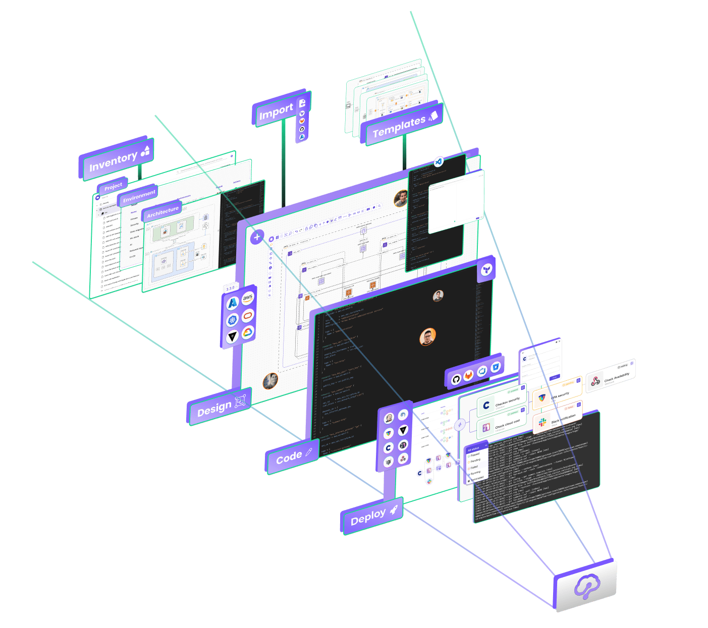

# Introduction

### What is Brainboard

Brainboard is an end-to-end solution to visually build and manage your cloud infrastructures, collaboratively.

It helps you centralize and standardize your cloud infrastructure management and build a self-serve model within your organization.

It is a collaborative and innovative solution that natively integrates IaC best practices and enforces security with an embedded CI/CD engine out of the box.

📌 Brainboard is a visual and intuitive solution, where you only have to do the work once.

* You design, then the code is automatically generated.

📌 It accelerates automation and can easily be integrated with existing processes and support your modules.

* You are one git push away from your source code repository.

📌 It centralizes the management of all your cloud infrastructures.

* Everything related to the cloud infrastructure is centralized in one solution, no need to have 10 different tools with different learning curves and individual maintenance efforts.

📌 It makes building and maintaining your cloud architectures fast and efficient.

* Go DRY (Don’t Repeat Yourself) by using our architecture templates & our integrated CI/CD engine.

📌 It helps to build and maintain in-house standards, integrate best practices and streamline your processes.

* The Best way to enforce your standards is to use a system that natively integrates best practices.

### Brainboard & Terraform

Among the plethora of tools in the infrastructure as code (laC) ecosystem, Terraform is the most used language in the infrastructure as code (IaC) space. You can describe (in a specific language called HCL) how you want your infrastructure to be, then Terraform will provision/update your infrastructure to match what you want.

Engineers use vanilla Terraform to build their infrastructures, This requires them manually writing the code, testing it, linting it, documenting it, and once approved, they deploy it. When they need to replicate the same stack, they either copy/paste and manually change variables or use some open-source scripts to help them do that.

Brainboard, on the other hand, removes the hassle of doing everything manually, saves time and reduces error.

It is a complete ecosystem to manage cloud infrastructures from end-to-end. It uses Terraform as an execution layer, and offers engineers a solution to build and manage production-grade cloud infrastructures without manually writing the code and gluing different tools together to deploy it.

### Why Brainboard?

* **Migrate into IaC & Terraform** with the least learning curve, best practices and Brainboard team helping you build confidence.
* **Standardize** the way you build and maintain your cloud infrastructures.
* **Document** in real time and track all changes with the native versioning of Brainboard.
* **Multi-cloud** by design.
* **Build trust in your process** by bringing clarity, documentation and visibility on how the infrastructure is built and managed.
* **Best practices**: Brainboard integrates Terraform & IaC best practices by design so you don’t have to.
* **Integrated CI/CD engine** where you can build pipelines and trigger them to analyze the infrastructure before introducing any change.
* **Stay DRY**: don't repeat yourself, build templates for your infrastructure that you and your colleagues can use off the shelf. This saves vast amounts of engineering time.
* **Terraformize**: accelerate the move to IaC & Terraform. Brainboard can help import your existing infrastructure for you. Meaning, you don't have to write Terraform code. Brainboard will generate it for you.
* **Git flow** by configuring your preferred repo in Brainboard, you "git push" your changes with one click.
* **Control costs & security** by integrating your security checks and cost estimation into your workflow. This means you and your team control the impact of the changes.
* **Time saving**: whether it’s when building cloud infrastructures, onboarding new hires or communicating with different teams, Brainboard saves you time and helps you stay organized.

### How Brainboard works

Brainboard is composed of different services that work together, in harmony, as one application.

There are 2 main categories of services:

1.  Synchronous services: that process the information of users, and return the value in real time.

    For example, generate the Terraform code when the user designs the infrastructure.
2.  Asynchronous actions: users request actions to be done, and once completed, Brainboard informs the users.

    For example, triggering an import from a cloud provider is an async action, where Brainboard connects to the target cloud provider, lists the resource then builds both the design and the Terraform code. Then Brainboard simply informs the user via an email.

Furthermore, the frontend part of Brainboard uses CDNs to reduce latency for users, while the backend is located in key regions of the USA and Europe.

* In the single-tenant offering, customers can choose where the installation of Brainboard will be.

### Get in touch

We want to hear your feedback, tell us the features you want or ask us any question:

* Contact us at: contact@brainboard.co
* Join our Slack [here](https://brainboard-community.slack.com/join/shared\_invite/zt-eo44d2fr-a5h0oNodNhHvK3hOuCQKSQ#/)
* Follow our YouTube channel [here](https://www.youtube.com/channel/UCB0DLhFEgta83U62mQzxGPg)
* Product roadmap [here](https://roadmap.brainboard.co/roadmap)

### What's next

Want to try Brainboard for yourself? Sign up [here](http://app.brainboard.co/register) to explore, or reach out to our team of cloud architects, who will be happy to help you get started or even build your architecture with you.
