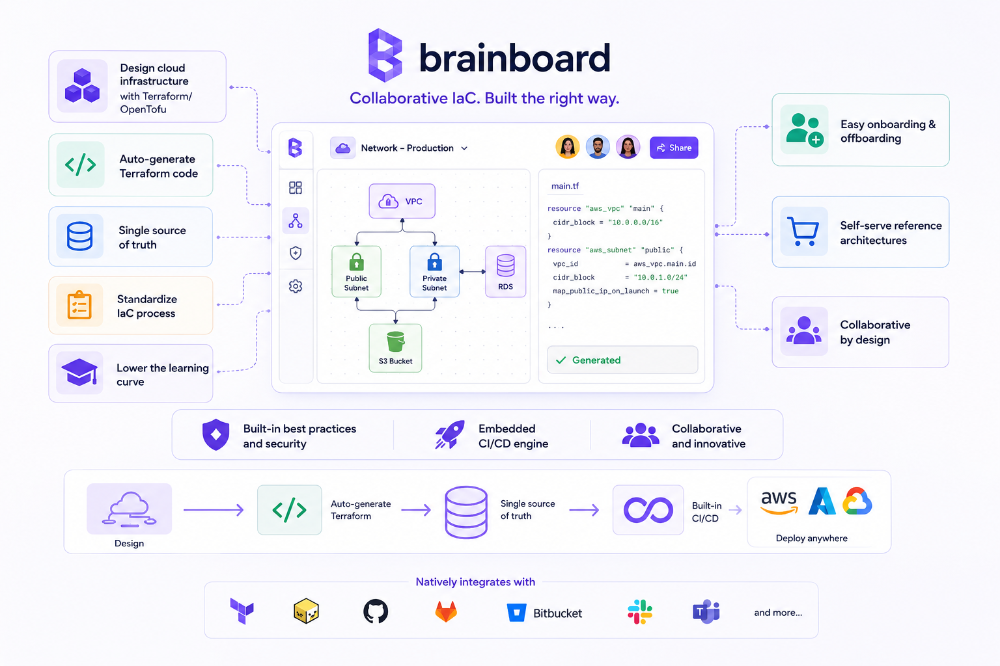
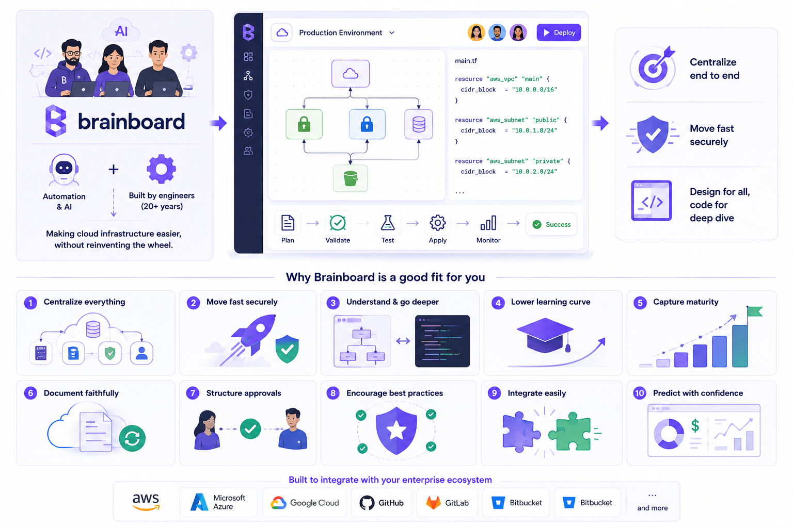
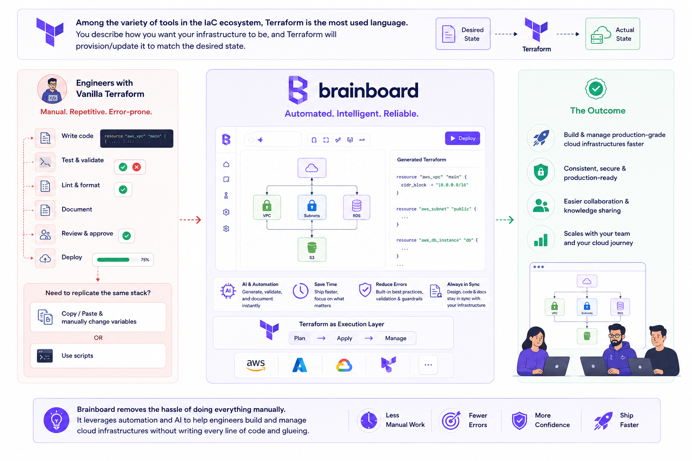

# Welcome

### What is it about?



Brainboard is a solution that helps you:

* Build your cloud infrastructure design with <mark style="color:$primary;">**Terraform/OpenTofu**</mark> resources.


Automatically generates the Terraform code.


* Centralize your **cloud infrastructure** to establish a single source of truth.
* Standardize your **IaC process.**
* Lower the **learning curve** for <mark style="color:$primary;">**Terraform**</mark> and the cloud.
* Easily **onboard** new engineers and safely **offboard** those leaving.
* Create a **self-serve model** within your organization, where your teams easily consume your reference architectures.

<mark style="color:$primary;">**Brainboard**</mark> is a collaborative and innovative solution that natively integrates **IaC** best practices, enforces security and has an embedded **CI/CD** engine out of the box.

<figure><figcaption></figcaption></figure>

### Why?

<mark style="color:$primary;">**Brainboard**</mark> has been built by experienced engineers with more than 20 years of experience, for engineers, by using automation and AI to make building and managing cloud infrastructure easier, without reinventing the wheel.

Here are the reasons why <mark style="color:$primary;">**Brainboard**</mark> is a good fit for you:

* It helps you centralize all the management of the cloud infrastructure, literally from end to end, into one single & unique platform.
* Move fast securely: It is designed to be intuitive and easy to learn, while providing the full power of an embedded **CI/CD** to shift left fast.
* No one is left behind: Anyone can understand a design, and for those who want to go deeper, the Terraform code is next to the design.
* Lower the learning curve of the cloud and Terraform/IaC.
* Help organizations capture the maturity of their cloud journey in a system that scales as the processes and use cases grow.
* Document faithfully the state of your cloud infrastructure that is already provisioned. This documentation is in constant sync with reality.
* Structure the review and approval process of the cloud infrastructure.
* Encourage adoption of best practices as they are implemented natively.
* Having a system that easily integrates with the enterprise workload.
* Be able to predict cloud infrastructure deployment in terms of costs and configuration.

<figure><figcaption></figcaption></figure>

### Brainboard & Terraform

Among the variety of tools in the **infrastructure as code (laC)** ecosystem, <mark style="color:$primary;">**Terraform**</mark> is the most used language in the space, where you only describe how you want your infrastructure to be. Then <mark style="color:$primary;">**Terraform**</mark> will provision/update your infrastructure to match the desired state.

Engineers use **vanilla&#x20;**<mark style="color:$primary;">**Terraform**</mark> to build their infrastructures. This is a manual process to write every line of code, test it, lint it, document it, and once approved, deploy it.

When they need to replicate the same stack, they either copy/paste and manually change variables or use scripts to help them do that.

<mark style="color:$primary;">**Brainboard**</mark>, on the other hand, removes the hassle of doing everything manually, saves time and reduces errors by leveraging automation and AI.

It uses <mark style="color:$primary;">**Terraform**</mark> as an execution layer and offers engineers a solution to build and manage production-grade cloud infrastructures without manually writing every line of code and glueing different tools together to deploy them.

<figure><figcaption></figcaption></figure>

### How does Brainboard work?

Brainboard is composed of different services that work together, in harmony, as one application.

There are two main categories of services:

1. **Synchronous services**: These process the information of users and return the value in real time.


**Example:** Generating the Terraform code as the user designs the infrastructure.


2. **Asynchronous actions**: Users request actions to be done, and once completed, Brainboard informs them.


**Example:** Triggering an import from a cloud provider. Brainboard connects to the target cloud provider, lists the resources, then builds the design, the Terraform code and the Terraform state file. Once the import is done, the user is informed via email.


### Get in touch

We want to hear your feedback, listen to your feature requests, and answer your questions. Here is how you can reach out to us:

🗨️ **In app:** Click on the <mark style="color:$primary;">**`Help`**</mark> button in the top-right and select <mark style="color:$primary;">**`Ask us anything`**</mark>.

📧 **By email:** <mark style="color:$primary;">**contact@brainboard.co**</mark>

▶️ Follow our YouTube channel [here](https://www.youtube.com/channel/UCB0DLhFEgta83U62mQzxGPg)

💻 Product roadmap [here](https://roadmap.brainboard.co/roadmap)

### What's next?

Sign up [here](http://app.brainboard.co/register) to explore the platform, or reach out to our cloud architects team, who will be happy to help you get started and build your first use cases.

