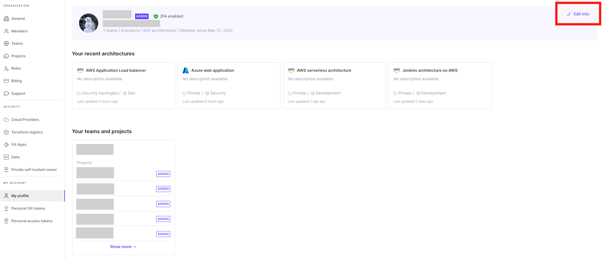

# Account management 👤

### Create account

To create a new Brainboard account:

1. Go to the [Sign up page](https://app.brainboard.co/register).
2. Either click on `register` or choose sign up with Google or Microsoft.
3. If you choose to register with your email, then add it with a first name, last name and password.
4. Click `Register` to create the account.

Once you create your account, Brainboard will automatically send you a confirmation email. ​​ :::tip If you are creating an account for your team or a business, we recommend choosing an email alias or distribution list for your email, for e.g. brainboard@yourdomain.com. :::

#### Organization owner

The first account created on Brainboard will be, by default, the owner of the organization and Brainboard creates automatically a new team and new project for this account as part of the onboarding process.

### Customize your account

After you create your Brainboard account, you can update the following information in your account [settings page](https://app.brainboard.co/settings/my-profile):

* First name
* Last name
* Email address: you need to reach out to the support at support@brainboard.co to change your email address
* Password

To edit the information, click on the 3 vertical dots on the right:

### Add members

Refer to [this page](https://gitlab.com/brainboard/brainboard/-/blob/main/account-billing/invite-members/README.md) to invite new members into your organization.

### Edit member's information

To edit the information of a user:

1. Go to [members page](https://app.brainboard.co/settings/members).
2. Click on `Edit` option that appears when you click on the three dots button at the end of the row for a member.
3. You can change the first name, last name, organization role or two factor authentication status of the user.

### Disable members

You have the possibility to temporary suspend a user, which means that the account still exists within your organization but the user cannot access Brainboard until you enable it again.

When you disable a user, you will not be billed for this user until you enable it again.

To suspend a member:

1. Go to [members page](https://app.brainboard.co/settings/members).
2. Click on `Disable member` option that appears when you click on the three dots button at the end of the row for a member.
3. Click on `Disable member` in the confirmation window that will show.

### Remove members

To remove any member from your organization:

1. Go to [members page](https://app.brainboard.co/settings/members)
2. Click on `Delete` option that appears when you click on the three dots button at the end of the row for a member.
3. Click on `Yes, delete user` in the confirmation window that will show.

\
\
!\[]\(./assets/edit-member.png)
