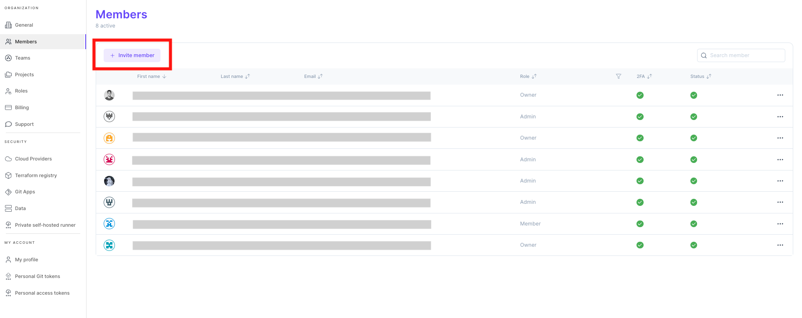
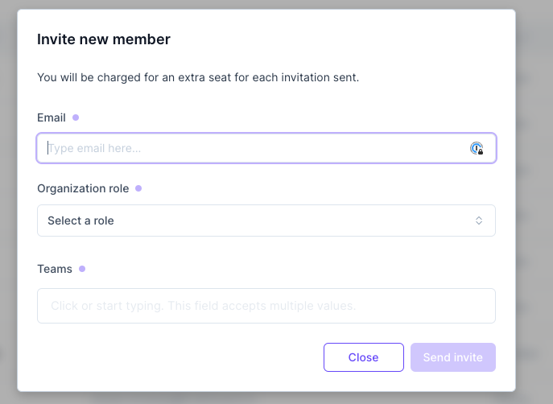

# Invite members 👥

You can invite your colleagues, customers, auditors or external contributors to your Brainboard organization.

To invite a new member:

1. Go to [members page](https://app.brainboard.co/settings/members)
2.  Click on the icon on the right&#x20;

    <figure><figcaption></figcaption></figure>
3. Add the following information and click `invite`:
   * Email address.
   * The `organization` role that you want this user to have. There are `4 roles` available:
     * **Owner**: can do any action in Brainboard.
     * **Admin**: can do most of the actions, except the billing.
     * **Member**: can only do actions authorized on specific projects.
     * **Guest**: this is read-only access. Suitable for auditors or team members that only need to view cloud architectures.
   *   The initial team of the user.&#x20;

       <figure><figcaption></figcaption></figure>


A member can belong to **one and only one** organization, so if the user you are trying to invite already has an account in Brainboard. This user should delete his/her organization following [this documentation](organization.md#delete-an-organization-close-your-account).

