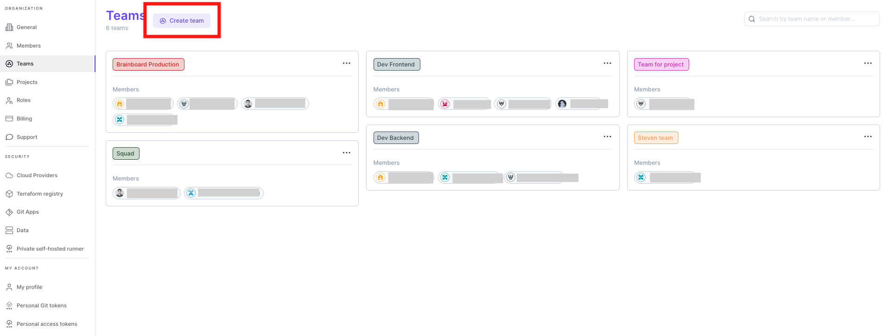
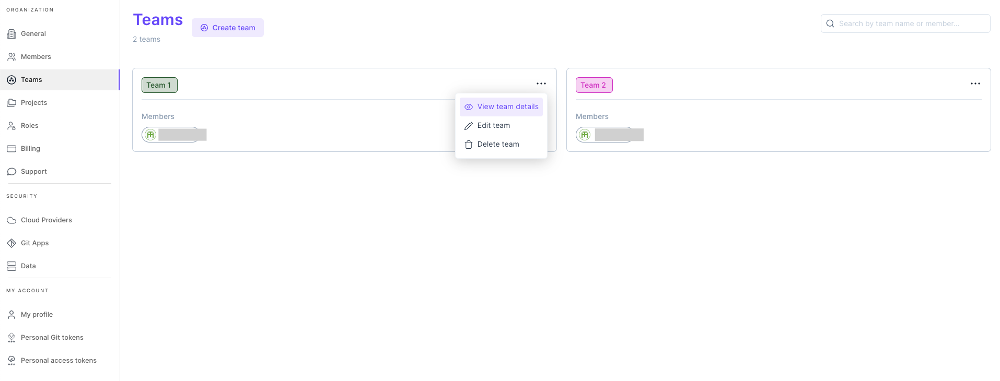
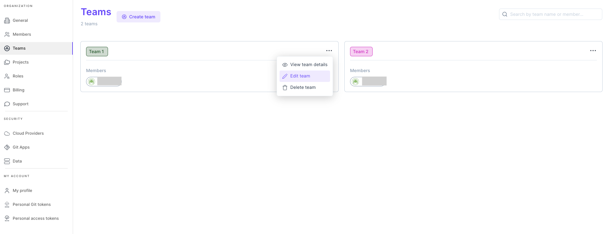
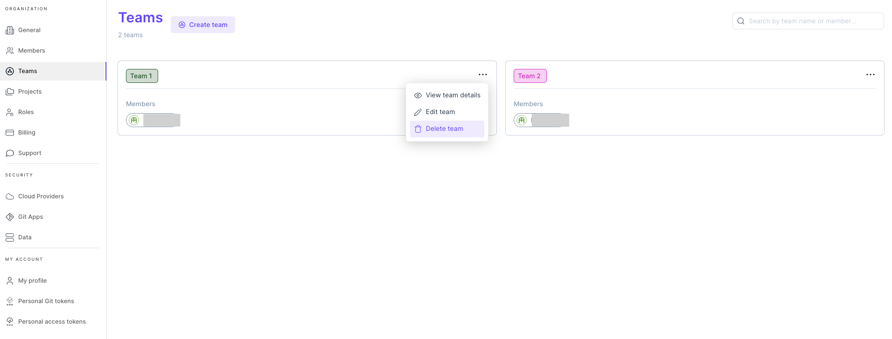

# Teams management 👥

### Create new team

To create a new team in Brainboard:

1. Go to the [settings page of teams](https://app.brainboard.co/settings/teams).
2.  Click on `Create team`

    
3. Fill the information about the team:
   * Name
   * Members
4. Click on create

### View team's information

To view the information of the team, hover the line of the team and click on `View team information`.

### Edit team

To edit the information of the team, hover the line of the team and click on `Edit team information`.

### Delete team

To delete a team, hover the line of the team and click on `Delete the team` and confirm.

:::warning Deleting a team cannot be undone. :::
