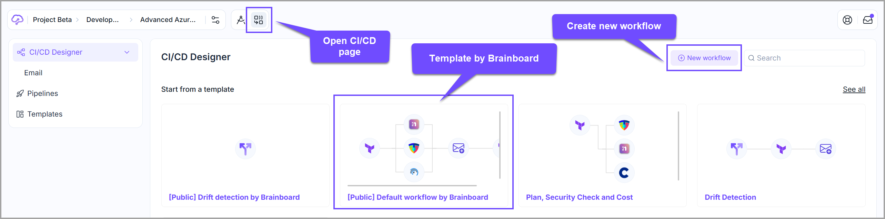
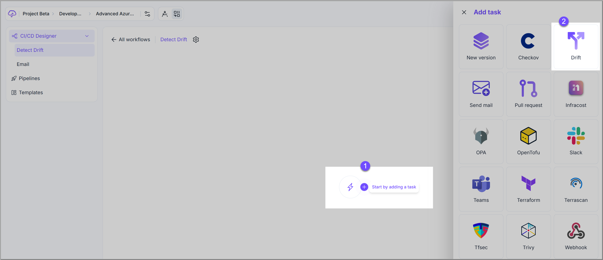
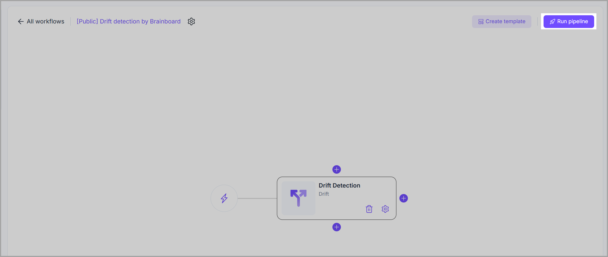
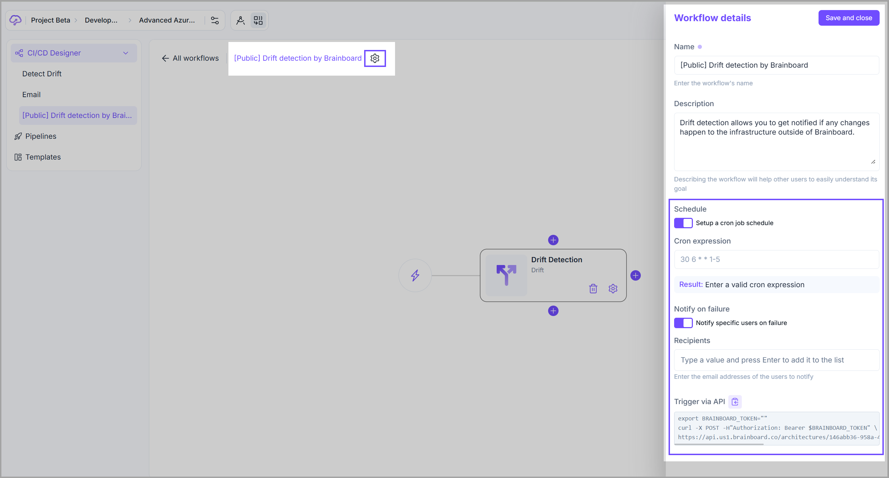

# Drift detection

### Overview

<mark style="color:$primary;">**Brainboard**</mark> allows you to detect any **drift** happening to the cloud infrastructure, and in some cases it removes the root cause of the drift.

### Detecting the drift

To detect a **drift** happening to the cloud infrastructure, you have **two** options. Both options are based on a workflow.


<mark style="color:$primary;">**Brainboard**</mark> is the only tool in the market that allows you to **create multiple CI/CD workflows** for the same infrastructure. You can, for e.g. create a workflow for security checks, another one for costs and a third one to detect a drift.


Refer to [this page](../ci-cd-designer.md) if you want additional information about workflows.

#### Manual workflow

You can create a workflow to check if a drift has happened to the cloud infrastructure and run it manually as follows:

1. Go to the **CI/CD page** of the infrastructure by clicking on the **rightmost icon** in the options bar at the top.&#x20;
2. Either create a new workflow by clicking on the <mark style="color:$primary;">**`New workflow`**</mark> button or use the public template called <mark style="color:$primary;">**`[Public] Drift detection by Brainboard`**</mark>.

<figure><figcaption></figcaption></figure>

3. Once the workflow is created, add a drift detection task and give it a name.

<figure><figcaption></figcaption></figure>

4. Run the pipeline by clicking the <mark style="color:$primary;">**`Run pipeline`**</mark> button in the top right corner of the page.&#x20;

<figure><figcaption></figcaption></figure>

#### Scheduled automatic detection

1. Open the **settings** of the workflow you already created. To do so, click the **gear wheel** icon available next to the workflow name at the top of the page.&#x20;
2. Activate the cron **schedule** and specify the frequency of the execution of the workflow.
3. If you want to be notified when a drift is detected, enable <mark style="color:$primary;">**`Notify on failure`**</mark> and specify the email address(es) that will receive the notification.

<figure><figcaption></figcaption></figure>


You can use this [crontab generator](https://codebeautify.org/crontab-format) to generate a cron expression.


### Output

When the pipeline runs (either manually or automatically), <mark style="color:$primary;">**Brainboard**</mark> creates an execution environment, runs the detection and gives you the output:


When a drift is detected, the workflow will be marked as <mark style="color:$primary;">**`failed`**</mark>, because when a drift happens, this is considered a failure by <mark style="color:$primary;">**Brainboard**</mark> as the infrastructure doesn't comply with the provisioned one.


### Best practices

It's a good practice to use the **automatic scheduled drift detection** for both:&#x20;

* **Critical workloads:** In case anything unwanted happens outside the source of truth.
* **Non-critical workloads:** To control costs and detect any modification that may increase them beyond the allowed budget.
