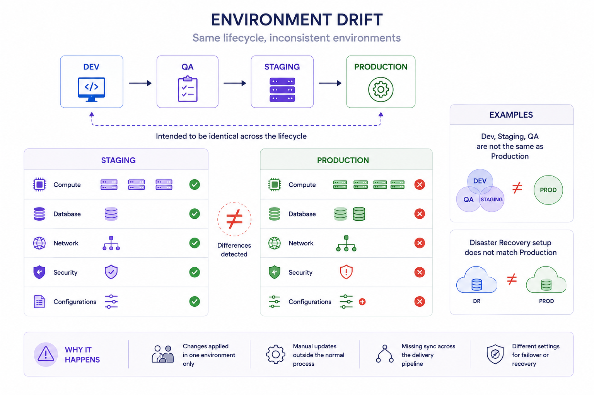
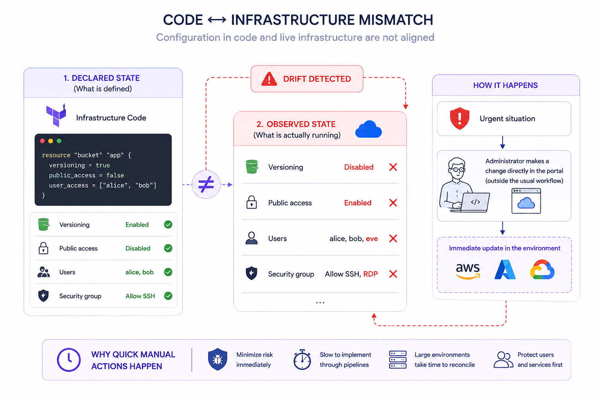

# Types of drift

### Source of truth

The modern cloud infrastructure is more like a living organism than static resources that are not supposed to be updated frequently. That's why **IaC (Infrastructure as Code)** is the most suitable way to build and manage cloud infrastructure, whatever the language you pick. It could be **Terraform**, **Ansible, Pulumi, CloudFormation, Azure Bicep**...

This infrastructure is managed by different people, frequently introducing changes to it. That's why it is important to have <mark style="color:$primary;">**`a unique source of truth`**</mark>⁣. Otherwise, it will be challenging to track all the changes and troubleshoot errors/incidents when they occur.

By having a unique source of truth, it is also important to constantly monitor whether the real infrastructure (that is already provisioned in your cloud provider(s)) has not drifted from its source.

This source of truth could be <mark style="color:$primary;">**Brainboard**</mark>, **Git**, **local files**...

### Definition

A <mark style="color:$primary;">**drift**</mark> is when the actual state of the deployed infrastructure diverges from the desired or expected state described in the code. Usually, it occurs when changes are made directly/manually to the deployed infrastructure outside the **IaC** tool's control.

### Types of drift

There are two types of drift.&#x20;

#### **1. Between environments**

This happens when the deployed infrastructure in one environment for e.g. <mark style="color:$primary;">**`staging`**</mark> is different from another environment for e.g. <mark style="color:$primary;">**`production`**</mark> that is supposed to be part of the same lifecycle of the infrastructure.

**E.g.**

* When the dev environment is different from staging or QA or production.
* When the disaster recovery configuration is different from production.

<figure><figcaption></figcaption></figure>

#### **2. Between the code and the infrastructure**

This happens when the provisioned cloud infrastructure (all resources and their configurations) is different from the configuration that you have in the source of the truth (**Terraform** code).

The **root cause** of the drift could be legitimate, e.g. when there is a security incident and as an emergency response, an engineer can choose to quickly do the action on the console of the cloud provider (like blocking a user) because it may take time to be done through **IaC** (especially if the infrastructure is big because **Terraform** may take hour(s) to refresh the state).

<figure><figcaption></figcaption></figure>
