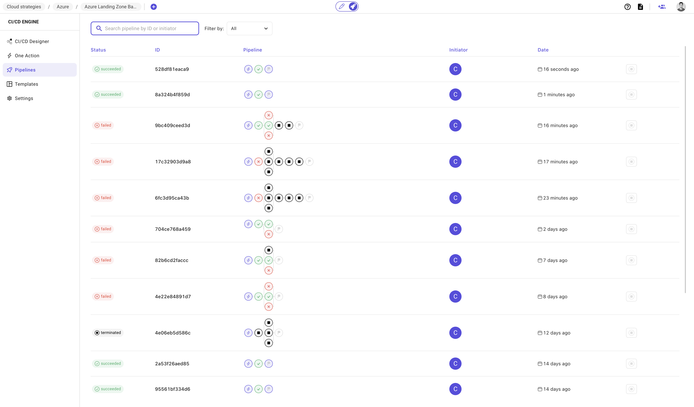
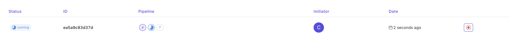
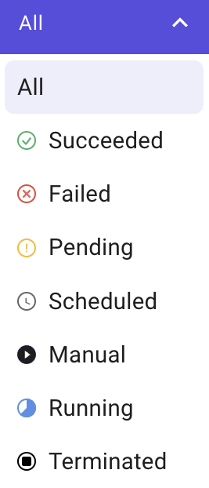

# Pipelines

### Description

Pipelines are the history of the execution of your workflow.

These pipelines contain both your triggered workflows and any action performed in `one action` tab.

### Pipeline information

#### Status

There are 7 statuses of any given pipeline:

1. **Scheduled**: the pipeline is accepted by Brainboard for execution and put in the pool to be picked by a runner.
   * By default, all jobs are accepted.
2. **Pending**: the pipeline is pending to be picked by a runner to execute it.
3. **Running**: the pipeline has been picked by a runner that is currently executing its tasks.
4. **Succeeded**: the execution of the pipeline ended, and all tasks were successful.
5. **Failed**: the execution of the pipeline ended and some of the tasks failed.
   * The pipeline is considered failed, when at least one task fails.
   * When you ignore errors in tasks to not stop the pipeline, if they fail, the pipeline is considered failed even if the execution of the last task is successful.
6. **Terminated**: the pipeline has been stopped by a user.
7. **Manual**: the pipeline requires approval. It means that at least one task of the pipeline is pending approval.

#### Unique identifier

Every pipeline has a unique identifier. It is used to store and retrieve its output.

The `id` displayed in this column is the last 12 characters of the UUID of the pipeline.


The complete UUID is visible in the URL of the browser. You use usually need it when you open a support ticket.


#### Visual stages and tasks

This is a minified graph of the pipeline.

It contains all tasks, and you can see the name and status of every task when you hover it.

#### Initiator

The avatar of the person who triggered the pipeline.

Hover this avatar to see the complete name of the person.

#### Date

Time of when the pipeline has been triggered.

#### Stop button

This button allows you to terminate/stop a running pipeline. It is only active when the pipeline is running.

### Run pipeline

To run the pipeline, go to the CI/CD designer and click on the button `Run pipeline`.

Refer to the [CI/CD page](/broken/pages/LTZOydO0KvRiXUWcIDDz) for more details.

### Stop pipeline

To stop the pipeline, click on the button `Stop pipeline` located at the right of the pipeline. This button is only active when the pipeline is running.

### Output

To open the output of any pipeline, click on it in the table of pipelines.

#### Tasks status

Tasks have the same [status](pipelines.md#status) as the pipeline.
