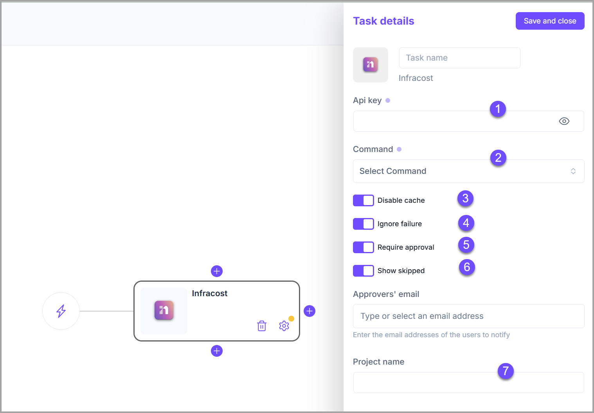

# Infracost

This plugin allows you to have a cost estimation for your infrastructure from your Terraform code.

* [Home page](https://www.infracost.io/).
* [Source code on Github](https://github.com/infracost/infracost).

<figure><figcaption></figcaption></figure>

**Configuration options**

1. **API key:** You can generate it from your Infracost account.
2. **Command:** 2 commands supported.
   * **Breakdown:** This command shows a cost breakdown.
   * **Diff:** This command shows a diff of monthly costs between the deployed infrastructure and planned changes.
3. **Disable cache**.
4. **Ignore failure:** If enabled, the execution of the following stage will be triggered even if the task fails.
5. **Require approval:** It means that this task will not be executed until approved by people added in the approvers' list.
   * The task remains blocked until all approvers added in the list approve it.
   * When enabled, it allows you to add approvers to the list.
   * The approver has to be a <mark style="color:$primary;">**Brainboard**</mark> user.
6. **Show skipped:** List unsupported and free resources.
7. **Project name**

**Sample output**

