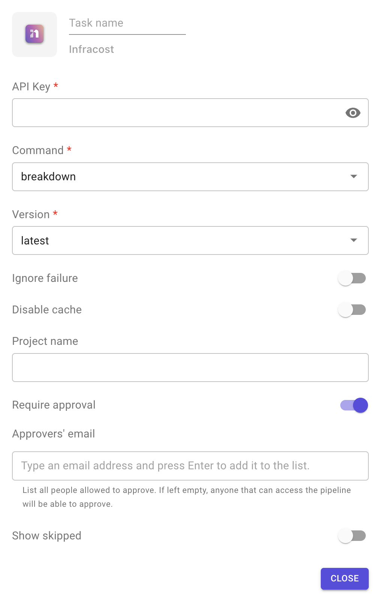

# Infracost

This plugin allows you to have a cost estimation for your infrastructure from your Terraform code.

* [Home page](https://www.infracost.io/).
* [Source code on Github](https://github.com/infracost/infracost).

**Configuration options**

1. API key: you can generate it from your Infracost account.
2. Command: 2 commands supported
   * Breakdown: this command shows a breakdown of costs.
   * Diff: this command shows a diff of monthly costs between the deployed infrastructure and planned changes.
3. Version: always points to the latest version.
4. Ignore failure: if enabled, the execution of the following stage will be triggered even if the task fails.
5. Disable cache.
6. Project name.
7. Require approval: means that this task will not be executed until approved by people added in the approvers' list.
   * The task remains blocked until all approvers added in the list approve it.
8. Show skipped: list unsupported and free resources.

**Sample output**

###
