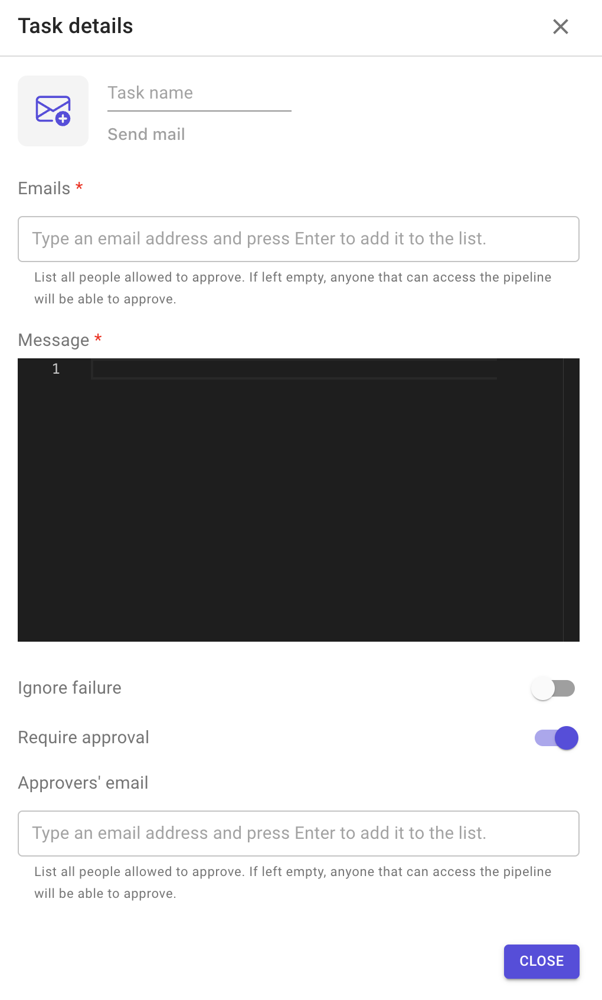

# Email

This plugin allows you to send an email to multiple emails.

This is Brainboard plugin.

**Configuration options**

1. Emails: list of email address that will receive a copy of the message.
2. Message: YAML content to be emailed.
3. Custom arguments.
4. Ignore failure: if enabled, the execution of the following stage will be triggered even if the task fails.
