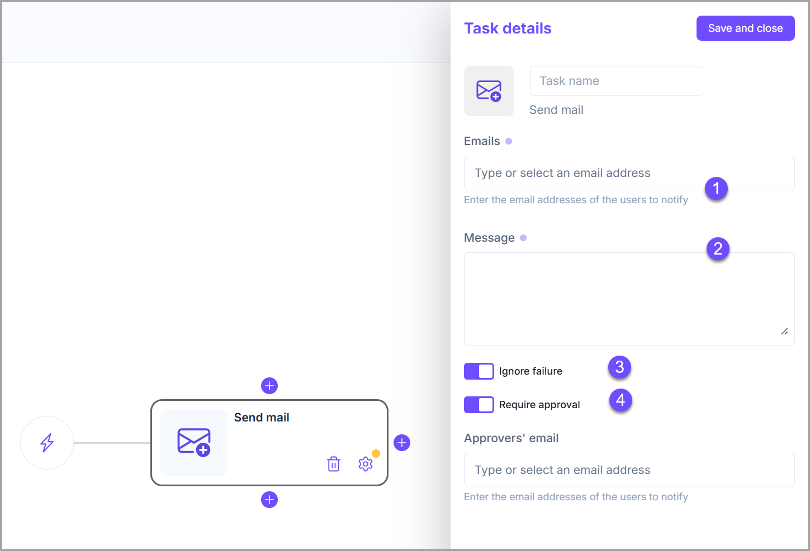

# Email

This plugin allows you to send an email to multiple recipients.

This is a <mark style="color:$primary;">**Brainboard**</mark> plugin.

<figure><figcaption></figcaption></figure>

**Configuration options**

1. **Emails:** list of email addresses that will receive a copy of the message.
2. **Message:** **YAML** content to be emailed.
3. **Ignore failure:** if enabled, the execution of the following stage will be triggered even if the task fails.
4. **Require approval:** means that this task will not be executed until approved by people added to the approvers' list.
   * The task remains blocked until all approvers added in the list approve it.
   * When enabled, it allows you to add approvers to the list.
   * The approver has to be a <mark style="color:$primary;">**Brainboard**</mark> user.
