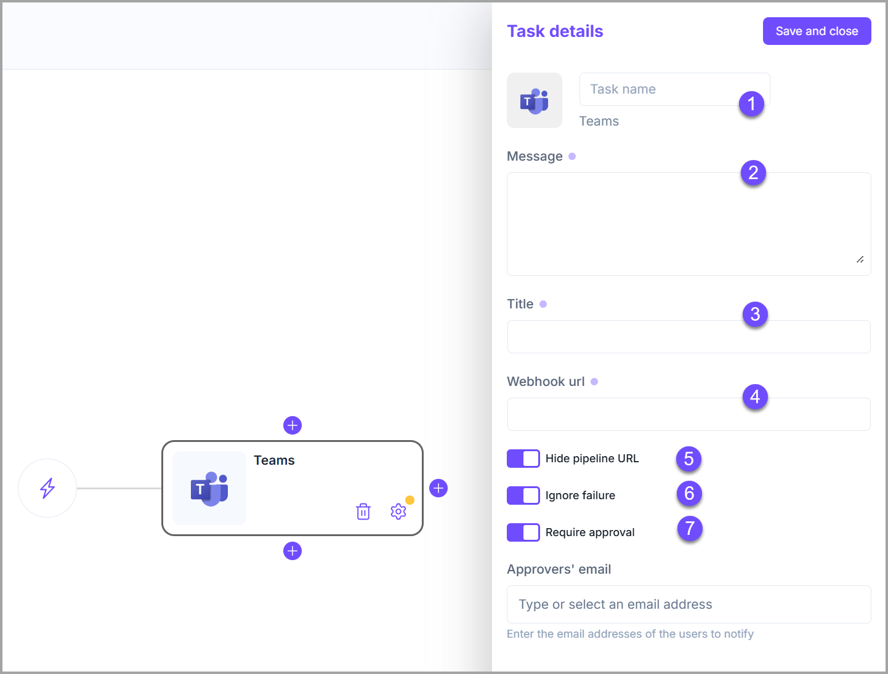

# Microsoft Teams

This plugin allows you to send a notification to your **MS Teams** channel.

<figure><figcaption></figcaption></figure>

**Configuration options**

1. **Task name:** This name will be visible in the pipeline when the task is executed.
2. **Message:** Text to be sent.
3. **Title:** Title of the message that will be posted to the **Teams** channel.
4. **Webhook URL** of your **MS Teams** channel.
5. **Hide pipeline URL:** Do not add a button with a link to the pipeline in the adaptive card for the message displayed in the **Teams** channel.
6. **Ignore failure:** If enabled, the execution of the following stage will be triggered even if the task fails.
7. **Require approval:** It means that this task will not be executed until approved by people added in the approvers' list.
   * The task remains blocked until all approvers added in the list approve it.
   * When enabled, it allows you to add approvers to the list.
   * The approver has to be a <mark style="color:$primary;">**Brainboard**</mark> user.

#### Setup instructions

If you want to configure **Microsoft Teams** to receive notifications from <mark style="color:$primary;">**Brainboard**</mark> pipelines, an _**incoming hook**_ needs to be set up in the channel of your choice. To do so, follow the steps:

1.  Go to your **Teams** channel where you want the notification to be posted, open its configuration menu in the top-right corner and click on **"**<mark style="color:$primary;">**Workflows**</mark>**."** 

    <figure><figcaption></figcaption></figure>

2. This will open the workflows configuration wizard. Search and select the line **"**<mark style="color:$primary;">**Post to a channel when a webhook request is received**</mark>**."**

<figure><figcaption></figcaption></figure>

3. Give it a name and click <mark style="color:$primary;">**`Next`**</mark>.

<figure><figcaption></figcaption></figure>

4. Select the channel where you want the notification to be posted:

<figure><figcaption></figcaption></figure>

5. Copy the generated **webhook URL** to use in <mark style="color:$primary;">**Brainboard.**</mark>

<figure><figcaption></figcaption></figure>

If you have an old configuration, follow the steps in this video:




This configuration is deprecated by **Azure** and will be removed by the end of 2025.

