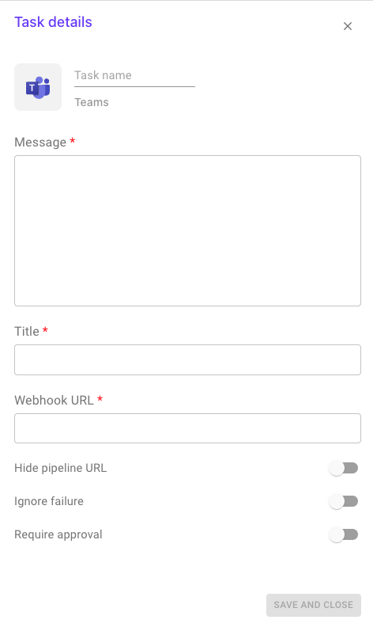

# Microsoft Teams

This plugin allows you to send a notification to your MS Teams channel.

**Configuration options**

1. Message title: title of the message.
2. Message: text to be sent.
3. Incoming webhook URL of your MS Teams channel.
4. Hide pipeline URL: do not add button with link to the pipeline in the adaptive card.
5. Ignore failure: if enabled, the execution of the following stage will be triggered even if the task fails.

#### Setup instructions

If you want to configure Microsoft Teams to receive notifications from Brainboard pipelines, an _incoming hook_ needs to be set up in the channel of your choice. To do so, follow the steps from the Brainboard video tutorial:

.
