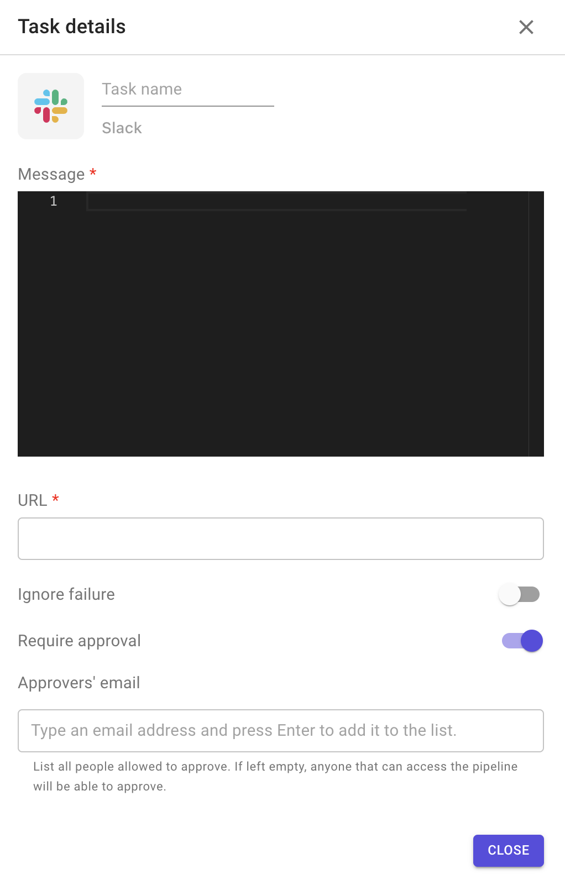

# Slack

This plugin allows you to send a notification to your Slack channel.

**Configuration options**

1. Message: YAML content to be sent.
2. URL of your Slack channel.
3. Custom arguments.
4. Ignore failure: if enabled, the execution of the following stage will be triggered even if the task fails.
