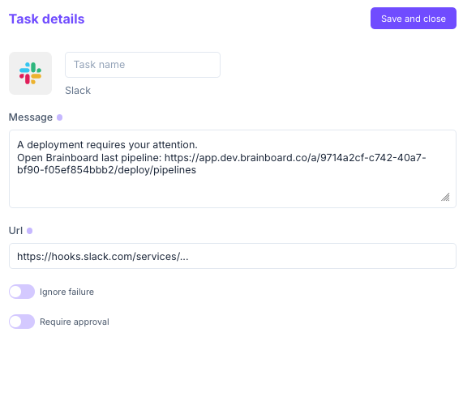
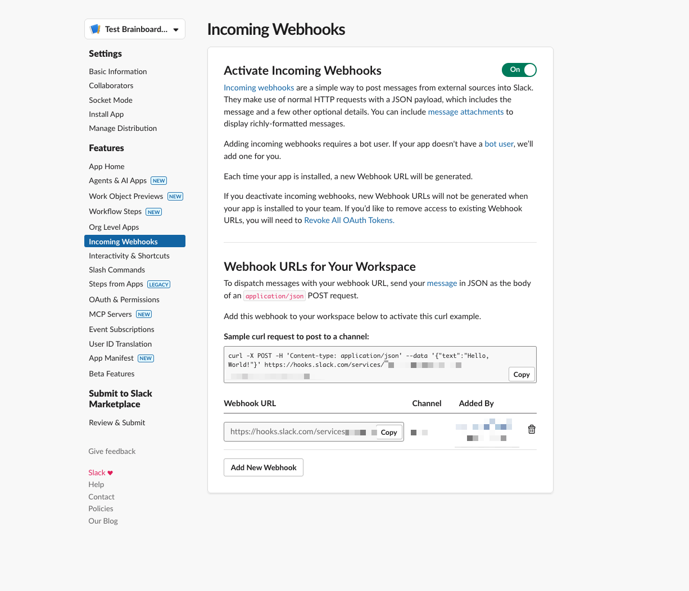

# Slack

This plugin allows you to send a notification to your Slack channel.

**Configuration options**

1. Message: content to be sent.
2. URL of your Slack incoming webhook.

### Setup

1. Create a Slack application from scratch ([https://api.slack.com/apps](https://api.slack.com/apps))
2. Activate incoming webhooks
3. Create a webhook URL and copy this URL in Brainboard Slack plugin configuration

<figure><figcaption></figcaption></figure>
