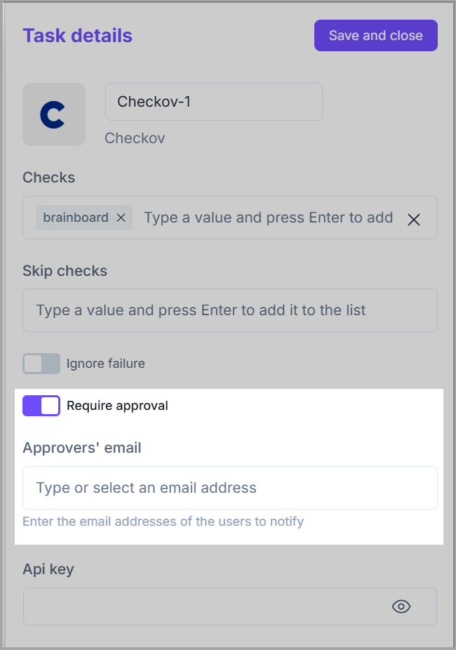

# Checkov

This plugin allows you to scan your **Terraform** code to find misconfigurations before they're deployed.


* [Checkov home page](https://www.checkov.io/)
* [Source code on GitHub](https://github.com/bridgecrewio/checkov)


### Accessing Checkov

1. Launch the **CI/CD Designer** by clicking the 🚀**CI/CD i**con available at the top.&#x20;
2. Click <mark style="color:$primary;">**`+`**</mark>  in the canvas to add a new task, and select <mark style="color:$primary;">**Checkov**</mark> from the available options. It will be added to the canvas, and its **Task details** slide form will appear on the right, where you can do the desired configuration.

<figure><figcaption></figcaption></figure>

### **Configuration options**

1. **Name:** This is the Brainboard field to describe what this task is about.
2. **Version:** Always points to the latest version to give you the latest security checks released.
3. **Skip checks.**
4. **Ignore failure:** This will put the task in a non-blocking failure, which means the execution of the following stage will be triggered even if the task fails.
5. **Require approval:** It implies that this task will not be executed until approved by the people added to the approvers' list.
   * The task remains blocked until all approvers added to the list approve it.
   * When enabled, it allows you to add approvers to the list.


The approver has to be a **Brainboard** user.


<figure><figcaption></figcaption></figure>


**API key is optional.** If you have a paid subscription, you can add your key and repository ID.


**Sample output**

<figure><figcaption></figcaption></figure>
