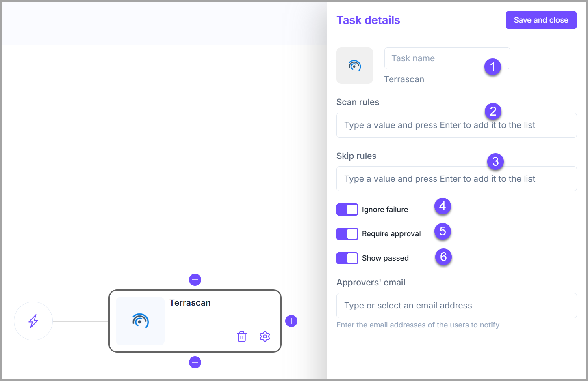

# Terrascan

This plugin allows you to scan the Terraform code with <mark style="color:$primary;">**`Terrascan`**</mark> and provide output.


<mark style="color:$primary;">**`Terrascan`**</mark> is a static code analyzer for **Infrastructure as Code.**

It provides **500+ out**-of-the-box policies so that you can scan **IaC** against common policy standards such as the **CIS Benchmark.**


* [Home page](https://runterrascan.io/)
* [Source code on Github](https://github.com/tenable/terrascan)

<figure><figcaption></figcaption></figure>

**Configuration options**

1. **Name:** This is a <mark style="color:$primary;">**Brainboard**</mark> field to describe what this task is about.
2. **Scan rules:** Specify rules to scan, example: -**scan-rules**=<mark style="color:$primary;">**`“ruleID1,ruleID2”`**</mark>.
3. **Skip rules:** specify one or more rules to skip while scanning:
   1. Example: **–skip-rules**=<mark style="color:$primary;">**“ruleID1,ruleID2”**</mark>
   2. No space should be added after the comma in the list.
4. **Ignore failure:** this will put the task in a non-blocking failure, which means, the execution of the following stage will be triggered even if the task fails.
5. **Require approval:** It means that this task will not be executed until approved by people added to the approvers' list.
   * The task remains blocked until all approvers added in the list approve it.
   * When enabled, it allows you to add approvers to the list.
   * The approver has to be a <mark style="color:$primary;">**Brainboard**</mark> user.
6. **Show passed:** Display passed rules, along with violations.

**Sample output**

<figure><figcaption></figcaption></figure>
