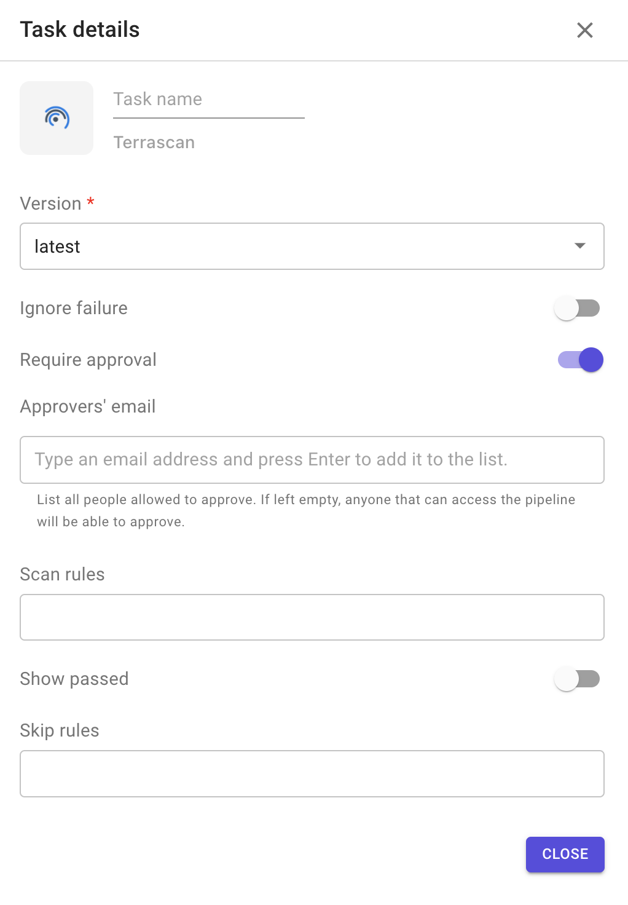
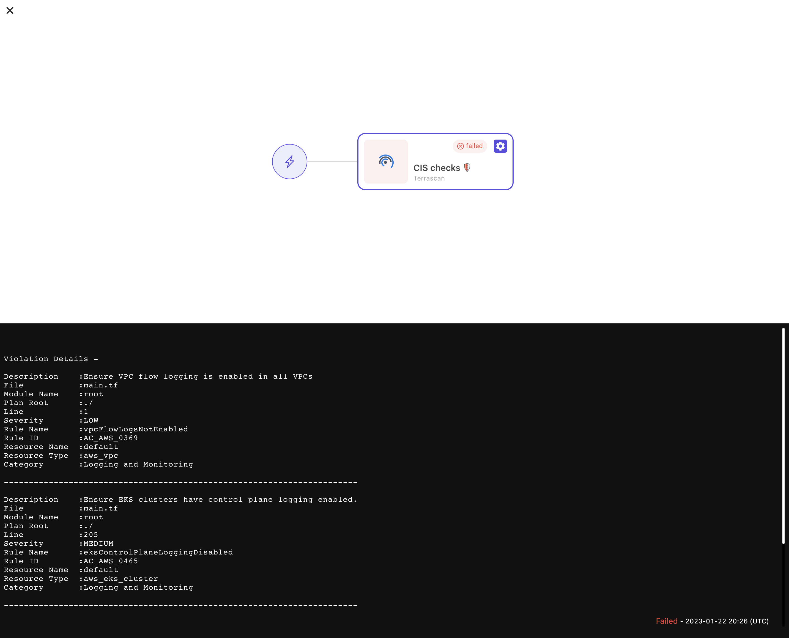

# Terrascan

This plugin allows you to scan the Terraform code with `Terrascan` and provide output.

`Terrascan` is a static code analyzer for Infrastructure as Code.

It provides 500+ out-of-the-box policies so that you can scan IaC against common policy standards such as the CIS Benchmark.

* [Home page](https://runterrascan.io/).
* [Source code on Github](https://github.com/tenable/terrascan).

**Configuration options**

1. Version: always points to the latest version.
2. Ignore failure: if enabled, the execution of the following stage will be triggered even if the task fails.
3. Require approval: means that this task will not be executed until approved by people added in the approvers' list.
   * The task remains blocked until all approvers added in the list approve it.
4. Scan rules: specify rules to scan, example: –scan-rules=“ruleID1,ruleID2”.
5. Show passed: display passed rules, along with violations.
6. Skip rules: specify one or more rules to skip while scanning. Example: –skip-rules=“ruleID1,ruleID2”.

**Sample output**

