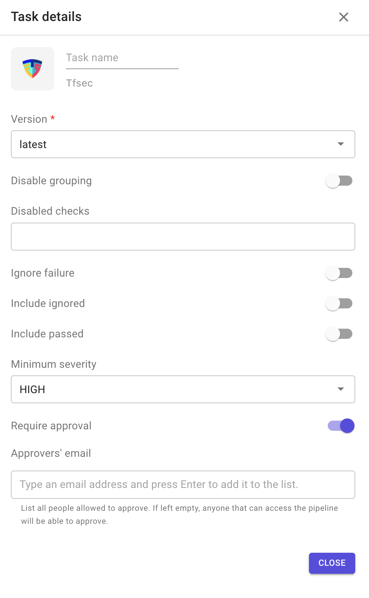
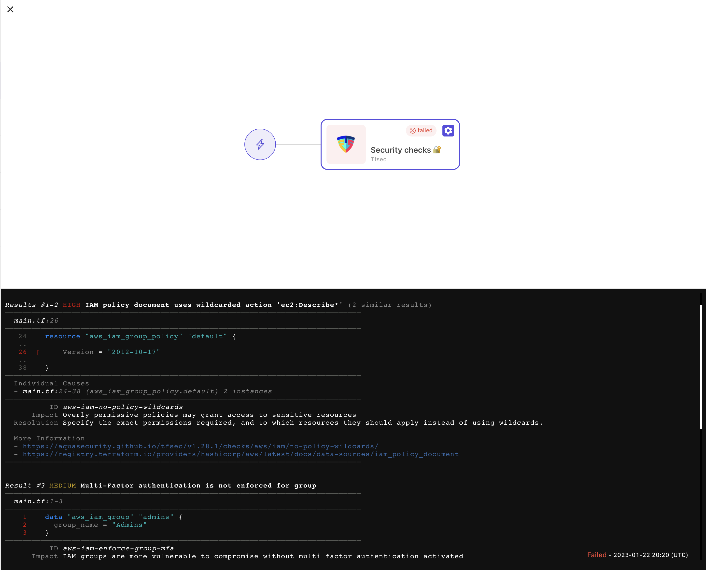

# Tfsec

This plugin allows you to scan the Terraform code with `tfsec` and provide output.

`tfsec` is a static analysis security scanner for your Terraform code.

* [Home page](https://aquasecurity.github.io/tfsec).
* [Source code on GitHub](https://github.com/aquasecurity/tfsec).

**Configuration options**

1. Version: always points to the latest version.
2. Disable grouping: disable grouping of similar results.
3. Disabled checks
4. Ignore failure: if enabled, the execution of the following stage will be triggered even if the task fails.
5. Include ignored: include ignored checks in the result output.
6. Include passed: include passed checks in the result output.
7. Minimum severity: you can specify the minimum severity of result that should be reported. By default, every severity is reported. You must use one of `CRITICAL`, `HIGH`, `MEDIUM`, `LOW`.
8. Require approval: means that this task will not be executed until approved by people added in the approvers' list.
   * The task remains blocked until all approvers added in the list approve it.

**Sample output**

####
