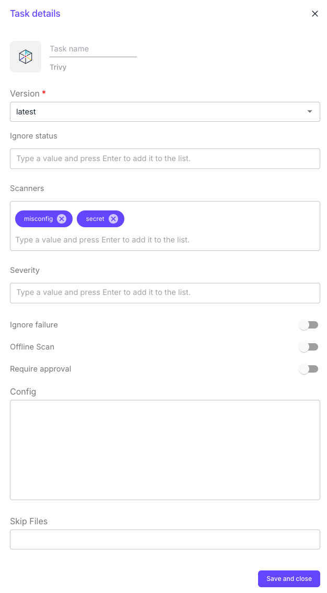

# Trivy

This plugin allows you to scan the Terraform code with `trivy` and provide output.

`trivy` is a static analysis security scanner that can be used for Terraform code.

* [Home page](https://trivy.dev/latest/docs/coverage/iac/terraform/).
* [Source code on GitHub](https://github.com/aquasecurity/trivy).

**Configuration options**

1. Version: always points to the latest version.
2. Ignore status: list of vulnerability status to ignore (`unknown`, `not_affected`, affected, fixed, under\_investigation, will\_not\_fix, fix\_deferred, end\_of\_life)
3. Scanners: list of what security issues to detect (`vuln`, `misconfig`, `secret`, `license`)
4. Severity: severities of security issues to be displayed (`UNKNOWN`, `LOW`, `MEDIUM`, `HIGH`, `CRITICAL`)
5. Ignore failure: if enabled, the execution of the following stage will be triggered even if the task fails.
6. Offline scan: do not issue API requests to identify dependencies
7. Include ignored: include ignored checks in the result output.
8. Include passed: include passed checks in the result output.
9. Minimum severity: you can specify the minimum severity of result that should be reported. By default, every severity is reported. You must use one of `CRITICAL`, `HIGH`, `MEDIUM`, `LOW`.
10. Require approval: means that this task will not be executed until approved by people added in the approvers' list.
    * The task remains blocked until all approvers added in the list approve it.
11. Config: can be used to pass any valid Trivy configuration page (see [documentation](https://trivy.dev/latest/docs/references/configuration/config-file/))
12. Skip files: specify the files or glob patterns to skip

**Sample output**

