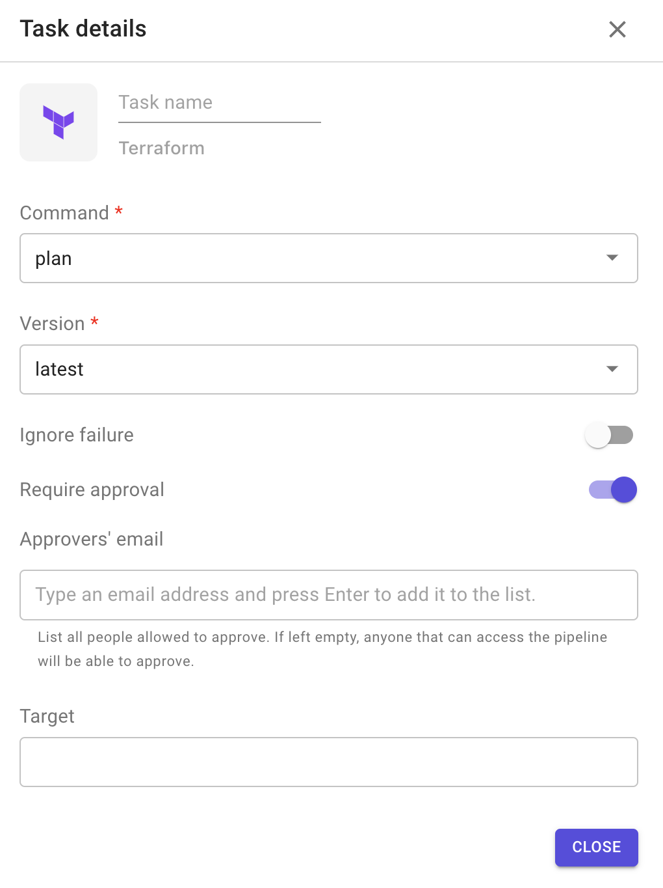
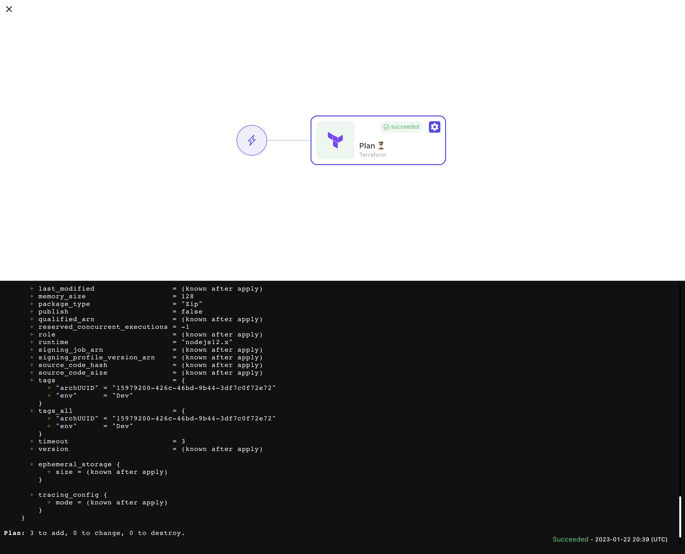

# Terraform

This plugin allows you to execute `Terraform` actions on your code.

**Configuration options**

1. Command: Terraform commands to execute. 4 options are available:
   * validate
   * plan
   * apply
   * destroy
2. Version: refers to the version of Terraform binary to use.
3. Ignore failure: if enabled, the execution of the following stage will be triggered even if the task fails.
4. Target: is a regex to specify which resource(s) will be the target of the execution.\
   Refer to [this documentation page](https://developer.hashicorp.com/terraform/cli/commands/plan#resource-targeting) to understand how resource targeting works in Terraform
5. Require approval: means that this task will not be executed until approved by people added in the approvers' list.
   * The task remains blocked until all approvers added in the list approve it.
   *   When enabled, it allows you to add approvers to the list 

       <figure><figcaption></figcaption></figure>
   * The approver has to be Brainboard user

**Sample output**

