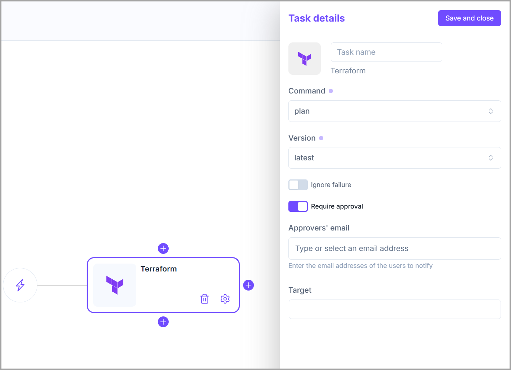
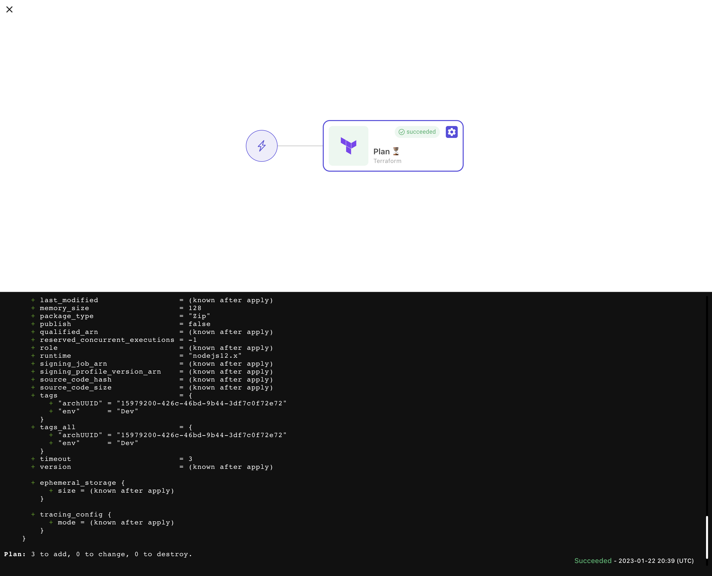

# Terraform

This plugin allows you to execute <mark style="color:$primary;">**`Terraform`**</mark> actions on your code.

<figure><figcaption></figcaption></figure>

### **Configuration options**

1. **Command:** Terraform commands to execute. Four options are available:
   * <mark style="color:$primary;">**`validate`**</mark>
   * <mark style="color:$primary;">**`plan`**</mark>
   * <mark style="color:$primary;">**`apply`**</mark>
   * <mark style="color:$primary;">**`destroy`**</mark>
2. **Version:** Refers to the Terraform binary version to use.
3. **Ignore failure:** if enabled, the next stage will execute even if the task fails.
4. **Target:** It is a **regex** to specify which resource(s) will be the target of the execution.\
   Refer to [this documentation page](https://developer.hashicorp.com/terraform/cli/commands/plan#resource-targeting) to understand how resource targeting works in Terraform
5. **Require approval:** means that this task will not be executed until approved by the people added to the approvers' list.


* The task remains blocked until all approvers added to the list approve it.
* When enabled, it allows you to add approvers to the list.



The approver has to be a Brainboard user.


### **Sample output**

