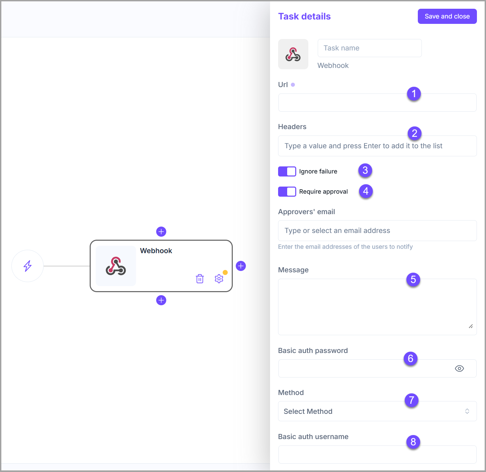

# Webhooks

This is a <mark style="color:$primary;">**Brainboard**</mark> plugin, and it allows you to communicate with an external system that is accessible through an **API.**

<figure><figcaption></figcaption></figure>

**Configuration options**

1. **URL** of the external system.
2. **Headers.**
3. **Ignore failure:** If enabled, the execution of the following stage will be triggered even if the task fails.
4. **Require approval:** It means that this task will not be executed until approved by people added to the approvers' list.
   * The task remains blocked until all approvers added in the list approve it.
   * When enabled, it allows you to add approvers to the list.
   * The approver has to be a <mark style="color:$primary;">**Brainboard**</mark> user.
5. **Message:** Payload to send with the API post request.
6. **Basic auth password.**
7. Method: <mark style="color:$primary;">**`GET`**</mark>, <mark style="color:$primary;">**`POST`**</mark>, <mark style="color:$primary;">**`PUT`**</mark>, **`PATCH`**, or <mark style="color:$primary;">**`DELETE`**</mark>.&#x20;
8. **Basic auth username.**
