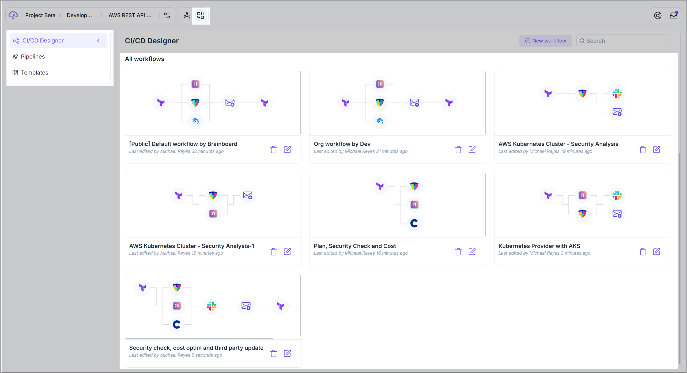
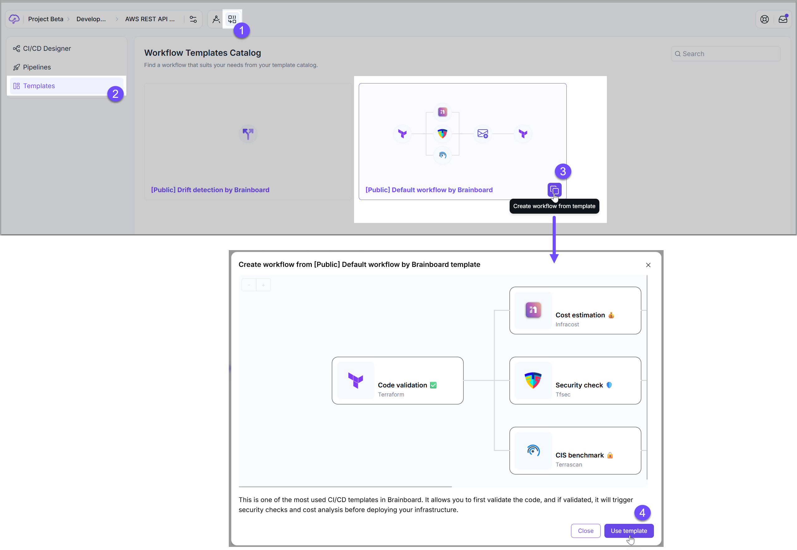
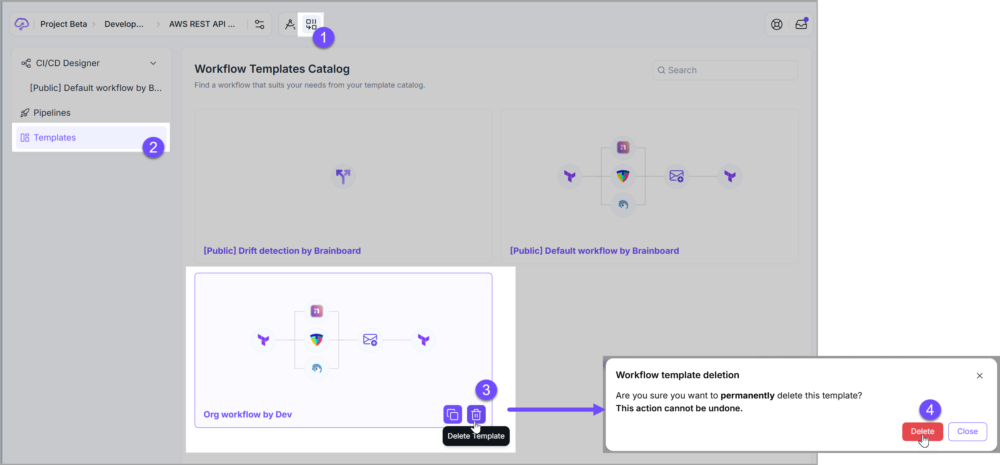

# Workflow templates

### Description

<mark style="color:$primary;">**`Workflow templates`**</mark> is a library of templates that contains all workflow scenarios that you build once and use everywhere.


This is a great way to standardize your deployment process without reinventing the wheel, as it allows you to stay **DRY (don't repeat yourself)** even at the workflow level. You no longer need to copy and paste **YAML** files and manually change them for every architecture.


<figure><figcaption></figcaption></figure>

### Create template

To create a new template, refer to the page: [create workflow template](ci-cd-designer.md#create-workflow-template). It contains all the details.

### Clone template

To clone a template and add it to your architecture:

1. Go to the <mark style="color:$primary;">**`CI/CD`**</mark> tab in the top navigation bar, within your architecture.&#x20;
2. Click on <mark style="color:$primary;">**`Templates`**</mark> in the left menu.
3. Hover the workflow template you want to clone, and click on the **copy icon** at the bottom-right corner of the template thumbnail. Its tooltip will display <mark style="color:$primary;">**`Create workflow from template`**</mark> when hovered over.&#x20;
4. Confirm the action by clicking the <mark style="color:$primary;">**`Use template`**</mark> button on the <mark style="color:$primary;">**Create workflow from template**</mark> confirmation modal.&#x20;

<figure><figcaption></figcaption></figure>

### Delete template

To delete a template:

1. Go to the <mark style="color:$primary;">**`CI/CD`**</mark> tab in the top navigation bar, within your architecture.&#x20;
2. Click on <mark style="color:$primary;">**`Templates`**</mark> in the left menu.
3. Hover the workflow template you want to clone, and click on the **bin icon** at the bottom-right corner of the template thumbnail. Its tooltip will display <mark style="color:$primary;">**`Delete template`**</mark> when hovered over.&#x20;
4. Confirm the action by clicking the <mark style="color:red;">**`Delete`**</mark> button on the <mark style="color:$primary;">**Workflow template deletion**</mark> confirmation modal.&#x20;

<figure><figcaption></figcaption></figure>


Deleting a workflow template cannot be undone.


### Best practices

1. It's a good practice to include **security checks** as part of your process. Users will get used to it and will help you raise awareness about infrastructure security.
2. **Create** as **many workflows** as you can to represent your deployment scenarios. It helps your team members quickly pick the right one.
3. Always add a **description** when you create a template.
4. Put generic emails (the team's email) in the approvals field in tasks before creating templates so they are not dependent on specific persons.
5. You can use **naming conventions** for workflows, especially if you have workflows for different teams.
