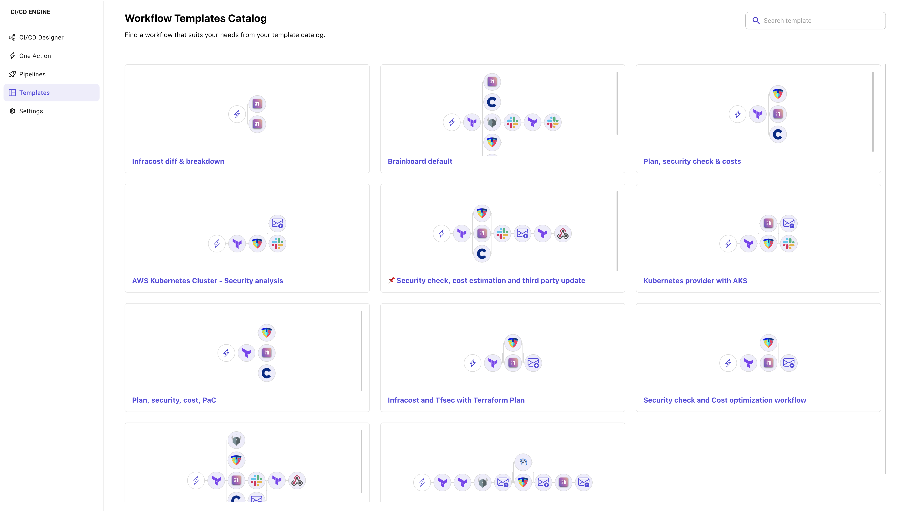

# Workflow templates

### Description

`Workflow templates` is a library of templates that contains all workflow scenarios that you build once and use everywhere.

This is a great way to standardize your deployment process without reinventing the wheel as it allows you to stay DRY (don't repeat yourself) even at the workflow level. You no longer need to don't copy and paste YAML files and manually change them for every architecture.

### Create template

To create a new template, refer to the page: [create workflow template](broken-reference). It contains all the details.

### Clone template

To clone a template and add it to your architecture:

1. Go the `deploy` tab within your architecture
2. Click on `Templates` in the left menu
3. Hover the workflow template you want to delete
4. Click on `Create workflow from template`
5. Confirm the action

### Delete template

To delete a template:

1. Go the `deploy` tab within your architecture
2. Click on `Templates` in the left menu
3. Hover the workflow template you want to delete
4. Click on `Delete template`
5. Confirm the action to permanently delete it


Deleting a workflow template cannot be undone.


### Best practices

1. It's a good practice to include security checks are part of your process. Users will get used to it and will help you raise the awareness about infrastructure security.
2. Create as many workflows that represent your deployment scenarios. It helps your team members quickly pick the right one.
3. Always add a description when you create a template.
4. Put generic emails (team's email) in the approvals field in tasks before creating templates to not be dependent on specific persons.
5. You can use naming conventions for workflows, especially if you have workflows for different teams.
