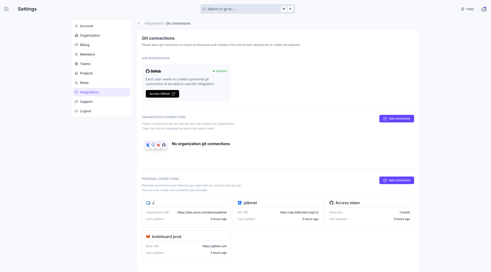
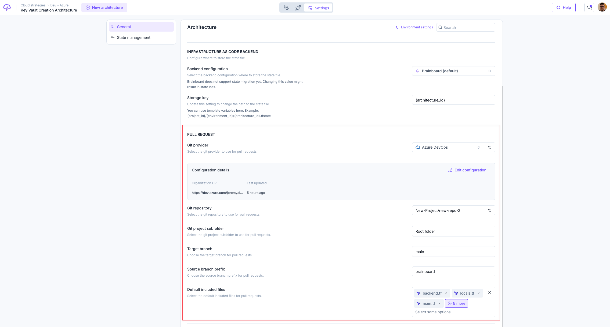
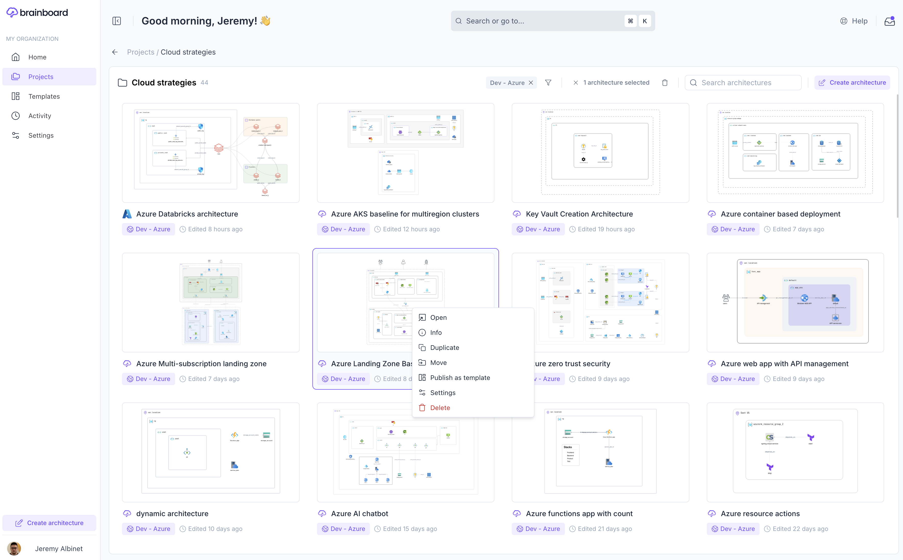
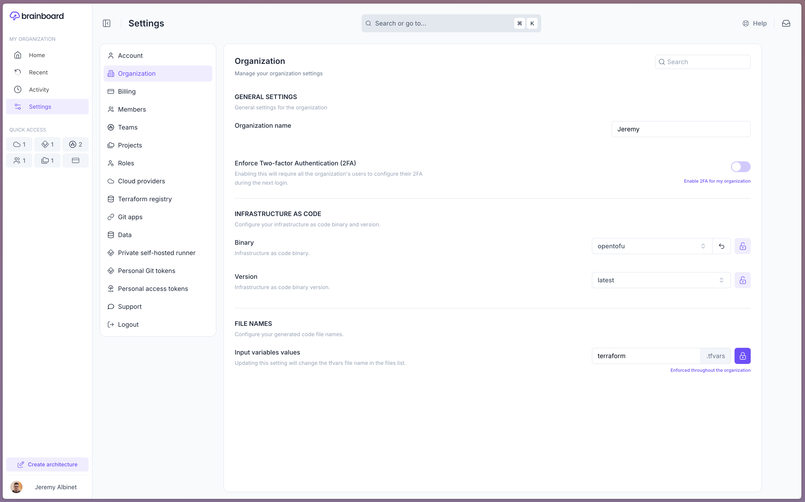
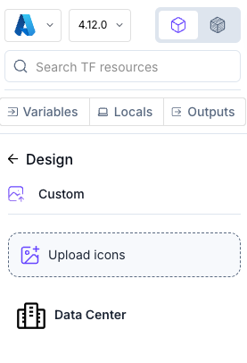
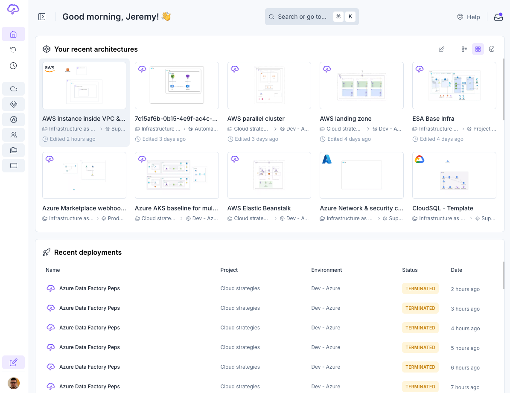

# Changelog

### 2025.06.2 - Jun 05, 2025

#### ✅ Bug Fixes

* CI/CD / Pipelines
  * Improved error handling and logging to prevent deadlocks during pipeline updates, resulting in more robust and reliable pipeline execution for all users.
  * Enhanced URL validation to support complex URLs with ports and query parameters, ensuring smoother integrations (e.g., MS Teams).
* Code edition
  * Removed unnecessary initialization of module graphics, ensuring that module containers correctly retain their existing children—improving diagram accuracy and consistency.

***

### 2025.06.1 - Jun 03, 2025

#### ✅ Bug Fixes

* Cloud Provider Credentials
  * Introduced a custom tree view to manage credential scopes, offering a more intuitive interface and removing reliance on external UI libraries.
* Workflow
  * Enhanced logging and error handling for job processing, making troubleshooting and monitoring more reliable for all users running pipelines and automations.

***

### 2025.05.9 - May 30, 2025

#### ✅ Bug Fixes

* Project Creation
  * Fixed an issue that prevented users from creating new projects, ensuring all users can now reliably add projects.
* Project & Environment Selection
  * Resolved a bug that caused broken project and environment selection in the architecture wizard, ensuring users can now select the correct context for their work.
  * Addressed scenarios where the wrong project or environment could be selected, improving consistency for all users working with templates and new architectures.

***

### 2025.05.7 & 2025.05.8 - May 29, 2025

#### 🎉 Features and Improvements

* Leftbar
  * The Leftbar and related components have been fully redesigned and migrated from Material-UI to SCSS, delivering a faster, more modern, and visually consistent interface.
  * Improved usability and clarity when selecting cloud providers and versions, with a streamlined dropdown experience and better feedback.

#### ✅ Bug Fixes

* General
  * Fixed an issue where list selection was not working as expected, ensuring accurate selection and improved usability for all users.
* Architecture Warnings
  * Architecture warnings now ignore "brainboard\_group" resources in hierarchy checks, reducing unnecessary alerts and making warnings more relevant.
* Settings - Architecture
  * Git-related errors are now clearly displayed in the settings page, making it easier to diagnose and resolve configuration issues.
* Import from files
  * When importing architectures, resources from reserved files (like `providers.tf`, `variables.tf`, `outputs.tf`, `locals.tf`, and `backend.tf`) are now automatically moved to the `main.tf`, ensuring a smoother and more consistent import experience.
* Git Configuration
  * Fixed error handling across Git settings, selectors, and API calls, so users now receive clearer feedback when issues arise.
* Project selector / Architecture selector
  * Resolved a bug that caused the same project to appear multiple times in the selector, providing a cleaner and more accurate project selection experience for all users.

***

### 2025.05.6 - May 27, 2025

#### 🎉 Features and Improvements

* **Infrastructure Management**
  * Introduced a new Terraform provider schemas service, enabling more accurate validation and support for the latest provider features.
* **Code Edition / Bidirectional**
  * Added autocomplete suggestions for Terraform/OpenTofu attributes and variables in the Monaco editor, streamlining code editing and reducing errors.

#### ✅ Bug Fixes

* **Design Area / Diagram**
  * Fixed an issue where nodes could become detached from their parent when another child was deleted, improving diagram stability for all users.
* **Identity Card**
  * Resolved problems with the retrieval of the resource identity card in multi-cloud architectures, ensuring accurate attribute display and editing.
* **CI/CD**
  * Fixed saving and display of custom CI/CD task names, so custom names now persist as expected.
* **Architecture Warnings**
  * The warnings indicator now hides when there are no active (non-ignored) warnings, reducing unnecessary distractions for users.
* **Modules**
  * Enhanced the module card source field with better text overflow handling for improved readability.

***

### 2025.05.5 - May 15, 2025

#### 🎉 Features and Improvements

* Design Area - Architecture Warnings
  * Locating resources with warnings now animate and auto-focus when selected from the warnings tab, making it easier to locate and address issues.
  * Added a new warning type to detect connectors linked to non-existent nodes, automatically  resolving diagram inconsistencies.
  * Improved feedback and visibility for architecture warnings, including clearer grouping, new button placement, and enhanced notification styles.
* Design Area - Nodes & Contextual Menus
  * The contextual menu now allows you to duplicate or lock nodes directly, streamlining common actions for faster diagram editing.
  * Group actions (like duplicate and lock) are now available when selecting multiple nodes for more efficient bulk operations.
* Code Editor
  * When variables, locals, or outputs are moved between files, the code editor now provides clear feedback so you always know what changed and where.
* Home Tab - Recent Architectures
  * Added a contextual menu to architecture cards in the home tab grid view, allowing quick actions and detailed views right from your dashboard.
  * Double-clicking an architecture card now takes you directly to the design page, speeding up navigation.

#### ✅ Bug Fixes

* Design Area - Layout & Usability
  * The "Templates Catalog" and "Architecture Warnings" buttons have been repositioned for better accessibility and no longer overlap other controls.
* Project Settings / Environment Creation
  * Fixed an issue that prevented creating new environments from the project settings modal, ensuring all users can add environments as needed.
* Code Editor
  * Reverted a change that enforced a specific font in the code editor, restoring your preferred font experience.

***

### 2025.05.4 - May 08, 2025

#### 🎉 Features and Improvements

* Code Edition / Bidirectional
  * Enforced margin for line decorations in the bidirectional code editor, ensuring a consistent and user-friendly experience for all Terraform file edits, regardless of user settings.
* Settings
  * Added easy-access documentation links for Git and Terraform backend provider forms, helping users quickly find relevant setup guides directly from the settings pages.

#### ✅ Bug Fixes

* Design Area / Diagram
  * Fixed an issue where clicking on the resizer panel could cause errors, ensuring stable resizing for all users and preventing unexpected interruptions.

***

### 2025.05.3 - May 07, 2025

#### 🎉 Features and Improvements

* Variables/Locals/Output
  * Improved Terraform variable import: Now creates new variables when changing scope and updates only when values actually change, making variable management more intuitive and accurate.

#### ✅ Bug Fixes

* Screenshot
  * Fixed issues where screenshots and thumbnails could fail due to ignored warnings, ensuring all users receive up-to-date visual previews.
* CI/CD & One Action
  * Pipeline status updates now immediately display the last job status message, giving users real-time feedback on pipeline progress. This fix also ensure one action outputs is updated once the job starts.
  * Resolved terminal height issues in CI/CD pipelines, ensuring a consistent and user-friendly terminal view during deployments.
* Design Area / Diagram
  * Improved handling of missing child nodes when updating positions or finding descendants, preventing errors in complex diagrams.
  * Improved error handling to prevent crashes when updating or searching for non-existent nodes, ensuring smoother diagram editing for all users.
  * Fixed undo/redo metadata for synced architectures, so changes can be reliably reverted or reapplied in collaborative environments.
* Code Edition / Bidirectional
  * Fixed error messages not disappearing when reverting code changes, making the bidirectional editor clearer and less confusing.
  * Prevented errors by clamping line numbers and adding necessary null checks, improving overall code editor stability.

***

### 2025.05.2 - May 07, 2025

#### ✅ Bug Fixes

* Identity Card
  * Fixed an issue where certain fields could cause editors to fail to initialize (e.g. `for_each`), ensuring a smoother experience when editing custom code attributes.
* Infrastructure as Code / Terraform
  * Updated variable validation `error_message` to align with industry standards, providing clearer feedback when variable values do not meet requirements.

***

### 2025.05.1 - May 06, 2025

#### 🎉 Features and Improvements

* Design Area / Diagram
  * Added architecture warnings detection and an autofix mechanism to help users quickly identify and resolve common design issues in cloud diagrams.
  * Improved error handling when updating diagrams, ensuring issues are logged and surfaced appropriately.
  * Enhanced node copy-to-clipboard functionality to support nested children and prevent errors.
* Code Edition / Bidirectional Editor
  * Introduced a new bidirectional code editor design with enhanced feedback, file editing restrictions, and unsaved changes prompts to streamline code and diagram synchronization.
  * Added banners and tooltips to guide users on code edition limitations and best practices.
  * Improved detection and messaging for renaming restrictions and variable warnings in Terraform files.
  * Added support for clickable URLs in job output and editor hints for easier navigation.
  * Improved code editor font consistency and fixed text cursor issues for better editing experience.
* CI/CD / Workflow Designer
  * Improved configuration forms and validation for task and workflow settings.

#### ✅ Bug Fixes

* Design Area / Diagram
  * Fixed an issue where node counts were incorrect when both resources and data were present in an architecture revision.
  * Resolved an error when copying nodes with nested children.

***

### 2025.04.13 - Apr 24, 2025

#### 🎉 Features and Improvements

* Code Edition/Bidirectional
  * Added a new feedback component in the code editor to provide real-time feedback on save operations, including success and error states, improving user interaction with the editor.

#### ✅ Bug Fixes

* Code Edition/Bidirectional
  * Fixed issues with Terraform code unsaved state detection, ensuring users are correctly prompted to save changes.
  * Enhanced Terraform block parsing to support heredoc syntax, expanding the editor's capability to handle complex configurations.
  * Resolved issues where variable warnings appeared incorrectly, ensuring warnings are only shown when necessary.
  * Improved error handling in the Terraform code editor to prevent illegal line number errors, enhancing stability and user experience.

***

### 2025.04.12 - Apr 23, 2025

#### ✅ Bug Fixes

* Design Area / Diagram
  * Enhanced the design area to ensure connectors are always rendered on top even when a container is selected, improving visibility and interaction.
* Code Edition/Bidirectional
  * Removed unnecessary open idcard button for variables, locals or outputs, streamlining the code editing experience.
* Architecture Templates
  * Resolved an issue where scrolling on a template page inadvertently scrolled the readme, improving user navigation and reading experience.
* Global
  * Improved the ComboBox component used in many places like Git repository selection to ensure dropdown options are always visible within the screen, enhancing usability and accessibility.
* Variables/Locals/Output
  * Fixed the premature closing of the variable deletion modal, ensuring it remains open until all processes are complete, thus preventing accidental closures.

***

### 2025.04.11 - Apr 23, 2025

#### 🎉 Features and Improvements

* Code Edition/Bidirectional
  * Introduce a modal to manage unsaved Terraform code changes, prompting users to save or discard unsaved changes.
  * Add Variables, Locals and Outputs cache invalidation after code edition of respectively `variables.tf`, `terraform.tfvars`, `locals.tf` or `outputs.tf` to ensure data freshness.
  * Add a button in the Monaco editor to open the ID card directly from the code, improving the UX and allowing the user to always copy-paste the code.
* Design Area / Diagram
  * Keep selected files persistent when switching between Value and Design areas.
* Topbar
  * Integrate architecture selector into the new topbar for easier project navigation.
* API Documentation
  * Add missing path parameters and operation IDs to enhance API documentation clarity: [https://api-docs.brainboard.co](https://api-docs.brainboard.co)

#### ✅ Bug Fixes

* **Import from Cloud**
  * Fix attribute retrieval in Terraform state when dealing with resources with repeated blocks, ensuring accurate code generation.

***

### 2025.04.10 - Apr 17, 2025

#### 🎉 Features and Improvements

* Integrations - Cloud provider connection
  * Enhanced AWS assume role creation instructions.
* Import from Cloud provider
  * Added support of some AWS Cognito TF resources: `aws_cognito_user_pool` & `aws_cognito_identity_pool`
* Code Edition/Bidirectional
  * Enabled updates to `terraform.tfvars` file
  * Updated graphics via bidirectional synchronization when the architecture diagram is empty.

#### ✅ Bug Fixes

* Identity Card
  * Automatically load the selected cloud provider version when opening the identity card to ensure attributes are properly re-fetched.
* Node / Containers
  * Corrected node metadata region updates from bidirectional synchronization to ensure accurate data representation.
* New architecture - Git import
  * Fixed import of Terraform modules by checking if the module exists in currently imported modules.
  * Automatically select Git credentials if only one option is available, simplifying the setup process.
* CI/CD Designer
  * Resolved double scrolling issue in the CI/CD workflow preview for a more seamless navigation.

***

### 2025.04.9 - Apr 16, 2025

#### 🎉 Features and Improvements

* Git Configuration
  * Automatically set the pull request settings when creating a new architecture via git import, streamlining the setup process.
* Code edition - User Interface
  * Refactored the handling of editor modes in the design area to prevent losing unsaved changes, providing a smoother user experience when the page is refocused.

#### ✅ Bug Fixes

* Terraform Pane
  * Enhanced the Terraform code editor by adjusting the height of the pane for better visual alignment with the future topbar redesign.
* Code edition - locals & variable
  * Enhanced the code parsing process to skip variable or local deletion if they are edited from a different file, ensuring data integrity.
* Terraform Git Module
  * Corrected the handling of Terraform git module versions during import to ensure the correct version is always used.
* Identity Card
  * Fixed a spacing issue in the search functionality, affecting users who frequently use the search feature within the Identity Card.

***

### 2025.04.8 - Apr 15, 2025

#### ✅ Bug Fixes

* Code edition
  * Improved marker hooks and subscription handling for better performance and reliability in bidirectional editing.
  * Enhanced Terraform code import by using architecture provider versions, ensuring compatibility and reducing errors.
* New architecture
  * Resolved crashes at the last step when creating new architectures from the topbar or project selector, enhancing stability for users transitioning between architectures.

\

***

### 2025.04.7 - Apr 15, 2025

#### ✅ Bug Fixes

* Import from Git
  * Fixed search functionality when listing Bitbucket repositories by updating the library and modifying API calls.
  * Updated the interface for a cleaner layout and better visual hierarchy.

***

### 2025.04.6 - Apr 14, 2025

#### ✅ Bug Fixes

* Architecture
  * Enhanced the architecture creation process to prevent mismatches between environments and projects, ensuring data integrity.
* Git Configuration
  * Updated error handling in the Git plugin for better response management.
* Global
  * Prevented unnecessary page refresh during token refreshes, enhancing performance.

***

### 2025.04.4 - Apr 07, 2025

#### ✅ Bug Fixes

* Git Configuration
  * Resolved issues in the migration command to ensure it correctly filters modules with valid credentials.
* Identity Card
  * Improved error notification behavior for ID card fetch failures, ensuring notifications are only shown when opening the ID card, reducing unnecessary alerts.
* RBAC
  * Fixed the default `Admin` role adding `get` and `list` permissions to `User credentials`, enhancing security and reliability.

***

### 2025.04.3 - Apr 07, 2025

#### 🎉 Features and Improvements

* Git Connections & Pull request configuration

<figure><figcaption>
Integrations > Git connections
</figcaption></figure>

<figure><figcaption>
Architecture Settings > Pull request configuration
</figcaption></figure>

#### ✅ Bug Fixes

* Identity Card
  * Prevented the Identity Card from closing when the autocomplete is open, ensuring smoother user interactions.

***

### 2025.04.2 - Apr 03, 2025

#### 🎉 Features and Improvements

* Homepage
  * Added a 'Projects' tab to the homepage, allowing users to view and manage projects & architecture directly from the main interface.

<figure><figcaption>
Homepage - Projects &#x26; Architectures
</figcaption></figure>

#### ✅ Bug Fixes

* Connector
  * Resolved issues with connector paths breaking when moving handlers, ensuring smoother and more reliable diagram adjustments.

***

### 2025.04.1 - Apr 02, 2025

#### ✅ Bug Fixes

* Pipelines - One Actions
  * Send pipeline status update events when creating a pending pipeline, improving real-time notifications and switch to One-Action job's output.
* Pull Request in CI/CD
  * Added support for custom commit messages in pull requests, allowing for more personalized and descriptive commit histories.

***

### 2025.03.11 - Mar 31, 2025

#### 🎉 Features and Improvements

* SSO
  * Enhanced user role assignment using claims for organization roles.

#### ✅ Bug Fixes

* Identity Card
  * Enhanced input focus handling to prevent unexpected closures.
  * Fixed input focus handling to prevent unexpected closures.
* Variables/Locals/Output
  * Improved handling of multi-line descriptions for local variables, ensuring correct formatting.
  * Addressed variable suggestion issues, ensuring variables appear promptly in the list.
* Diagram
  * Only normalized resource names to lowercase for modules, improving consistency.

***

### 2025.03.10 - Mar 24, 2025

#### 🎉 Features and Improvements

* Workflow
  * Introduced a cancel job functionality, allowing users to stop ongoing tasks with ease.

#### ✅ Bug Fixes

* Import from Cloud Provider
  * Enhanced import parser to clean redundant connectors (connectors from a resource to a parent container), ensuring better diagram generation.
  * Fixed issues with Azure certificate credential handling during cloud provider import, ensuring smoother integration for Azure users.
* Infrastructure as Code
  * Improved parsing by quoting block attribute keys that start with "--" ensuring better compatibility and error handling.

***

### 2025.03.9 - Mar 20, 2025

#### 🎉 Features and Improvements

* Design Area / Diagram
  * Enhanced visual feedback during node resizing for a smoother design experience.
* Home Page - Architecture Templates
  * Added homepage templates with new components and design adjustments for a more intuitive user experience.
* Settings
  * Refactored Terraform backend settings to use credentials, improving backend management.

***

### 2025.03.8 - Mar 13, 2025

#### 🎉  Features and Improvements

* Architecture Templates
  * Introduced a new feature for creating architectures using templates, enhancing the setup process with updated components and configurations.

#### ✅ Bug Fixes

* Code edition
  * Improved variable scope management during bidirectional imports, ensuring accurate scope handling and reducing unnecessary filtering.
* Templates
  * Fixed an issue where the modal would close unexpectedly when sorting, improving user interaction by preventing accidental closures.

***

### 2025.03.7 - Mar 12, 2025

#### ✅ Bug Fixes

* RBAC
  * Fixed the issue where role status remained in a loading state when enabling or disabling multiple roles.
* Containers
  * Corrected the bug where resizing a container smaller did not remove its children, preventing duplicate children.

***

### 2025.03.6 - Mar 11, 2025

#### 🎉 Features and Improvements

* Design Area / Diagram
  * Introduced dynamic visual indicators for node parentship changes during movement, enhancing the design experience.
  * Adding text overflow for container titles, ensuring better readability
* Global
  * Improved text overflow handling, ensuring better display of long text.

#### ✅ Bug Fixes

* Connector
  * Fixed the positioning of the Connector Options Bar to ensure it displays correctly relative to the selected connector part.
* Node / Containers
  * Prevented the display of container connector anchors when multiple nodes are selected, ensuring clarity in node selection.
* Cloud connections
  * Corrected the file type restrictions for Google and OCI credentials, ensuring users upload the correct file formats.

***

### 2025.03.5 - Mar 10, 2025

#### 🎉 Features and Improvements

* Design Area / Diagram - Connectors
  * Added offsets to container connector anchor points, improving the accuracy and visual alignment of connections.
* New architecture - all imports
  * Fixed the default style of diagrams created via import to maintain visual consistency.
* Settings
  * Unified the UI across all settings pages for a more consistent user experience.
* Readme
  * Automatically opens the README file in preview mode if it contains content, streamlining the review process.

#### ✅ Bug Fixes

* Git Configuration - Github
  * Fixed the oauth2 route forgotten during settings refactoring, improving flexibility in Git configurations.
* Authentication
  * Corrected the logout functionality, ensuring users can log out without issues.
* Home Page
  * Added missing status badges for recent deployments, providing clearer status updates.
* Design area
  * Prevented code omissions in the node contextual menu for non-TF resources (icons or logos).

***

### 2025.03.4 - Mar 07, 2025

#### 🎉 Features and Improvements

* New version popup
  * Enhanced the design of the new version banner for a more modern look.
* Diagram Generation (Import)
  * Fixed diagram node clustering to improve the accuracy of node placement and connections.
* Settings
  * Updated settings breadcrumbs to align with new identifiers for improved navigation.

#### ✅ Bug Fixes

* Project / Environment / Architecture
  * Architectures are now automatically deleted when environments are removed, streamlining project management.
* Git Configuration
  * Resolved an issue where Git credentials were not loading preventing user to import from Git when they start from the home page, ensuring smoother access.
* Settings
  * Corrected the redirect link in settings documentation to point to the correct page.
  * Fixed the minimum width of text fields in settings for better UI consistency.

***

### 2025.03.3 - Mar 06, 2025

#### 🎉 Features and Improvements

* Settings
  *   New Settings engine with a hierarchical structure that follows this inheritance pattern:

      **Organization → Project → Environment → Architecture**
  * Documentation available here: [overview.md](settings/overview.md "mention")
  * We will continue to migrate our settings (Remote backend, Git configuration, ...) to this new engine in the coming weeks.

<figure><figcaption>
Organization Setting page
</figcaption></figure>

#### ✅ Bug Fixes

* Architecture
  * Fixed clone architecture functionality to support variable values of any type (including list/array).
* One-action
  * Introduced GraphQL subscription for real-time pipeline status updates, enhancing performance.

***

### 2025.03.2 - Mar 04, 2025

#### ✅ Bug Fixes

* New Architecture
  * Fixed issues with architecture creation by adding template selection and improving project/environment data handling.

***

### 2025.03.1 - Mar 03, 2025

#### 🎉 Features and Improvements

* Global
  * Introduced a new `Time` component for consistent date formatting across the platform.

#### ✅ Bug Fixes

* New architecture - Import from Cloud provider
  * Updated import cloud provider flow to prevent INVALID\_BODY error message, improving the architecture creation process.
* Home page - Recent deployments
  * Added a 'warning' status to deployment status mappings for better status visibility.
* Leftbar
  * Fixed the visibility issue when adding or pinning a module, ensuring all modules are displayed correctly.
* Settings - Projects
  * Resolved the "View details" option in the project list to ensure dropdowns close correctly after selection.
* Architecture Templates
  * Fixed the sync architecture modal to ensure it updates correctly with project data changes.

***

### 2025.02.11 - Feb 27, 2025

#### 🎉 Features and Improvements

* CI/CD - Plugin
  * MS Teams URL validation to include new webhook URL format, ensuring more robust integrations.
* Public API
  * Added VersionArchitecture endpoint to the public API documentation for better version management.
* New version notification
  * Enhanced the "New version available" component for better update notifications.

#### ✅ Bug Fixes

* Architecture
  * Prevented architecture creation if required fields are not filled, ensuring data integrity.
* Design Area
  * Fixed icons rendering issue on Firefox, ensuring a better diagram visualization on all supported browsers.
* Home Page
  * Added trial check in billing handler to correctly process trial subscriptions.
* Node configuration / Identity Card
  * Updated Identity Card component to show the cursor only on the drag handle, enhancing usability.

***

### 2025.02.10 - Feb 19, 2025

#### 🎉 Features and Improvements

* Design Area - Node
  * Enhanced context menu (right-click) for better user interaction.
  * Added state actions (import or delete from state) to the new contextual menu, enhancing Terraform state management and UI interactions.
* Text Node
  * Introduced Markdown support for text nodes, allowing for richer text formatting.

#### ✅ Bug Fixes

* Identity Card
  * Maintains focus on the Identity card during search for a smoother user experience.
* Design Area / Diagram
  * Fixed the Terraform filename selector by adding search functionality and improving dropdown styles.
* CICD Plugins
  * Removed Microsoft Teams URL regex validation to support new webhook URL format.
* Infrastructure Management
  * Skipped decreasing license user count when removing a member with a pending invitation, ensuring accurate license management.

***

### 2025.02.9 - Feb 14, 2025

#### 🎉 Features and Improvements

* Pull Request
  * Refactored the pull request user experience for a more intuitive workflow.

#### ✅ Bug Fixes

* Licensing
  * Resolved licensing issues by removing outdated billing plan references, ensuring compliance and smoother user management.
* Import from Files
  * Corrected file upload validation to accurately handle invalid extensions, improving file import reliability.
* Code edition
  * Added support for GCP region parsing, enhancing the accuracy of resource metadata.

***

### 2025.02.4 - Feb 11, 2025

#### ✅ Bug Fixes

* Architecture creation
  * Improved the summary view UX preventing the user to be softlocked selecting the project/environment where the architecture will be created.
* Screenshot / Export architecture as diagram
  * Screenshot in PRs, manual export are both resolved and working again.
* Node / Containers
  * Improved node action handling by reverting nodes to previous positions on failure and displaying error notifications.

***

### 2025.02.3 - Feb 07, 2025

#### ✅ Bug Fixes

* Import from cloud providers
  * Fixed the final import modal UI, improving error display and overall layout for a smoother user interaction.
* Git Configuration
  * Use user's input for the 'Source branch prefix' configuration
* Variables
  * Put back the 'Return to design area' for the few users that have access to the private alpha of Home page

\

***

### 2025.02.2 - Feb 05, 2025

#### ✅ Bug Fixes

* Import from Git&#x20;
  * Enhanced import functionality by using registry credentials for module imports
  * Improved error message to provide all details
* Git Configuration / Pull request
  * Updated GitLab integration to ensure repositories appear in PR searches, enhancing Git settings management.
  * Improved UI and modal handling in Git settings and pull request components, fixing layout issues.
* Design Area
  * Resolved issue where node selection was cleared when a text node was open, ensuring consistent selection behavior.

***

### 2025.02.1 - Feb 03, 2025

#### 🎉 Features and Improvements

*   Leftbar - Custom icons\

    * Introduced custom icon management, allowing users to add, edit, and delete icons for a personalized experience.

    <figure><figcaption></figcaption></figure>
*   Home Page \[Private access]

    <figure><figcaption>
New home page
</figcaption></figure>

    * Launched a new homepage with recent architectures, deployments, and activities
    * Reach out to the support team to get access to it

#### ✅ Bug Fixes

* Git Configuration
  * Resolved an issue where the incorrect version of a Terraform module was used during refresh, ensuring accurate module management.

***

### 2025.01.8 - Jan 31, 2025

#### 🎉 Features and Improvements

* Leftbar
  * Introduced the ability to expand and collapse the Leftbar and Terraform code panels via shortcuts `[` or `]`, enhancing user navigation and interface customization.

#### ✅ Bug Fixes

* Git Configuration
  * Implemented pagination for listing Git repositories, ensuring efficient loading and management of large repository lists.

***

### 2025.01.7 - Jan 30, 2025

#### 🎉 Features and Improvements

* Import files/git/modules
  * Added custom error messages for module variable parsing failures, enhancing error clarity and debugging.
* CICD: Architecture Version Plugin
  * Added success and error messages, improving user feedback and error handling.

#### ✅ Bug Fixes

* Git Configuration
  * Fixed handling of excluded files in Git pull requests within CI/CD jobs, ensuring correct file management.
  * Simplified Git settings submission logic, removing redundant functions for a cleaner user experience.

***

### 2025.01.6 - Jan 29, 2025

#### 🎉 Features and Improvements

* Design area
  *   Enhanced node inheritance, parenting, resize, and movement logic for more intuitive design interactions.\
      Inheritance and parent <> child relation will be triggered when you resize a container over nodes/containers.\

      <figure><figcaption></figcaption></figure>
* CI/CD Plugin
  * Introduced a new architecture version plugin to streamline version management.
* Identity Card & Terraform
  * Added support for boolean and ternary expressions, improving logic handling in configurations.
* API
  * Added API base URL display and documentation link to personal access token settings for easier API integration.

#### ✅ Bug Fixes

* Git Configuration
  * Re-fetch Git configuration when switching to another architecture within CI/CD workflow.
* Project Selector / Architecture Selector
  * Resolved crashes in the project selector, ensuring stability for users without assigned projects or architectures.

***

### 2025.01.5 - Jan 23, 2025

#### 🎉 Features and Improvements

* Connectors
  * Introduced animation options for connector lines and circles, allowing for a more dynamic and visually appealing design experience.
* CI/CD Plugins
  * Added the Trivy plugin, enhancing security scanning capabilities within CI/CD workflows.
* Import from Files
  * Implemented error handling for duplicate Terraform blocks during import, providing clear feedback to users.

#### ✅ Bug Fixes

* Readme
  * Enhanced the markdown editor with a switch between edit and preview modes, improving user experience when editing documents.
* Architecture Selector
  * Fixed an issue when updating the current architecture, ensuring users receive notifications if the architecture doesn't exist anymore.
  * The project selector now unfolds automatically, streamlining navigation and project management.

***

### 2025.01.4 - Jan 22, 2025

#### 🎉 Features and Improvements

* Synced architectures
  * Created architecture revisions for all synced architectures, ensuring up-to-date versions.
* CI/CD
  * Added a scrollbar to the CI/CD workflow view in pipeline details for improved navigation.

#### ✅ Bug Fixes

* Architecture selector
  * Fixed an issue where the architecture list remained empty when the last search did not match any record, ensuring accurate search results.
  * Prevented crashes if the current architecture was deleted, enhancing stability.
* Import from Cloud Provider
  * Created Terraform variables for empty required password attributes during cloud import, improving import accuracy.

***

### 2025.01.3 - Jan 16, 2025

#### 🎉 Features and Improvements

* Plugins
  * Introduced environment variable support for the Wiz plugin, enhancing configuration flexibility.

#### ✅ Bug Fixes

* Import from Cloud Provider
  * Corrected the error message when attempting to create an import with an existing name, ensuring clarity for users.
* Team Management
  * Resolved an issue with the click outside functionality when adding team members, improving user interaction and experience.

***

### 2025.01.2 - Jan 16, 2025

#### 🎉 Features and Improvements

* Design Area / Diagram
  * Revamped the Design Area Options Bar for a more intuitive user experience.
* Code edition (bidirectional)
  * Improved node creation order logic for better resource management.
* Import from Cloud
  * Added support for fetching Azure nested cloud resources by CloudID and Terraform Type like NSG subnet association (`azurerm_subnet_network_security_group_association` )

#### ✅ Bug Fixes

* Leftbar
  * Fixed broken shapes, logos, and icons when searching, improving the user interface for all users.
* Screenshot
  * Resolved issues with screenshots breaking when using custom icons or text.
* Import from Cloud Provider
  * Fixed import view issues and infinite table rendering for a smoother import experience.

***

### 2025.01.1 - Jan 07, 2025

#### 🎉 Features and Improvements

* Code Edition (Bidirectional) & Connector
  * Enabled bidirectional parsing and management of connectors for better integration and functionality.
  * Enhanced HCL parser to support bidirectional parsing of connectors, improving code management.
* Import from Cloud Provider
  * Ensured Azure resources' terraformID includes the correct case-sensitive resource group for accurate deployments.
  * Fixed JSON format issues during import to ensure correct data handling and display.

