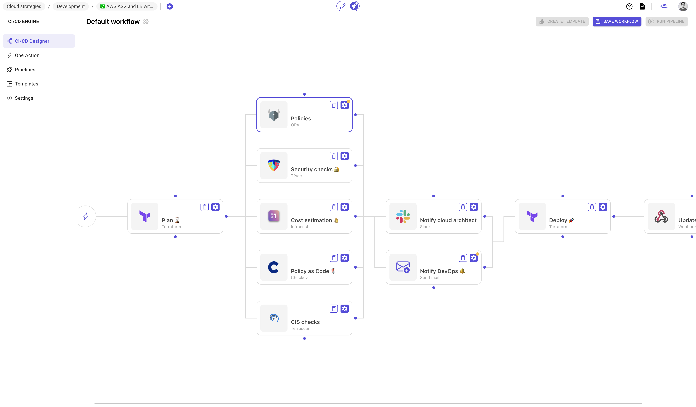
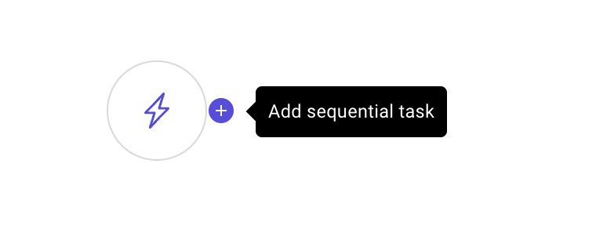
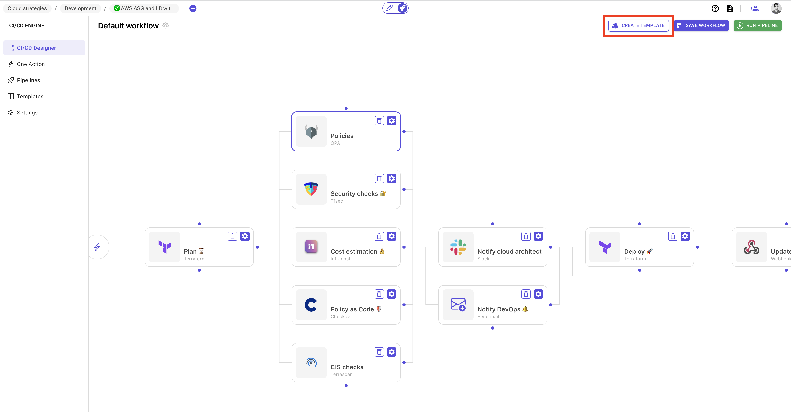
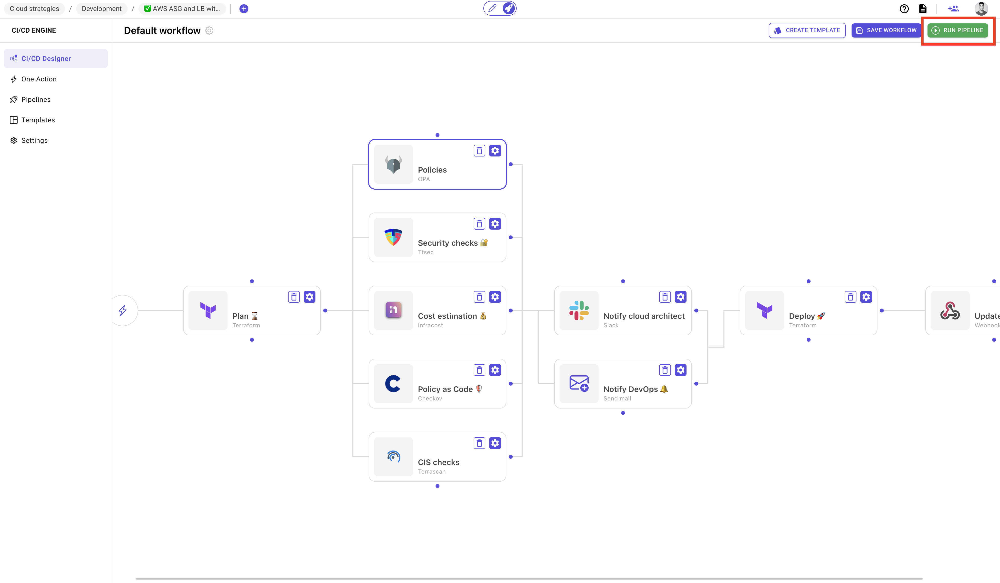

# CI/CD designer 🎨

### Description

Brainboard CI/CD designer is a visual editor that allows you to build your pipelines without any YAML knowledge.

This allows you to focus on building the logic and the right process without extra learning curve.

### Workflow

A workflow is a set of orchestrated stages that contain tasks which run either in parallel or sequentially.

So, it is a list of steps that you want your infrastructure to go through before, during and after provisioning your infrastructure.

When you create a new architecture, Brainboard by default creates an empty workflow named `New workflow`.

#### Rename workflow

To rename a workflow, click on the wheel button on the right of the workflow name: 

### Task

Task, is an individual action that you want to run to do a specific job. For e.g. Terraform apply, send Slack notification or update your ticketing system like ServiceNow.

Tasks can be created from the list of available plugins. Refer to the sections below to learn how to create tasks.

Refer to the [supported plugins](https://gitlab.com/brainboard/brainboard/-/blob/main/ci-cd-engine/supported-plugins/README.md) page to see the options for each kind of task and how to configure it.

#### Task approval

Every task contains an approval option. When activated, the tasks will not be executed until approved by people or teams added in the approvers list.

This allows you to gate the execution of actions until explicitly approved by the right people or teams, and the approver has all the information needed to take a decision to approve the task or not.

When a task has an approval, it is called manual execution.

### Stage

A `stage` is a logical grouping of parallel tasks that will be executed at the same time. They are represented vertically in the CI/CD designer.

`Stages`, in the other hand, are horizontal and looks like columns. So there is an implicit dependency between them, which means that any given stage will not be executed until all tasks in the stage before complete successfully.

:::info You can `ignore errors` in tasks of a stage to not block the execution of following stages if it makes sense in your workflow. :::

#### Add a stage

As a stage is just a logical grouping of tasks, to add a new stage, click on the `plus` button on the right of any tasks

 

Then, add vertically the tasks you want to be executed `in parallel`.

#### Delete a stage

To delete a stage, you need to delete all its vertically stacked tasks.

### Create workflow template

When your workflow is complete and all information of tasks are filled, you can create a template from it to use it on any other architecture you have or you will create.

### Run pipeline

Once your workflow is configured, you can trigger the execution of the pipeline by clicking on the button `Run pipeline`.

When the pipeline is triggered, it switches to the `Pipelines` page where you can see the output of the execution in real time.

Refer to the [pipelines page](https://gitlab.com/brainboard/brainboard/-/blob/main/ci-cd-engine/pipelines/README.md) for detailed information about pipeline.

### Best practice

* It's always a good practice to introduce hygiene in the way you build the infrastructure by triggering pipelines to analyze your architecture before pushing into the git repository.
* Don't use generic email in task's approval unless the email is already a Brainboard user.
