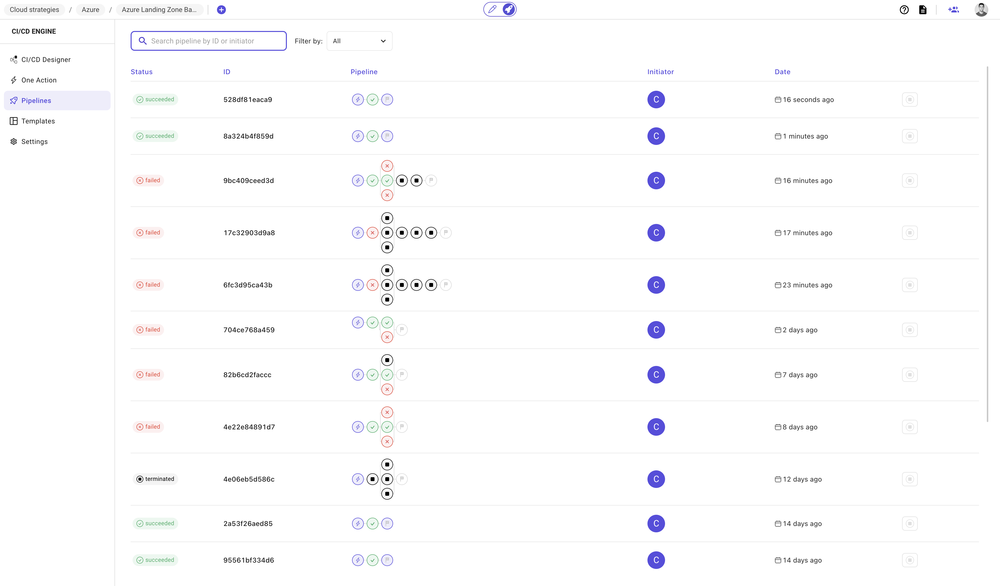

# Pipelines 🛫

### Description

Pipelines are the history of the execution of your workflow.

These pipelines contain both your triggered workflows and any action performed in `one action` tab.

### Pipeline information

#### Status

There are 7 status of any given pipeline:

1. **Scheduled**: the pipeline is accepted by Brainboard for execution and put in the pool to be picked by a runner.
   * By default: all jobs are accepted.
2. **Pending**: the pipeline is pending to be picked by a runner to execute it.
3. **Running**: the pipeline has been picked by a runner that is currently executing its tasks.
4. **Succeeded**: the execution of the pipeline ended and all tasks were successful.
5. **Failed**: the execution of the pipeline ended and some of the tasks failed.
   * The pipeline is considered failed, when at least one task fails.
   * When you ignore errors in tasks to not stop the pipeline, if they fail, the pipeline is considered failed even if the execution of the last task is successful.
6. **Terminated**: the pipeline has been stopped by a user.
7. **Manual**: the pipeline requires approval. It means that at least one task of the pipeline is pending approval.

#### Unique identifier

Every pipeline has a unique identifier. It is used to store and retrieve its output.

The `id` displayed in this column is the last 12 characters of the UUID of the pipeline.

:::tip UUID The complete UUID is visible in the URL of the browser. You use usually need it when you open a support ticket. :::

#### Visual stages and tasks

This is a minified graph of the pipeline.

It contains all tasks, and you can see the name and status of every task when you hover it.

#### Initiator

The avatar of the person that triggered the pipeline.

Hover this avatar to see the complete name of the person.

#### Date

Time of when the pipeline has been triggered.

#### Stop button

This button allows you terminate/stop a running pipeline. It is only active when the pipeline is running.

### Run pipeline

To run the pipeline, go to the CI/CD designer and click on the button `Run pipeline`.

Refer to the [CI/CD page](https://gitlab.com/brainboard/brainboard/-/blob/main/ci-cd-engine/ci-cd-designer/README.md#run-pipeline) for more details.

### Stop pipeline

To stop the pipeline, click on the button `Stop pipeline` located at the right of the pipeline. This button is only active when the pipeline is running.

### Output

To open the output of any pipeline, click on it in the table of pipelines.

#### Tasks status

Tasks has the same [status](pipelines.md#status) as the pipeline.
