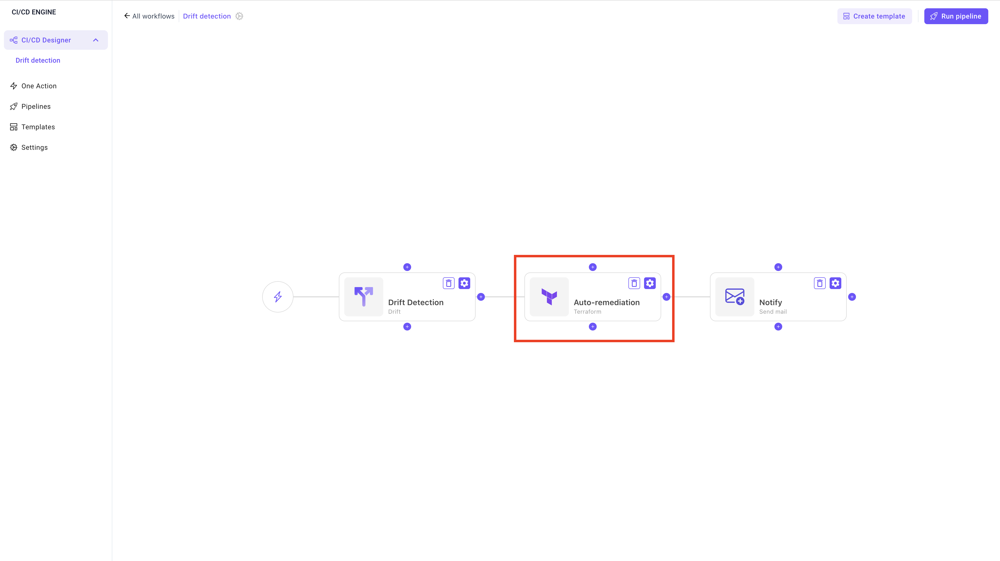

# Remediation 🔃

### Definition

The remediation of a drift is the action of bringing back the deployed infrastructure and the code used to deploy it to the same state.

### Types of remediation

When a drift happens, you have 2 ways to remediate to it:

#### 1. Override the infrastructure

This consists of redeploying the code that describes the infrastructure because it is the source of truth and any changes happening outside the code should be reverted.

You have 2 methods to implement this type of remediation:

*   **Automatic:** In the drift detection workflow that you create, you can add as a task Terraform apply. Which means whenever the workflow executes, it will always redeploy the current code when any change is detected.&#x20;

    <figure><figcaption></figcaption></figure>


Please refer to [this page](./) to know how to create a drift detection scheduled workflow.



This automatic remediation should be used with caution. It usually requires a team effort and we advise you to always send a notification from any drift detection workflow you setup.


* **Manual:** In this case, you manually inspect the output of the drift detection and manually redeploy the infrastructure, either by triggering the deployment [pipeline](https://gitlab.com/brainboard/brainboard/-/blob/main/ci-cd-engine/ci-cd-designer/README.md#run-pipeline) or doing a Terraform apply from[ one ](../../one-action.md)[action](../../one-action.md).

#### 2. Bring changes to the code

In this case, you add the changes that have been applied to provisioned infrastructure to the code.

This is useful and required in situations where the changes are legitimate. The common example is during a security incident and as an emergency response, users make the change on the cloud provider because it is quicker, especially if the pipeline to deploy with Terraform takes time.
