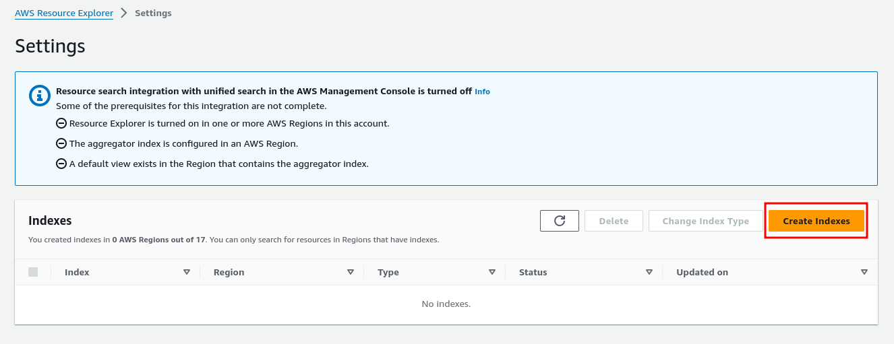
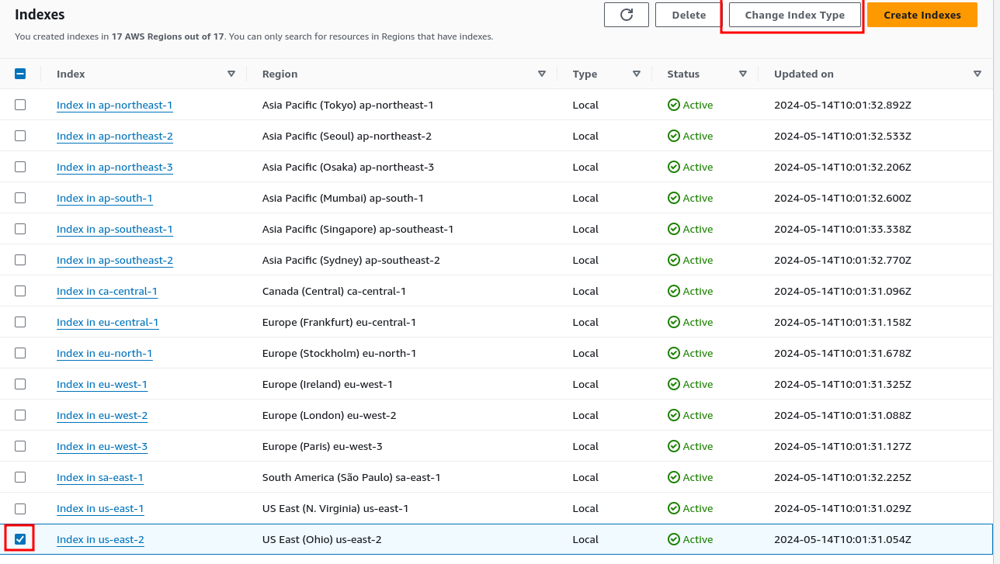
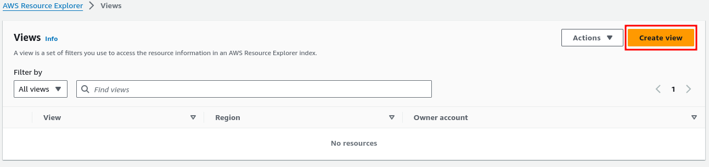
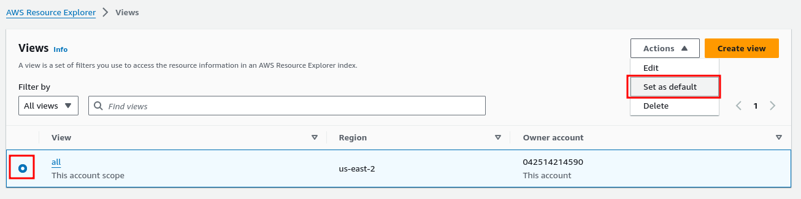

# Import from cloud provider

### Description

When creating a new architecture from existing data, you can select the cloud provider option.

This feature will allow you to import existing resources already deployed in your cloud provider account, in order to generate the corresponding architecture diagram and Terraform code.

:::info Brainboard only supports import from Azure and AWS cloud providers for now. :::

### Import from AWS provider prerequisites

When importing resources from AWS provider, Brainboard will scan your cloud account resources using the following AWS services:

* [AWS Resource Groups Tagging](https://docs.aws.amazon.com/resourcegroupstagging/latest/APIReference/overview.html): this service will list any resource which has been tagged at least once
* [AWS resource explorer](https://docs.aws.amazon.com/resource-explorer/latest/userguide/welcome.html): this service will list all resources matching Resource Explorer view index.

Brainboard will scan your cloud account using a best effort method: it will try to find as many resources as possible, using AWS resource explorer in priority if possible.

#### Create indexes

In order for AWS Resource Explorer to list your existing resources, AWS needs to frequently update its search index.

The index is based per region, so we recommend creating indexes for all your regions and then select your main region as an **aggregator index**. An aggregator index will aggregate results from all other regions indexes.

If you haven't already created indexes, here are the steps to take:

1. Open the [AWS Resource Explorer console](https://console.aws.amazon.com/resource-explorer/home)
2. Navigate to the `Settings` menu in the left panel:

3. Click on `Create Indexes`:

4. Select all regions and click on `Create Indexes`:

5. Go back to the `Settings` menu, select your aggregator region and click on `Change Index Type`:

6. In the modal window, select `Aggregator Index` and click on `Save changes`:

#### Create a default view

When using Resource Explorer service, Brainboard will look for a **default view** in one of the regions you select during the import steps.

Here are the steps to create a default view in AWS Resource Explorer:

1. Open the [AWS Resource Explorer console](https://console.aws.amazon.com/resource-explorer/home)
2. Navigate to the `Views` menu in the left panel:

3. Click on `Create View`:

4. In the view creation form, set a name for your view and **make sure you select the region containing the aggregator index** you created in the previous step:

5. Once the view has been created, select the view and click on Actions button to set this view as default view:

### Import cloud resources

Once your account is correctly configured to list cloud resources, you can import them into a new Brainboard architecture.

1. Click on new architecture button in the top bar
2. Select the `import data` option:

3. Select the `Cloud providers` option:

4. Expand the desired cloud provider in the cloud providers list, and select the [cloud provider credentials](https://gitlab.com/brainboard/brainboard/-/blob/main/cloud-providers/configure-access/README.md) corresponding to your cloud account.
5. Select the resource groups (Azure) or regions (AWS) containing the resources you want to import and click on `Next`:

 Remember to select the region containing the default view you created in the previous step.

6. Your cloud import task has now started. The next window will display a link to track your import progress:

:::info Importing resources from your cloud account can take a long time, depending on the amount of resources Brainboard will find in your account. You can either check the import progress window regularly or wait for an email notification once the import is complete. The email notification will contain the same link, allowing you to select resources. :::

7. Once the cloud import is complete, the import window will allow you to select which resources you wish to import into your architecture:

This window will also display the remaining import credits in your Brainboard account.

Every time you select a resource to import, the number of credits that will be deducted from your account displayed at the bottom of the window is refreshed.

Once you have selected the desired resources, click next to create the Brainboard architecture.
