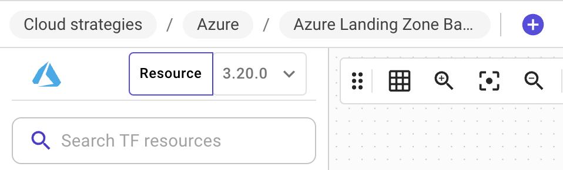

# Cloud resource ☁️

### Description

Cloud resource is any resource available at the cloud provider that has either a Terraform resource or data source associated with it.

* This resource can be drag & dropped from the left bar.
* Every cloud resource has a set of configuration parameters that you can customize on the ID card of that resource.
* There are **5** types of nodes:
  1. Cloud resource: this resource will be created when you provision the infrastructure.
  2. Data source: it refers to an existing cloud resource.
  3. Module: Terraform module.
  4. Container: it can contain other resource and give them its properties. E.g. AWS VPC, or Azure virtual network.
  5. Icon only: this resource is just graphic and has no Terraform representation.
* Refer to the [identity card](id-card.md) page for more information on how to configure resources.

### Types of resources

Brainboard supports all the supported types by Terraform. You have the possibility to switch between the 2 types of resource from the switch in the left bar.

| Resource button                                            | Data sources button                                              |
| ---------------------------------------------------------- | ---------------------------------------------------------------- |
|  |  |

#### Resources

They represent resources available at the Terraform provider for a specific version.

#### Data sources

As per Terraform definition: Data sources allow Terraform to use information defined outside of Terraform, defined by another separate Terraform configuration, or modified by functions.

They are used in architecture to reference and/or get information about a resource already deployed. Data resources could be:

* A common resource shared between multiple architectures.
* For security reasons (read-only access) resources.
* Managed by another team.

**Agnostic nodes**

Nodes like Text, or generic icons have no cloud configuration and will not be deployed into the target cloud provider.



* You can convert any cloud resource into an icon, so its code will be removed from the generated one.
  * You can put it back into cloud resource, its configuration will be preserved.
*   You also have the possibility to hide the code of any cloud resource from the generated code by clicking on the hide icon of the id-card&#x20;

    <figure><figcaption></figcaption></figure>
* You can change/customize the icon of any resource to reflect your preferences.


### Supported cloud providers

Refer to the page [supported cloud providers](../cloud-providers/supported-cloud-providers.md) for more details.

### Interactions between nodes

When you drag-&-drop any resource, for any cloud provider, the id-card of this resource will be open to allow you to configure its cloud parameters. Brainboard generates the Terraform code instantly when you close the id-card.

There is a special type of resource called `containers`, which means you can drop resources inside them, Brainboard detects the relationship between them and automatically the added resource and populate the information in the right direction.

For example:

1.  **AWS VPC & subnet**: when you add a subnet inside the VPC, Brainboard detects the relationship between them and automatically adds VPC information in the subnet resources.&#x20;

    <figure><figcaption></figcaption></figure>
2.  **Azure Virtual Network & subnet**: when you add a subnet inside a virtual network, Brainboard automatically detects their relationship and updates the code accordingly.&#x20;

    <figure><figcaption></figcaption></figure>
3.  **GCP network & subnetwork**: when you have a subnetwork inside a network, Brainboard understands it and populates the inherited information automatically.&#x20;

    <figure><figcaption></figcaption></figure>


Smart detection

* Brainboard detects which exported attribute is needed and automatically adds it to the resource. You don't need to do it automatically.
  * In the examples above, it detected that the `.id` is needed for AWS VPC and `.name` is needed for Azure vnet.
* Brainboard has the knowledge of the cloud provider of every resource and allows only actions allowed by the cloud provider.
  * E.g. you cannot add AWS resource inside an Azure container
* Within the same provider, Brainboard can understand what is allowed or not.
  * E.g. you cannot add a region inside a region, VPC inside a VPC, vnet inside vnet....
* When you change the `resource name` of any resource, Brainboard automatically updates all resources that reference it with the new value.


#### Links between nodes aka Connectors

The connector links two components together and can exist in 2 forms:

1.  **Automatically added**: this connector is added when you use a specific property of one node into the configuration of another one:&#x20;

    <figure><figcaption></figcaption></figure>

    In this example, Azure firewall uses in its public IP parameter the exported attribute `ID` of the resource public IP. Brainboard automatically generated this connect when the configuration is updated.
2. **Manually added**: This type of connector has no equivalent cloud configuration and it is just a graphical representation of the link that may exist outside of Terraform.

### Terraform code

When you add a resource into the design area, Brainboard generates its Terraform code instantly and automatically, and highlights it in the embedded VS Code editor.

When you click on any resource, Brainboard highlights it in the code and vice versa, when you click on the name of the resource in the code, Brainboard automatically selects the resource and opens its configuration menu.

### Best practices

* Always start by adding containers first into the design, this way Brainboard will detect automatically any resource you insert inside them, whatever the number of layers.
* If you want to stay compliant with Terraform, always put the Terraform resource name you choose as a text of the resource as well.
* Use the native auto-inheritance mechanism of Brainboard when you add resources. It saves you a lot of time.
