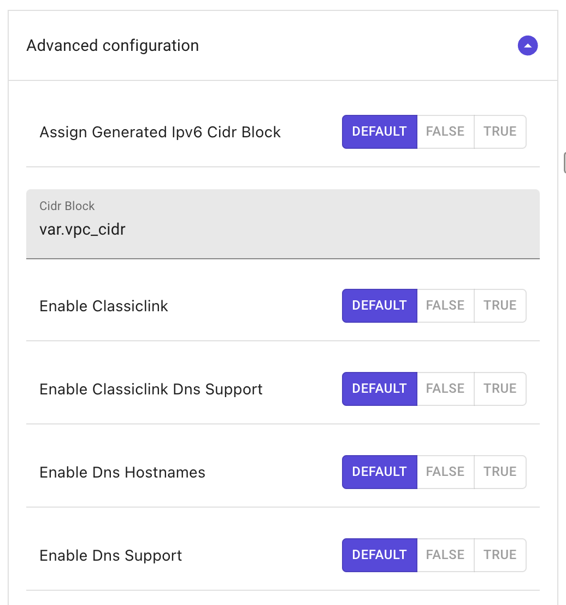
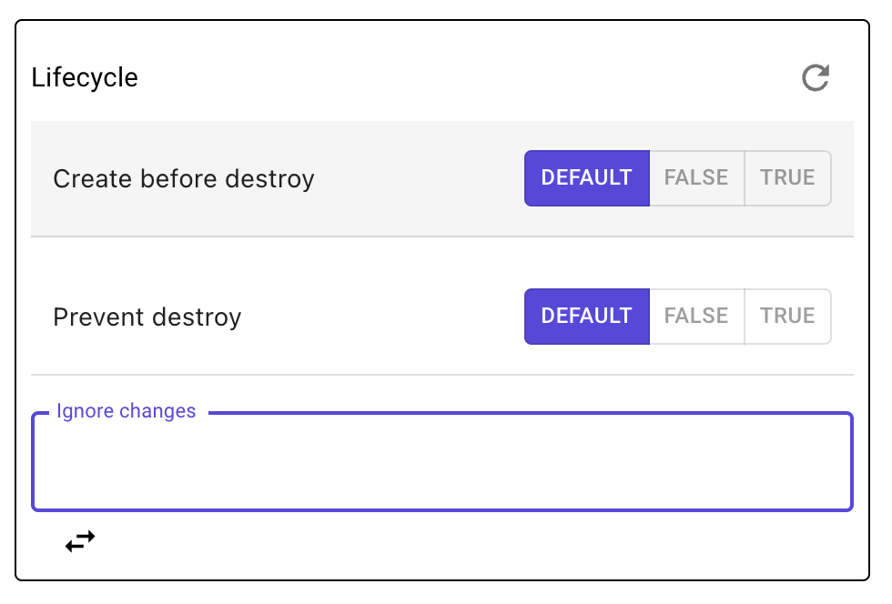

# ID card 🪪

### Description

The `ID cards` in Brainboard are configuration menu that manage all the information and details about objects in the diagram.

You can open the ID card of any resource by either selecting the resource or clicking on its name in the code.

:::info

The ID card contains `all` information about resources/data, such as their name, properties, attributes that are supported by both Terraform and the cloud provider.

:::

### Main components of card id

When you click on a node and open its id card, you have the components as below:

#### 1. Required params

A required attribute is a property or configuration setting that must be specified in order for a resource to be created or updated. These attributes are defined by the provider and are used to configure the underlying infrastructure.

#### 2. Advanced configuration

All the other parameters that are not part of the required parameters can be found in this section.

#### 3. Extra Attributes

This part contains all the advanced features of Terraform such as `count`, `for_each`, `depends_on` and `lifecycle`. You can find more details about this section [below](id-card.md#advanced-configuration).

#### 4. Exported attributes

These attributes are information of the resource that you can use in another resource to refer to a specific value of a parameter.

These attributes are also used in output blocks to define attributes that you want to make available for other Terraform modules to use.

:::info An exported attribute is simply a value that is created by one Terraform module and made available for another module to use. :::

#### 5. Top bar parameters

In the upper part you can find 4 buttons:

1.  Close button: by pressing the `x` button you can close the id card and save all the changes.

    :::note The Terraform code will be generated or updated after you close the id card according to the changes you make. :::
2. Reset changes: by pressing the first button on the upper right, you can discard all the current changes you've made in the id card.
3.  Hide resource from code: the `eye` button allows you to hide the Terraform code of the resource while keeping its configuration for future use or as a reference.

    :::note This is useful when you want to just depict the resource visually but not include it in the generated Terraform code. :::
4. Documentation: the `info` button opens the right Terraform documentation page associated with the resource selected.

### Types of fields

Brainboard generates the right fields for every parameters as expected by Terraform and the cloud provider. We make it easier for you to fill without worrying about the underlying format.

#### Text attributes

This type of field is used when the expected value for the parameter is a `string` such as the `name` of the resource, the IP address or its location.

In Brainboard you can add all Terraform supported types of text values including string, template strings, and heredocs.

`string`: A plain string attribute is used to specify a text value.

`template string`: A template string allows Terraform to interpolate variables and expressions within the text value.

`heredoc`: Heredoc is a multi-line string literal. It is useful for defining long strings with line breaks and white space.

#### Number attributes

In the id card, to specify numerical values you can use number field, such as integers and floating-point numbers.

:::info

Some common uses of the number attribute type include:

* Resource counts: Specifying the number of resources to create, such as the number of virtual machines in an Azure virtual machine scale set.
* Networking parameters: Specifying network configurations, such as the number of load balancer frontend IP configurations.
* Timeouts: Specifying timeouts for various operations, such as the timeout for a resource creation operation.

:::

The number attribute type can be either an integer or a floating-point number, and it can be specified in decimal or scientific notation.

:::tip

Terraform also provides a set of built-in functions for manipulating and converting numbers. The exact usage of the number attribute type varies by resource and is specified in the Terraform documentation for that resource.

:::

#### List attributes

The `list` attribute type is used to specify a collection of values. The values in the list can be of any data type, including strings, numbers, booleans, and even nested lists and maps.

:::info Some common uses of the list attribute type include:

* Lists of resources: Specifying a list of related resources, such as a list of virtual network subnets.
* Lists of strings: Specifying lists of strings, such as a list of IP addresses.
* Lists of maps: Specifying lists of maps, where each map represents a set of key-value pairs. :::

In Terraform, lists can be accessed and manipulated using built-in functions and expressions, such as indexing, length, concatenation, and filtering.

#### Boolean attributes

There are three options for a boolean type attribute:

* Default : this means that the value will be removed from the generated Terraform code and use Terraform default. Refer to the documentation of the resource to check the default value.
* False : the attribute value with be defined as 'false'.
* True : the attribute value will be defined as 'true'.

#### Blocks attributes

The blocks can have all the types mentioned above.

In cases where the configuration requires more than one block of the same type then you can click on the `+` button and add a new block of the same configuration.

To delete a block you can use the `bin` button and remove the block.

You can also reset the block to remove its configuration from the generated code by clicking on the `reset` button.

### Advanced configuration

This part contains all the meta argument supported by Terraform that allows you to do loops, define dependencies and configure lifecycle:

1. `Depends_On`: allows you to specify dependencies between resources, ensuring that one resource is created before another.
2. `Count`: allows you to create multiple instances of a resource with a single configuration.
3. `for_each`: allows you to create multiple instances of a resource based on a map or set of values.
4.  `lifecycle` allows you to define actions that should be taken when the resource is created, updated, or deleted. The lifecycle attribute can be used to implement custom logic or to enforce specific policies on your infrastructure.

    The lifecycle attribute supports several options, including:

    

    * `create_before_destroy`: This option allows Terraform to first create a new resource before destroying the existing one.
      * This can be useful for scenarios where you need to maintain resource availability during an update.
    * `prevent_destroy`: This option prevents Terraform from destroying a resource.
      * This can be useful for resources that you want to keep around for auditing or regulatory purposes.
    * `ignore_changes`: This option allows you to specify a list of attributes that should not trigger an update.
      * This can be useful for resources that have attributes that are managed by other processes and should not be updated by Terraform.
5.  `terraform code`: to give you more freedom, you can write any valid Terraform code in this section. Like provisioner.

    

### ID card of custom resources

The id card for a custom resource is similar to the card id for supported resources.

* `Description`
* `Icon`
* `Type of block`: Can be either resource or data.
* `Type of the new resource`: The exact name of the resource from the specific cloud provider.
* `Resource name`
* `Terraform code`: this is an editor where you can add the custom code related to the resource that was added.
