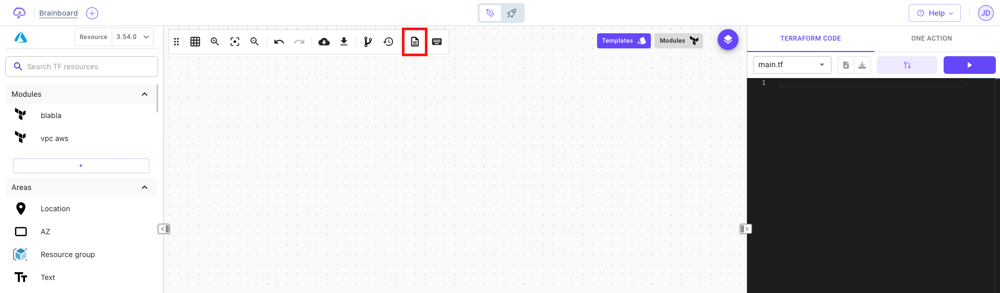

# Readme file 📝

### Description

The `readme` file refers to a text file that provides information about the architecture, its features, requirements, installation instructions, and usage instructions.

:::tip It's an important component as it serves as the first point of reference for users. :::

To add a Readme file to your architecture, click on the file icon placed at the end of the design area options bar:

### Edit readme file

To add information and edit the readme file, just open the editor and add the details.

Brainboard gives you the possibility to write markdown document and generates the HTML representation for it, which makes it super easier to read for you and your team.

### Visibility of the readme file

* The readme file will be displayed on the templates description when you publish your architecture.
* The readme file will be pushed in git when you are using git as your repository.
* The readme file will be cloned along with the design of your architecture.

### Best practice

A good README file typically includes the following information:

* Project description: A brief overview of the architecture, its purpose, and its key features.
* Usage instructions: A step-by-step guide on how to use the architecture, including any variables and configuration settings.
* Support and contact information: Details on how to get support or contact the development team, such as through email, forums, or social media.
* Release notes: A list of changes, bug fixes, and new features for each release of the architecture.
