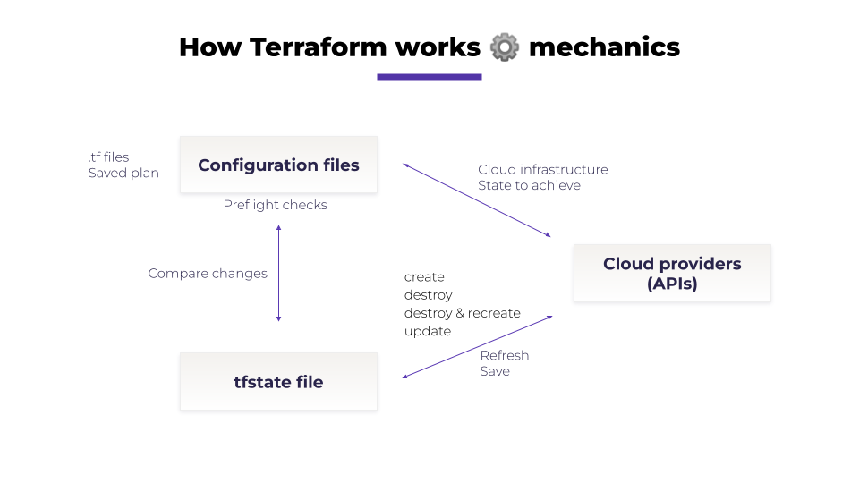

# Terraform state file 🔐

### Description

Terraform stores the information of the execution (apply or destroy) in a special file called `tfstate`. This is file is critical for future provisioning of the infrastructure as it is the absolute reference of which resource has been deployed or not.

🛡️ Refer to the [remote backend page](../security/remote-backend.md) for detailed information on how to configure and manage your state files in Brainboard.

### How it works

🎒 Refer to our [training session](https://youtu.be/Q3RYArLenYg) if you want to understand how Terraform works and how the tfstate is used.

