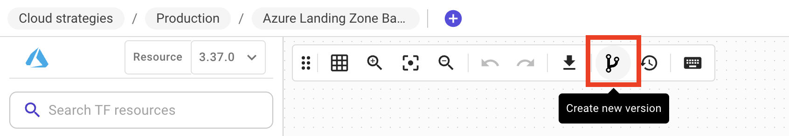
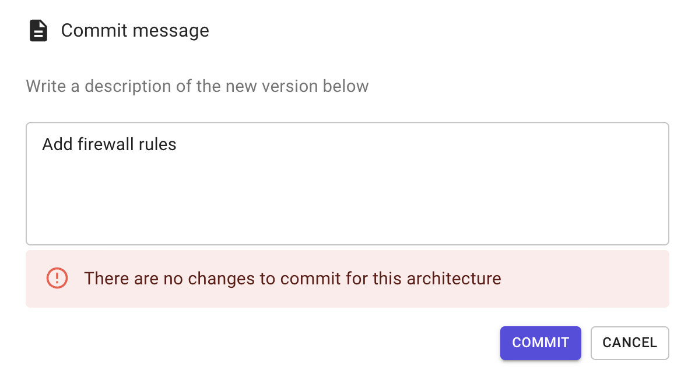
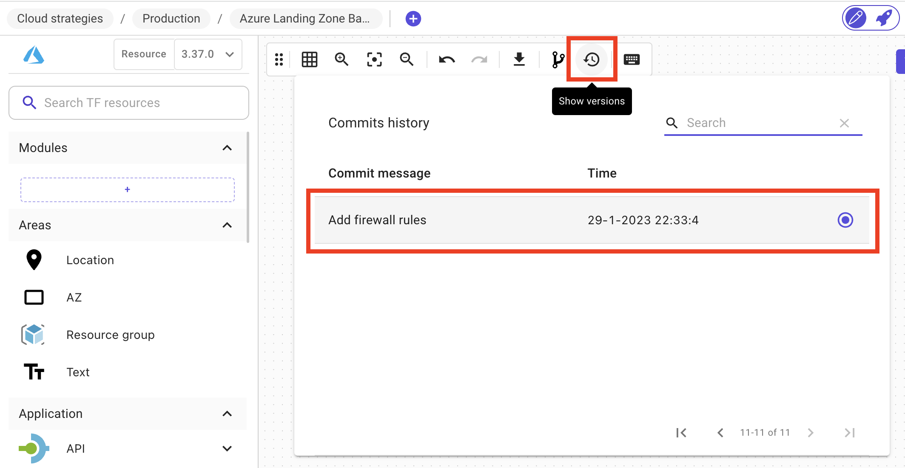

# Versioning 🗃️

### Description

Brainboard provides a native versioning mechanism that allows you to keep track of every modification you do and rollback or go to any specific point-in-time snapshot.

### Components of a version

When you create a version, Brainboard saves the following information:

* The architecture: everything in the design area.
  * The Terraform code is automatically generated in a predictable way for any version.
* The version of the cloud provider selected to create the architecture.
* Variables.
* Output.
* The Readme file.
* The structure of the Terraform files.
* Timestamp in UTC when the version is created.
* The person who created the version.
* The commit message.

### Create a version

To create a version of your architecture:

1. Click on `Create new version` button in the options bar: 
2. Write a description of the version in the versioning window that will open.
3. Click on `Commit` to create the new version.

When you create a new version, if there is no changes between the current version and the new one, you'll receive this message:

### Checkout a version

To checkout any version you create:

1. Click on `Show versions` button in the options bar: 
2. Click on the line of the version you want to open:

:::important

* Brainboard versions are immutable snapshot of your infrastructure. You cannot delete them.
* You can checkout any version and work on it without altering the history of the versioning.
* When you clone an architecture or create a template from it, its versions will be cloned with it.
* When you check out a version, both the diagram and the Terraform code will be update.

:::
