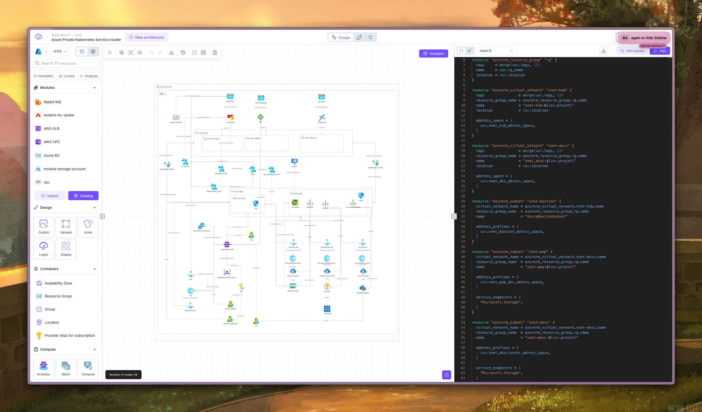
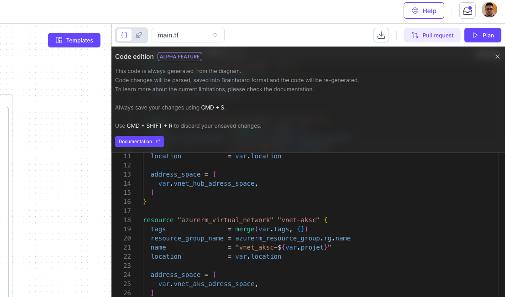
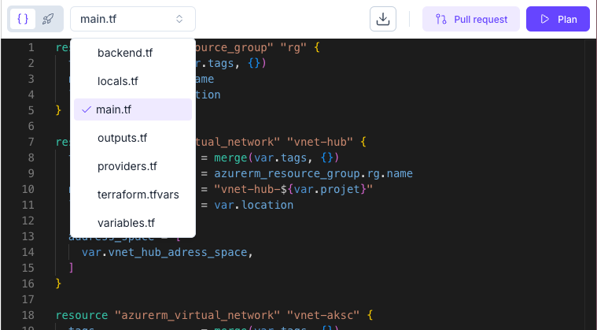
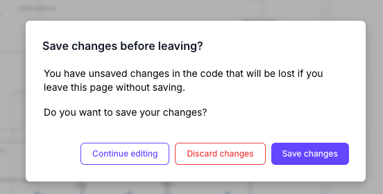
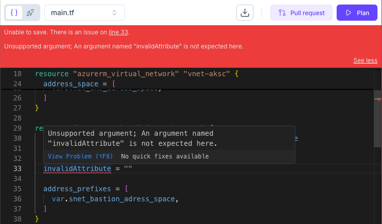
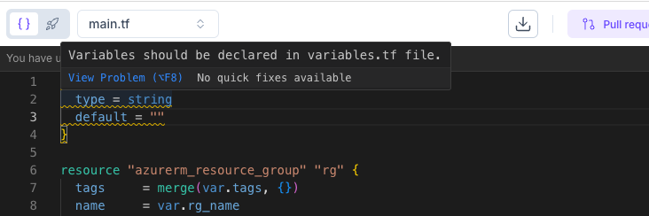
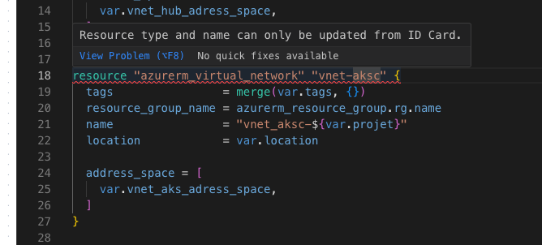
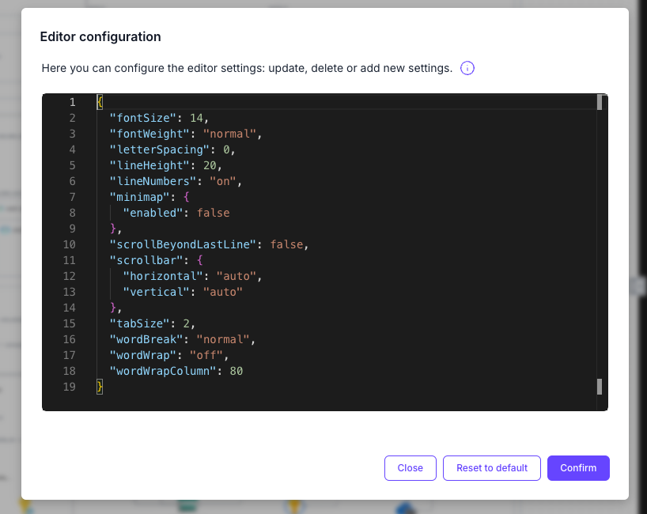

# Code Edition


**ALPHA FEATURE NOTICE:** Code Edition is currently an Alpha feature. This means it's under development. We encourage [feedback](../help-and-faq/support.md) to help us improve it!


## Code Edition: Directly Edit Your Terraform Code

Brainboard's **Code Edition** feature allows you to directly view and modify the auto-generated Terraform HCL code for your cloud infrastructure designs. While Brainboard promotes a "**design-first**" approach where configurations are primarily managed through the visual interface and [resource ID cards](design-area/id-card.md), Code Edition provides flexibility for users who are comfortable with or prefer direct code manipulation for specific tasks.

<figure><figcaption>
Brainboard design &#x26; Code panel
</figcaption></figure>

<figure><figcaption>
Code edition banner
</figcaption></figure>

### Why Use Code Edition?

* **Flexibility:** Make specific changes or additions to your Terraform code that might be quicker or more intuitive for code-centric users.
* **Familiar Environment:** For users accustomed to writing Terraform, this offers a direct way to interact with the configuration.
* **Quick Fixes:** Rapidly address minor issues or apply specific configurations directly in the code.
* **Pasting Existing Code:** Incorporate snippets of Terraform code from documentation or other sources (with some considerations, see "Pasting New Resources" below).

### Accessing and Using Code Edition

The Code Edition panel is always visible on the right-hand side of the Brainboard design interface.

1.  **Select a File:** At the top of the Code Edition panel, you'll find a file selector. You can choose from standard Terraform files like:

    * `main.tf`
    * `variables.tf`
    * `locals.tf`
    * `outputs.tf`
    * _Note: `providers.tf` and `backend.tf` are not yet editable through this feature to maintain Brainboard's core functionality._

    <figure><figcaption>
File selection
</figcaption></figure>
2. **View Code:** The content of the selected file will be displayed in the editor.
3. **Edit Code:** Simply click into the code editor and begin making your changes. The editor is based on Monaco Editor (the same editor that powers VS Code) and provides:
   * Syntax highlighting for Terraform HCL.
   * Search (`CMD/CTRL+F`).
   * Find and Replace (`CMD/CTRL+H`).
   * _Future enhancements may include suggestions, linting, and more advanced features._
4.  **Saving Changes:**

    * To save your changes, press `CMD+S` (on macOS) or `CTRL+S` (on Windows/Linux).
    * Upon saving, Brainboard will:
      * Parse the modified code.
      * Validate the HCL and Terraform syntax. Errors will be displayed if issues are found.
      * Transform the changes into Brainboard's internal format.
      * Update the visual diagram if your code changes imply structural modifications (e.g., adding new resources, creating connections). New resources added via code will typically be appended to the diagram and may need to be manually repositioned.
      * And finally, re-generate the relevant Terraform files.
    * **Discarding Unsaved Changes:** To discard any unsaved modifications you've made directly in the editor without saving, you can use the shortcut `CMD+SHIFT+R` (macOS) or `CTRL+SHIFT+R` (Windows/Linux).
    *   **Unsaved Changes on Navigation:** If you attempt to leave the page or navigate away with unsaved changes in the code editor, you will be prompted to either "Continue editing," "Discard changes," or "Save changes."\

        <figure><figcaption>
Save changes before leaving modal
</figcaption></figure>

### How Code Edition Interacts with the Visual Diagram

Brainboard aims for a synchronized experience between the visual design and the code:

* **Diagram/ID Card to Code:** Any modifications made to your infrastructure through the visual diagram (dragging, moving resources) or by configuring resources via their [ID Card](design-area/id-card.md) will automatically trigger a re-generation of the relevant Terraform code, which you will see updated in the Code Edition panel.
* **Code to Diagram:** Changes saved in the Code Editor that define new resources or modify existing ones in a way that impacts the diagram's structure (e.g., adding a `resource` block) will be reflected visually. New resources are typically appended to the diagram and may require manual placement.

### Key Features and Behaviors

* **Syntax Highlighting:** Makes reading and editing Terraform HCL easier.
*   **Code Validation:** On save, Brainboard validates the HCL syntax and basic Terraform structure. Errors will be reported to help you fix them.

    <figure><figcaption>
Syntax error: invalid attribute 
</figcaption></figure>
* **File Management:**
  * You can view and edit code within predefined files (`main.tf`, `variables.tf`, `terraform.tfvars`, `locals.tf`).
  * **Moving Resources to Different Files:** While you cannot create new files directly from the Code Edition panel _yet_, you can reassign a resource to a different file (or create a new logical file group for it) by right-clicking the resource in the diagram and selecting ["Edit TF filename."](autogenerated-code/split-code-into-files.md) After reassigning, you can then edit the resource's code within its newly designated file in the Code Edition panel.
*   **Warnings for Misplaced Blocks:**

    * Brainboard expects certain definitions to reside in specific files. For example, `variable` blocks should be in `variables.tf` and `locals` blocks in `locals.tf`.
    * If you start defining a `variable` block in `main.tf`, for instance, Brainboard will show a warning. Upon saving, the block will be automatically moved to the appropriate file (e.g., `variables.tf`).

    <figure><figcaption></figcaption></figure>

### Important Limitations (ALPHA)

As Code Edition is an Alpha feature and Brainboard primarily manages infrastructure through its structured visual paradigm, there are some important limitations to be aware of:

*   **Resource Renaming:** You cannot rename a resource (e.g., changing `resource "azurerm_virtual_network" "vnet-aksc"` to `resource "azurerm_virtual_network" "my_new_vnet"`) directly in the Code Edition panel yet. The resource name is a critical part of its identifier within Brainboard.

    * **How to Rename:** To rename a resource, please use its ID Card. Brainboard will then automatically propagate this name change throughout your configuration, updating all references to ensure consistency.

    <figure><figcaption></figcaption></figure>
* **Supported Feature Only:** Only Terraform configurations and structures that are supported by Brainboard's GUI (the visual designer and ID Cards) are guaranteed to be preserved.
* **No Comment Preservation:** Comments in the code are currently not saved or preserved. When Brainboard parses and re-generates the code, comments will be stripped out.
* **No Attribute or Block Order Preservation:** The order of attributes within a resource block or the order of blocks within a file may not be preserved. Brainboard will re-generate the code based on its own ordering rules.
* **Restricted File Edits:** Certain files crucial for Brainboard's operation, such as `providers.tf` or `backend.tf`, are generally not editable or changes might be overwritten.
* **Pasting New Resources:** When pasting a new resource block from external documentation:
  * The resource will be created.
  * It will be appended to the right side of your diagram and will likely need to be manually moved to the desired position.

### Customizing the Editor

You can customize some aspects of the Monaco editor's appearance and behavior:

1. Ensure the design canvas (diagram area) has focus (click on an empty space in the diagram).
2. Press `CMD+K` (macOS) or `CTRL+K` (Windows/Linux).
3.  In the command palette that appears, search for and select "update editor settings."

    _**\[Screenshot Placeholder: The command palette modal/dropdown that appears after pressing CMD/CTRL+K, with "update editor settings" typed in the search bar and the option highlighted.]**_
4.  An "Editor configuration" dialog will appear, allowing you to change settings like `fontSize`, `fontWeight`, `lineNumbers`, `tabSize`, etc., in a JSON format. \

    <figure><figcaption></figcaption></figure>
5. Click "Confirm" to apply your changes or "Reset to default" to revert.

### Best Practices

* **Save Frequently:** Use `CMD/CTRL+S` regularly to save your changes and ensure they are parsed and validated by Brainboard. Also, remember `CMD/CTRL+SHIFT+R` if you need to quickly discard unsaved changes in the editor.
* **Prioritize Visual Design for Structure:** For major structural changes, adding new resources, or defining relationships, it's often best to use the visual designer and ID Cards. Use Code Edition for fine-tuning or specific code-level adjustments.
* **Understand the Re-generation Process:** Be aware that Brainboard parses your code changes and then re-generates the files. This is why comments and exact formatting may not be preserved.
* **Check Diagram After Code Changes:** If you add or significantly modify resources via code, always review the visual diagram to ensure the changes are reflected as expected and adjust placement if necessary.
