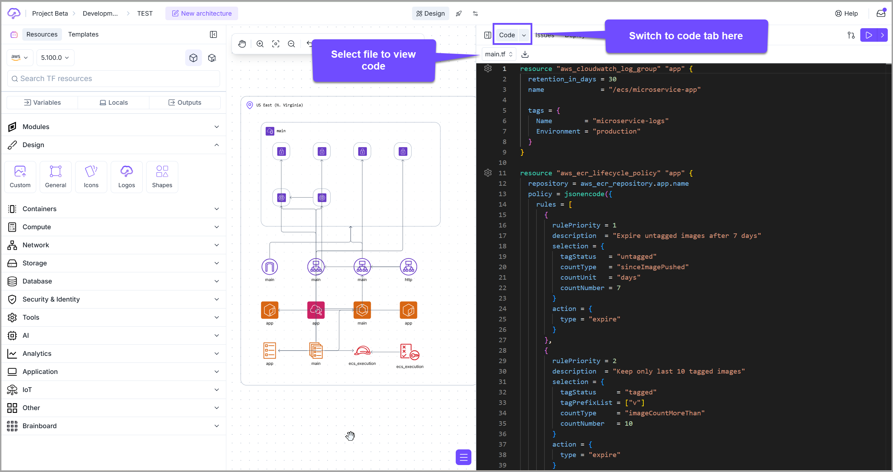
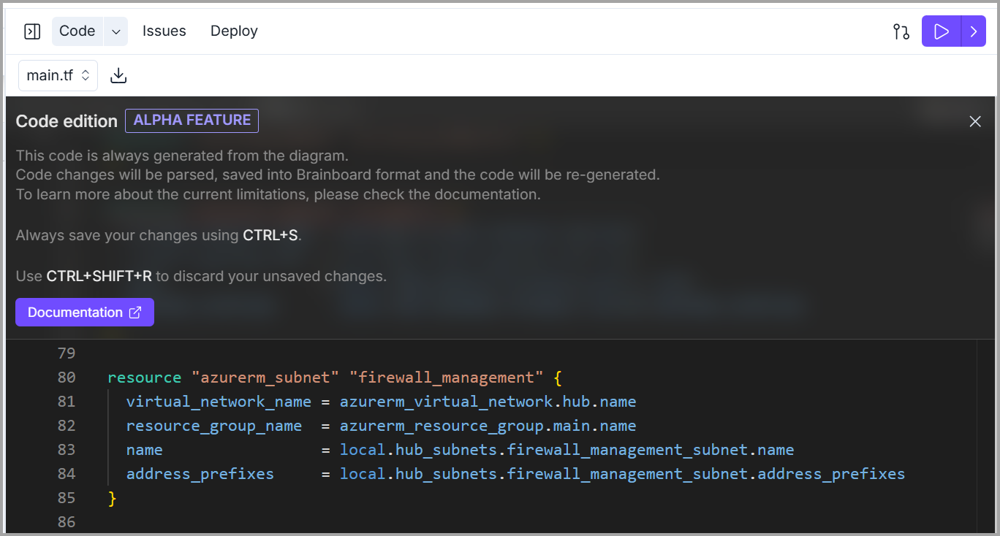
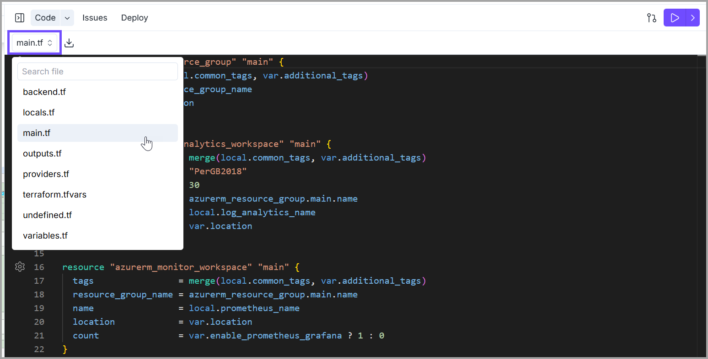
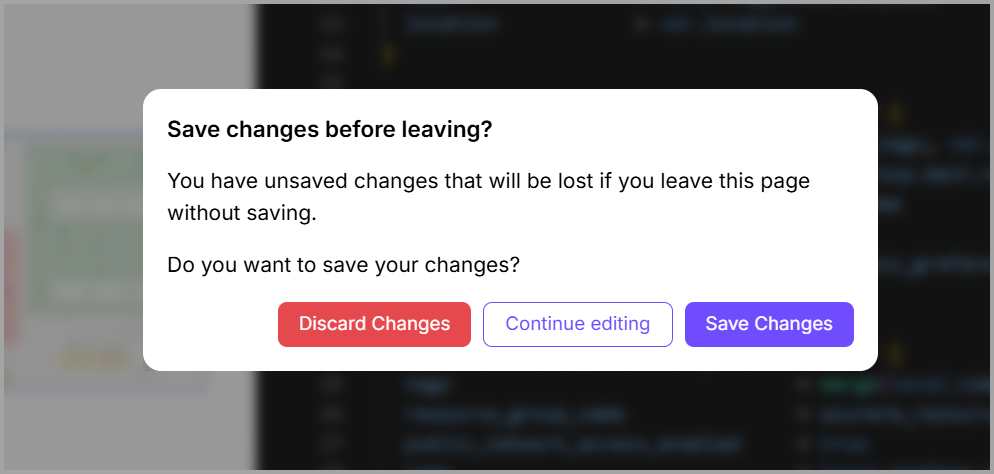
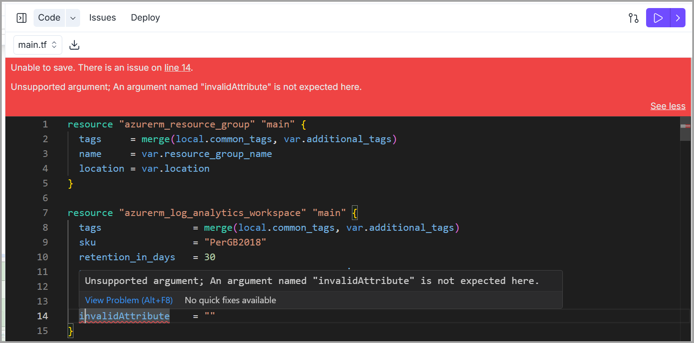
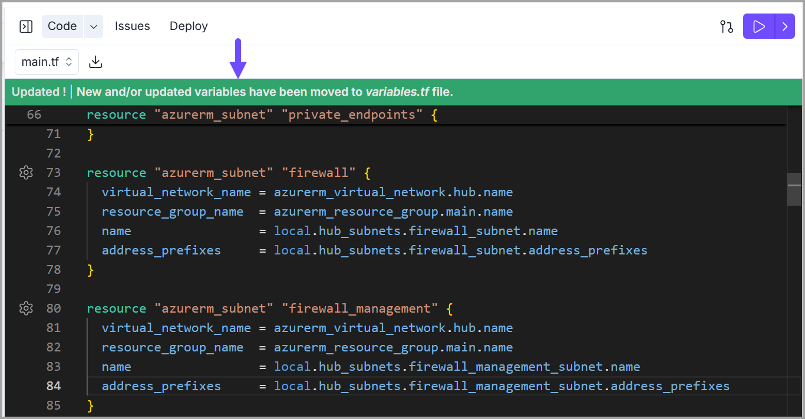
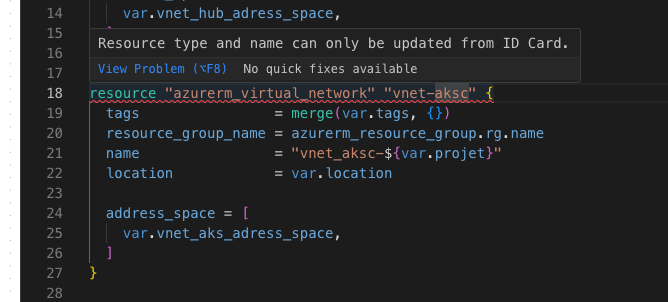
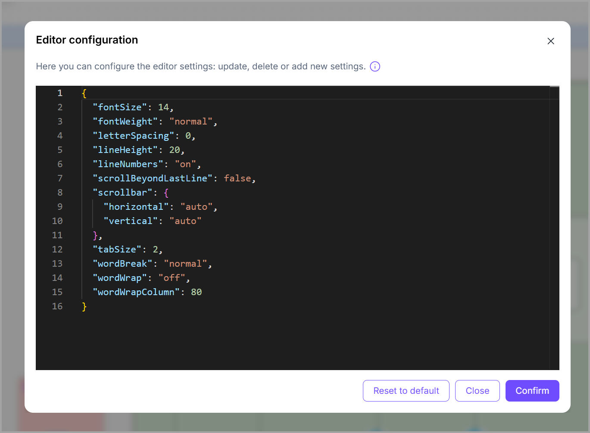

# Code Panel


**ALPHA FEATURE NOTICE**

Code Edition is currently an Alpha feature. This means it's under development. We encourage [feedback](../help-and-faq/support.md) to help us improve it!


## Code Panel: Directly Edit Your Terraform Code

Brainboard's **Code Edition** feature allows you to directly view and modify the auto-generated Terraform HCL code for your cloud infrastructure designs. While Brainboard promotes a "**design-first**" approach where configurations are primarily managed through the visual interface and [Resource Configuration](resource-configuration.md) panel, **Code Edition** provides flexibility for users who are comfortable with or prefer direct code manipulation for specific tasks.

<figure><figcaption></figcaption></figure>

<figure><figcaption>
Code panel banner
</figcaption></figure>

## Why Use Code Edition?

* **Flexibility:** Make specific changes or additions to your **Terraform** code that might be quicker or more intuitive for code-centric users.
* **Familiar Environment:** For users accustomed to writing **Terraform,** this offers a direct way to interact with the configuration.
* **Quick Fixes:** To rapidly address minor issues or apply specific configurations directly in the code.
* **Pasting Existing Code:** Incorporate snippets of **Terraform** code from documentation or other sources (with some considerations, see "**Pasting New Resources**" below).

## Accessing and Using Code Panel

The **Code** panel is always visible on the right-hand side of the Brainboard design canvas.

### **Select a File**

At the top of the **Code** panel, you'll find a file selector. You can choose from standard **Terraform** files like:

* <mark style="color:$primary;">**`main.tf`**</mark>
* <mark style="color:$primary;">**`variables.tf`**</mark>
* <mark style="color:$primary;">**`locals.tf`**</mark>
* <mark style="color:$primary;">**`outputs.tf`**</mark>


Note: **`providers.tf`** and **`backend.tf`** are not yet editable through this feature to maintain Brainboard's core functionality.


<figure><figcaption></figcaption></figure>

### **View Code**

The content of the selected file will be displayed in the editor.

### **Edit Code**

Simply click into the code editor and begin making your changes.&#x20;


The editor is based on **Monaco Editor** (the same editor that powers **VS Code**) and provides:

* Syntax highlighting for **Terraform HCL.**
* Search (**`CMD/CTRL+F`**).
* Find and Replace (**`CMD/CTRL+H`**).

_👉🏻 Future enhancements may include suggestions, linting, and more advanced features._


### **Saving Changes**

1. To save your changes, press <mark style="color:$primary;">**`CMD+S`**</mark> (on macOS) or <mark style="color:$primary;">**`CTRL+S`**</mark> (on Windows/Linux).
2. Upon saving, **Brainboard** will:
   1. <mark style="color:$primary;">**Parse**</mark> the modified code.
   2. <mark style="color:$primary;">**Validate**</mark> the **HCL** and **Terraform** syntax. <mark style="color:red;">**Errors**</mark> will be displayed if issues are found.
   3. <mark style="color:$primary;">**Transform**</mark> the changes into Brainboard's internal format.
   4. <mark style="color:$primary;">**Update**</mark> the visual diagram if your code changes imply structural modifications (e.g., adding new resources, creating connections).&#x20;
   5. And finally, re-generate the relevant Terraform files.


New resources added via code will typically be appended to the diagram and may need to be manually repositioned.


#### **Discarding Unsaved Changes**

To discard any unsaved modifications you've made directly in the editor without saving, you can use the shortcut <mark style="color:$primary;">**`CMD+SHIFT+R`**</mark> (macOS) or <mark style="color:$primary;">**`CTRL+SHIFT+R`**</mark> (Windows/Linux).

#### **Unsaved Changes on Navigation**

If you attempt to leave the page or navigate away with unsaved changes in the code editor, you will be prompted to either <mark style="color:$primary;">**`Continue editing`**</mark>**,** <mark style="color:red;">**`Discard changes`**</mark>**,** or <mark style="color:$primary;">**`Save changes`**</mark>**.**

<figure><figcaption></figcaption></figure>

## How Code Interacts with the Visual Diagram

Brainboard aims for a synchronized experience between the visual design and the code:&#x20;


### **Diagram/Resource Configuration to Code**

Any modifications made to your infrastructure through the visual diagram (dragging, moving resources) or by configuring resources via the [Resource Configuration](resource-configuration.md) panel will automatically trigger **re-generation** of the relevant **Terraform code**, which you will see updated in the **Code** panel.\\



### **Code to Diagram**

Changes saved in the Code Editor that define new resources or modify existing ones in a way that impacts the diagram's structure (e.g., adding a `resource` block) will be reflected visually. New resources are typically appended to the diagram and may require manual placement.


## Key Features and Behaviours

### **1. Syntax Highlighting**

Makes reading and editing **Terraform HCL** easier.

### **2. Code Validation**

On save, Brainboard validates the **HCL** syntax and basic **Terraform** structure. Errors will be reported to help you fix them.

<figure><figcaption></figcaption></figure>

### **3. File Management**

You can view and edit code within predefined files (<mark style="color:$primary;">**`main.tf`**</mark>, <mark style="color:$primary;">**`variables.tf`**</mark>**,&#x20;**<mark style="color:$primary;">**`terraform.tfvars`**</mark>**,&#x20;**<mark style="color:$primary;">**`locals.tf`**</mark>**).**

### **4. Moving Resources to Different Files**

While you cannot create new files directly from the **Code** panel _yet_, you can reassign a resource to a different file (or create a new logical file group for it) by **right-clicking the resource** in the diagram and selecting ["Edit TF filename."](autogenerated-code/split-code-into-files.md)&#x20;

After reassigning, you can then edit the resource's code within its newly designated file in the **Code** panel.

### **5. Warnings for Misplaced Blocks**

Brainboard expects certain definitions to reside in specific files. For example, <mark style="color:$primary;">**`variable`**</mark> blocks should be in <mark style="color:$primary;">**`variables.tf`**</mark> and <mark style="color:$primary;">**`locals`**</mark> blocks in <mark style="color:$primary;">**`locals.tf`**</mark>.


If you define a <mark style="color:$primary;">**`variable`**</mark> block in <mark style="color:$primary;">**`main.tf`**</mark>, upon saving, Brainboard  automatically move the defined variable to the appropriate file (e.g., <mark style="color:$primary;">**`variables.tf`**</mark>).


<figure><figcaption></figcaption></figure>

### Important Limitations (ALPHA)

As **Code** is an _<mark style="color:$primary;">**Alpha**</mark>_ feature and **Brainboard** primarily manages infrastructure through its structured visual paradigm, there are some important limitations to be aware of:

1. **Resource Renaming:** You cannot rename a resource (e.g., changing <mark style="color:$primary;">**`resource`**</mark>**` `**<mark style="color:orange;">**`"azurerm_virtual_network"`**</mark><mark style="color:orange;">**`"vnet-aksc"`**</mark> to <mark style="color:$primary;">**`resource`**</mark> <mark style="color:orange;">**`"azurerm_virtual_network"`**</mark><mark style="color:orange;">**`"my_new_vnet"`**</mark>) directly in the **Code** panel yet. The resource name is a critical part of its identifier within Brainboard.


**How to Rename**&#x20;

To rename a resource, please use the **Resource Configuration** panel. Brainboard will then automatically propagate this name change throughout your configuration, updating all references to ensure consistency.


<figure><figcaption></figcaption></figure>

2. **Supported Feature Only:** Only **Terraform** configurations and structures that are supported by Brainboard's GUI (the visual designer and <mark style="color:$primary;">**Resource Configuration**</mark> panel) are guaranteed to be preserved.
3. **No Comment Preservation:** Comments in the code are currently <mark style="color:red;">**not saved**</mark> or preserved. When Brainboard parses and re-generates the code, comments will be stripped out.
4. **No Attribute or Block Order Preservation:** The order of attributes within a resource block or the order of blocks within a file may not be preserved. Brainboard will re-generate the code based on its own ordering rules.
5. **Restricted File Edits:** Certain files are crucial for Brainboard's operation, such as <mark style="color:$primary;">**`providers.tf`**</mark> or <mark style="color:$primary;">**`backend.tf`**</mark>, and are generally not editable, or changes might be overwritten.
6. **Pasting New Resources:** When pasting a new resource block from external documentation:
   1. The resource will be created.
   2. It will be appended to the right side of your diagram and will likely need to be manually moved to the desired position.

### Customizing the Editor

You can customize some aspects of the <mark style="color:$primary;">**Monaco**</mark> editor's appearance and behaviour:

1. Ensure the design canvas (diagram area) has focus (click on an empty space in the diagram).
2. Press <mark style="color:$primary;">**`CMD+K`**</mark> (macOS) or <mark style="color:$primary;">**`CTRL+K`**</mark> (Windows/Linux).
3. In the <mark style="color:$primary;">**command palette**</mark> that appears, search for and select <mark style="color:$primary;">**`update editor settings.`**</mark>
4. An <mark style="color:$primary;">**`Editor configuration`**</mark> dialogue will appear, allowing you to change settings like <mark style="color:blue;">**`fontSize`**</mark>, **`fontWeight`**, <mark style="color:blue;">**`lineNumbers`**</mark>, <mark style="color:blue;">**`tabSize`**</mark>, etc., in a **JSON** format.&#x20;
5. Click "Confirm" to apply your changes or "Reset to default" to revert.

<figure><figcaption>
<em><strong>The command palette modal/dropdown that appears after pressing CMD/CTRL+K, with "update editor settings" typed in the search bar and the option highlighted.</strong></em>
</figcaption></figure>

### Best Practices


**Save Frequently**

Use <mark style="color:$primary;">**`CMD/CTRL+S`**</mark> regularly to save your changes and ensure they are parsed and validated by Brainboard. Also, remember <mark style="color:$primary;">**`CMD/CTRL+SHIFT+R`**</mark> if you need to quickly discard unsaved changes in the editor.



**Prioritize Visual Design for Structure**

For major structural changes, adding new resources, or defining relationships, it's often best to use the visual designer and **Resource Configuration** panel. Use the **Code** panel for fine-tuning or specific code-level adjustments.



**Understand the Re-generation Process**

Be aware that Brainboard parses your code changes and then re-generates the files. This is why comments and exact formatting may not be preserved.



**Check Diagram After Code Changes**

If you add or significantly modify resources via code, always **review** the visual diagram to ensure the changes are reflected as expected and adjust placement if necessary.

