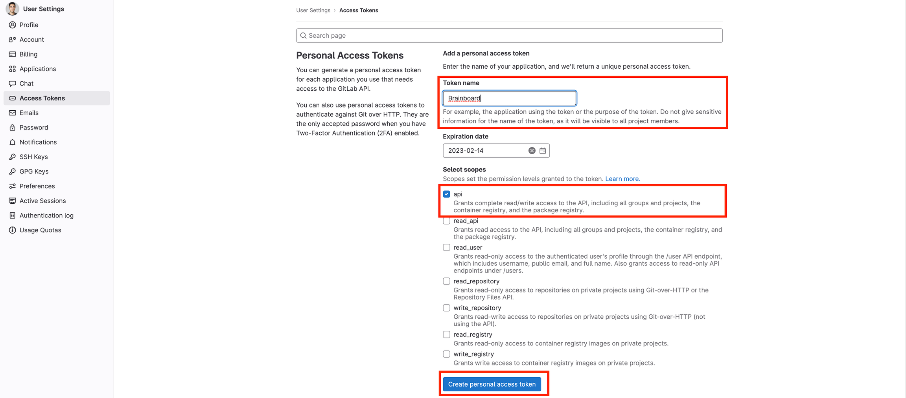

# Connectors

### Overview


A connector is a line that connects two resources in the architecture. It is used to show a relationship between two resources.&#x20;


_This article covers information about different connector types and how to create, edit, and delete a connector._&#x20;

***

### Connector types

There are two types of connectors:

1. Visual connector
2. Relationship connectors

#### **1. Visual connectors**

These are used to show a visual relationship between two resources. They are represented by a solid line.

<figure><figcaption></figcaption></figure>

#### **2. Relationship connectors**

These are used to show a relationship between two resources. They are represented by a solid line with the corresponding text in the middle of the connector.&#x20;

<figure><figcaption></figcaption></figure>

***

### How to create a connector?

#### Creating a visual connector

To create a **visual** connector, you need to follow these steps:

1. Click on the node/resource that you want to connect to another node/resource.&#x20;
2. Once the borders of the selected node/resource are highlighted, you will see a **small circle** in the middle of all its four borders. Hover over that small circle, and you will see an **arrow-shaped icon**. Click on that arrow-shaped icon, drag it to another node/resource to which you want to connect the first node/resource, and drop it there. You can now see a visual connector connecting the two nodes/resources in your design space.&#x20;

<figure><figcaption></figcaption></figure>

#### Creating a relationship connector between resources

To create a relationship connector, you need to follow these steps:

1. Right-click on the resource and select `Edit config` from the context menu. &#x20;

<figure><figcaption></figcaption></figure>

2. The selected resource's **form will** open in the right pane. You can scroll down to its **Main parameters** and look for the relevant field where you can select the other resource for connection.&#x20;

For example, in the image shared below, the desired storage is selected under the field **`Storage Account Name`** for the _<mark style="color:$primary;">Linux function app</mark>_.&#x20;


Once you select the desired resource in the relevant field, a relationship connector is drawn from the first resource pointing toward the second. The connector line will also be labelled accordingly.&#x20;


<figure><figcaption></figcaption></figure>


To verify the connection/relationship, you can cross-check the **label text** with the corresponding value in the code.&#x20;


***

### How to delete a connector?

To delete a connector, simply click on the **connector line** and hit the **`Delete`** key on your keyboard. Or, you can click the **bin icon** available in the connector editor bar that appears upon clicking the connector line.&#x20;

<figure><figcaption></figcaption></figure>

You will be prompted with two options:&#x20;

* **Keep reference:** Clicking on this will only delete the _<mark style="color:$primary;">visual connector line</mark>_, while the configured relationship between the resources will stay **intact.**&#x20;
* **Remove the reference:** Clicking on this will delete the _<mark style="color:$primary;">visual connector line</mark>_ as well as the configured _<mark style="color:$primary;">relationship</mark>_ between the resources.&#x20;

<figure><figcaption></figcaption></figure>

### How to edit a connector?

To edit a connector, simply click on the connect, and the options bar will appear above it. You can customzie the following properties of a connector-line:&#x20;

* **Connector type:** Available options are **`orthogonal`**, **`straight`**, and **`curvy`**.&#x20;
* **Line style:** Available options are **`solid`**, **`small dash`**, **`medium dash`**, and **`large dash`**.&#x20;
* **Colour:** You can use the available colour palette or enter a specific hex code.&#x20;
* **Line weight:** You can define the connector line weight as **`small`**, **`medium`**, or **`large`**.&#x20;
* **Start/end shape options:** These options enable you to define the start and the end shape of the connector line. Available options are `filled arrow`, `outlined arrow`, `no shape`.&#x20;

<figure><figcaption></figcaption></figure>

### How to edit the connector text?

To edit the connector label text, simply **`double-click`** on the connector line and it will become editable as the **`cursor`** will appear at the end of the text. You can then edit it as you wish.&#x20;

<figure><figcaption></figcaption></figure>

