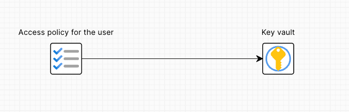

# Connectors

### Description

A connector is a line that connects two resources in the architecture. It is used to show a relationship between two resources. There are two types of connectors:

* **Visual connectors**: Are used to show a visual relationship between two resources. They are represented by a solid line.

* **Relationship connectors**: Are used to show a relationship between two resources and can be **depends\_on** or **normal** relationship connectors. They are represented by a solid line with the corresponding text in the middle of the connector: **depends\_on** if it's a **depends\_on** relationship connector or the name of the relationship if it's a **normal** relationship connector, eg **server\_name**.

### How to create a connector

To create a **visual** connector, you need to follow these steps:

1. Select a resource by clicking on it and then select the **Add connector** option from the node options.

2. Click the generated connector and drag it over the resource you want to connect it to.
3. Release the connector over the resource you want to connect it to.

To create a **depends\_on** relationship connector, you need to follow these steps:

1. Select a resource by clicking on it and open its cloud configuration by clicking on the **Cloud configuration** button from the node options bar.

2. Either scroll to the **Extra attributes** section, expand it and click on the **Depends on** input or using the search bar, search for **Depends on**.

3. Clicking on the **Depends on** input will recommend you resources that you can connect to. You can either click on the resource you want to connect to or type the name of the resource you want to connect to.
4. After selecting an item from the list, a connector will be created between the two resources. It will also have a text in the middle of the connector that says **depends\_on** and the automatically generated Terraform code will have the **depends\_on** attribute added to the resource.

To create a **normal** relationship connector, you need to follow these steps (the initial steps are the same as for the **depends\_on** relationship connector):

1. Select a resource by clicking on it and open its cloud configuration by clicking on the **Cloud configuration** button from the node options bar.

2. Select an input (eg **Key vault secret id**) or use the search bar to search for an input.
3. Clicking on the input will recommend you resources that you can connect to. You can either click on the resource you want to connect to or type the name of the resource you want to connect to.
4. After selecting an item from the list, a connector will be created between the two resources. It will also have a text in the middle of the connector that refers to the field that connects the two resources (eg **key\_vault\_secret\_id**).

### How to delete a connector

To delete a connector, you need to follow these steps:

1. Select the connector by clicking on it and then press the **Delete** key on your keyboard.
2. Select the connector start or end point and select the **Delete connector** option from the connector options or press the **Delete** key on your keyboard.

### How to edit a connector

To edit a connector, you need to follow these steps:

1. Select the connector by clicking on it and the connector options bar will appear just under the design area options bar.

2. Select the connector start or end point and the connector options will appear on the right side, just next to the selected point.

### Connector options bar

The connector options bar allows you to visually configure the connector and it has the following options:

* **Fill color**: Allows you to change the connector fill color.

* **Border weight**: Allows you to change the connector border weight.

* **Border dash**: Allows you to change the connector border dash.

* **Connector type**: Allows you to change the connector type visually, from a straight line to a curved line.

* **Connector start shape**: Allows you to change the connector start shape, from nothing, to a circle, square or arrow.

* **Connector end shape**: Allows you to change the connector end shape, from nothing, to a circle, square or arrow.

### Connector options

The connector options allow you to configure the connector and it has the following options:

* **Edit text**: Allows you to edit the connector text.

* **Unlink connector**: Allows you to unlink the connector from the target resource so that it can be moved freely and connected to another resource.

* **Delete connector**: Allows you to delete the connector.

