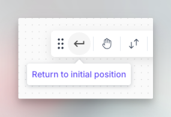
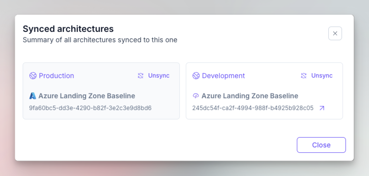
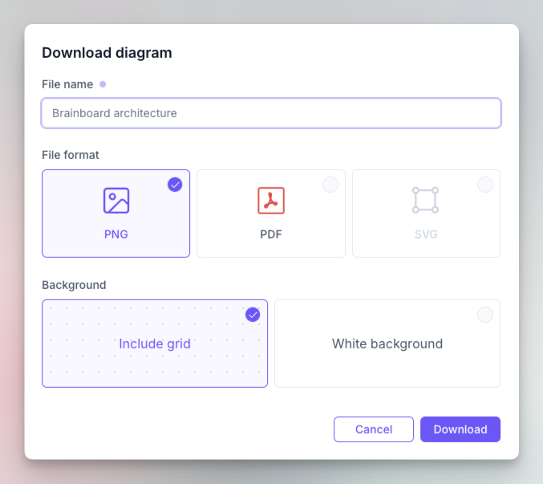
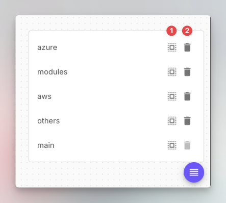

# Graphical options

### Description

Brainboard graphical elements within the design area help you control the visual of some aspects of the interface or display useful information.

There are 3 groups of graphical options:

1. [The options' bar](graphics.md#options-bar): It contains options that allow you to control the graphical options that are not related to a node, like the grid, the zoom…etc.
2. Templates button: It opens the templates catalog, where you can see the available cloud architecture templates and use them.
3. Nodes number: Shows either the number of nodes that are selected or present in the design area when no node is selected.
4. Groups: This button allows you to list & update all nodes' groups / Terraform files.

### Options bar

<figure><figcaption></figcaption></figure>

It has the following options:

1. Grab area where you can move the bar to place wherever you want in the design area
   1. Brainboard saves the position of the bar when you move it, so even when reload the page, it stays in the last position.
   2.  When it is moved, you can always reset it to its initial position through this button:

       <figure><figcaption></figcaption></figure>
2. Switch between select and grab mode:
   1. Select mode allows you to select resources and interact with them
   2. Grab mode allows you to move the canvas
3.  Synced architecture: This button opens the window that shows you architectures that are synced with this one:

    <figure><figcaption></figcaption></figure>
4. Switch the style of the grid between dots and rectangles.
5. Zoom in: It will zoom in the design area using its center as the zoom point.
   1. Use can zoom using the mouse as well by placing the cursor on any resource, press META or CTRL and scroll.
6. Fit content: It centralized the resources present in the design area in the middle, where all nodes are visible.
7. Zoom out: It will zoom out the design area using its center as the zoom point.
   1. Use can zoom using the mouse as well by placing the cursor on any resource, press META or CTRL and scroll.
8. Undo the changes.
9. Redo the changes.


**Universal Undo/Redo**

Brainboard uses the backend as a store for undo and redo actions, which means, even if you reload your page, close & reopen the browser or even connect from a different computer, you can undo & redo your actions.


10. Change the canvas color.
11. Dots or grid color.
12. Export the architecture in Brainboard format: This button allows you to export the architecture in JSON format.
    1. You can share the JSON file with someone else or restore it in a different organization, it will create the architecture exactly as it is with its Terraform code, variables, output and ReadMe file.
13. Download the diagram: This button allows you to download a picture of the architecture in multiple formats: PNG, SVG or PDF. You can also include the background grid in the download or set a transparent background.

    <figure><figcaption></figcaption></figure>
14. Create a new version of your architecture. Refer to the [versioning page](versioning.md#create-a-version) for more details about how to create a new version.
15. Show architecture versions. Refer to the [versioning page](versioning.md#list-versions) for more details about how to list versions and how to restore a specific one.
16. Readme: This button allows you to open the README of the architecture, where you can update its content.

    1. This file will be included in the list of the files to push to git when do a pull request.

    <figure><figcaption></figcaption></figure>
17. Shortcuts: This button allows you to see the shortcuts you can use inside the Brainboard editor. Refer to the [shortcut page](../../help-and-faq/shortcuts.md) to learn about all the available options.

### Templates button

It allows you to open the templates catalog window where you can see the public and private template.&#x20;

Refer to the [template catalog](../../data/data-structure/template.md) page for detailed information about how to use it.

### Number of nodes

This button is located in the bottom-left corner of the architecture, and it shows the number of nodes in the architecture.

<figure><figcaption></figcaption></figure>

### Groups

You can group nodes together in the same group and same Terraform file.

This button, located in the bottom-right corner of the design area, displays all the groups you have with the available options to update them.

<figure><figcaption></figcaption></figure>

1. Select the group: This will select all the resources of this group in the design area, and also select the Terraform file of the group.
2. Delete the group: This will delete the group and put all its resources in the main one (main.tf).
   1. This action doesn't delete the resources.
