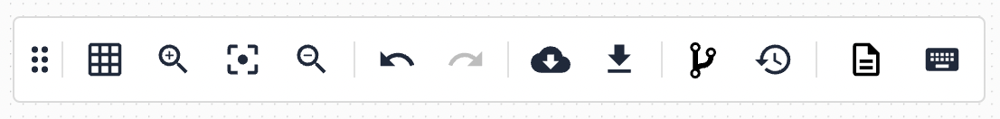
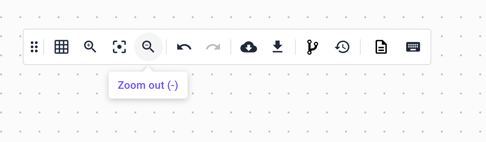

# Graphic options

### Description

Brainboard uses graphic elements to help you ease your workflow when you are designing & building your infrastructure. Some important graphic elements are:

* **Options bar**: The options bar is a bar situated on top of the architecture that allows you to configure visual elements. It is always visible and can be moved around the page easily.
* **Templates catalog button**: The templates catalog button is a button that allows you to open the templates modal. It is situated in the top-right corner of the architecture.
* **Visibility action buttons**: The visibility actions are a set of floating action buttons that allow you to show or hide elements (main grid, titles, connectors, depends\_on connectors and icons) in the architecture. They are situated in the top-right corner of the architecture.
* **Number of nodes**: The number of nodes is a number that is situated in the bottom-left corner of the architecture. It shows the number of nodes in the architecture.
* **Groups**: Groups are a way to group resources together. The groups floating action button allows you to see, edit and delete the groups in the architecture. It is situated in the bottom-right corner of the architecture.

### Options bar

The options bar is a bar situated on top of the architecture that allows you to configure visual elements. It is always visible and can be moved around the page easily.

The options bar contains the following elements:

* **Change the grid to squares**: This button allows you to change the grid to squares. It is useful when you want to align resources in the architecture.

* **Change the grid to dots**: This button allows you to change the grid to dots.

* **Zoom in**: This button allows you to zoom in the architecture.

* **Fit content**: This button allows you to automatically fit the content of the architecture on the screen. It is useful when you have zoomed in or out the architecture and you want to go back to the original size.

* **Zoom out**: This button allows you to zoom out the architecture.

* **Undo**: This button allows you to undo the last action you did in the architecture.

* **Redo**: This button allows you to redo the last action you did in the architecture.

* **Export the architecture in Brainboard format**: This button allows you to export the architecture in Brainboard format. It is useful when you want to save the architecture in your computer or share it with someone else.

* **Download the diagram**: This button allows you to download the architecture in multiple formats: PNG, SVG or PDF. You can also include the background grid in the download or set a transparent background.

* **Create a new version**: Brainboard allows you to create multiple versions of the same architecture. This button allows you to create a new version of the architecture. It is useful when you want to create a new version of the architecture before making changes to it.

* **Show versions**: This button allows you to see the versions of the architecture. It is useful when you want to see the versions of the architecture and switch between them.

* **Readme**: This button allows you to see the README of the architecture. It is useful when want to create a proper description of the architecture so that other team members can better understand the use case of the architecture.

.png>)

* **Shortcuts**: This button allows you to see the shortcuts you can use inside the Brainboard editor. Knowing the shortcuts can help you speed up your workflow.

* **Sync information**: When creating a new architecture based on an already existing architecture (cloning), you have the possibility to sync architectures together. That means that if you make a change in one architecture, the other architecture will be updated automatically. This button allows you to see the sync information of the architecture: what other architectures are synced with this architecture and you can unsync them if you want.

### Templates button

The templates catalog button is a button that allows you to open the templates modal. It is situated in the top-right corner of the architecture.

### Visibility action buttons

The visibility actions are a set of floating action buttons that allow you to show or hide elements (main grid, titles, connectors, depends\_on connectors and icons) in the architecture. They are situated in the top-right corner of the architecture.

### Number of nodes

The number of nodes is a number that is situated in the bottom-left corner of the architecture. It shows the number of nodes in the architecture.

### Groups

Groups are a way to group resources together. The groups floating action button allows you to see, edit and delete the groups in the architecture. It is situated in the bottom-right corner of the architecture.

