# ID card

### Description

The `ID card` in Brainboard is a configuration menu that contains all Terraform attributes (for any given resource) that you can customize. The Terraform code that is auto-generated uses information set in this menu.

To open the ID card of any resource, either double-click on it or click the button `Cloud configuration` in the node's options bar:

<figure><figcaption></figcaption></figure>

### Components

Here is the different sections of the ID card:

<figure>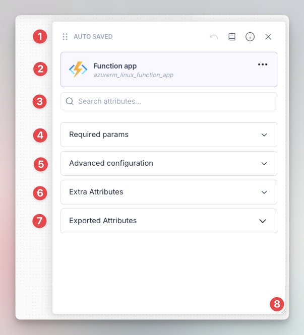<figcaption></figcaption></figure>

1. [Top bar](id-card.md#top-bar).
2. [Header](id-card.md#header).
3. Search bar: Allows you to display only fields that match your query.
4. [Required parameters](id-card.md#required-parameters).
5. Advanced configuration: It contains all the fields that are not mandatory.
6. [Extra attributes](id-card.md#extra-attributes).
7. [Exported attributes](id-card.md#exported-attributes).
8. Resizer: Allows you to resize the ID card to make it bigger or smaller, both in width and height.

#### Top bar

Options of this bar from left to right, allow you to:

* Move the ID card wherever you want in the design area.
* It indicates that the information is automatically saved as you type them.
* Reset the changes you made.
* Open the Terraform documentation of the resource.
* Show/hide the documentation of every field within Brainboard
* Close the ID card.

#### Header

The header shows information about the resource that include:

* The title of the resource. You can change, reset or delete it if needed

<figure>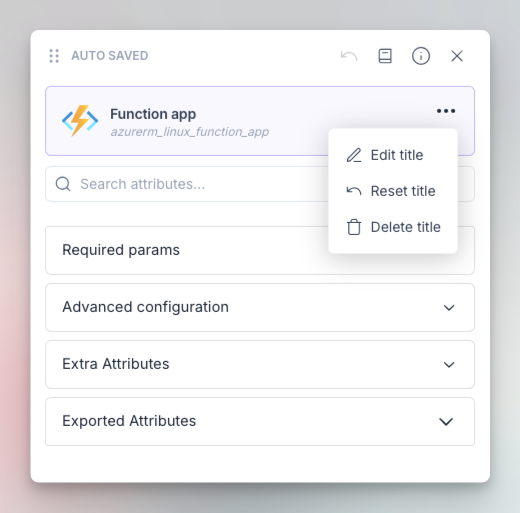<figcaption></figcaption></figure>

* The icon, as it comes from the cloud provider, with the possibility to change it.
* Terraform type of the resource

#### Required parameters

This section contains mandatory information that you need to fill to create or update the resource. These parameters come from what Terraform consider as required.

<figure>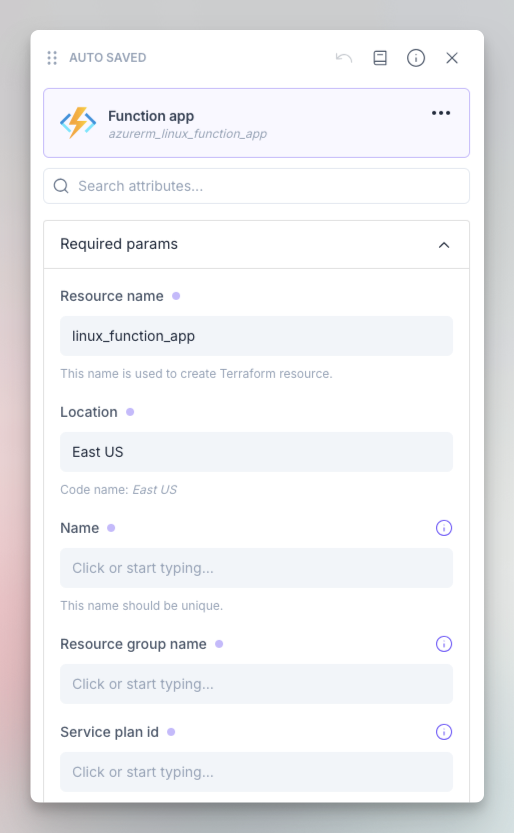<figcaption></figcaption></figure>


There are **2 special parameters**:

1. **Resource name:** This is the Terraform resource name and it is used to uniquely identify the resource in the design and code.
   1. Changing this name will destroy the resource and recreate it with the new name.
   2. This field doesn't accept variables. You need to use string text.
   3. Brainboard managed this field for you, so in most cases you don't need to update it.
2. **Location:** For some providers like AWS, where the location is not part of the Terraform resource, Brainboard uses this specific field to generates the Terraform code accurately.


#### Extra Attributes

This section contains all Terraform meta arguments that allow you to do loops, define dependencies and configure lifecycle:

<figure>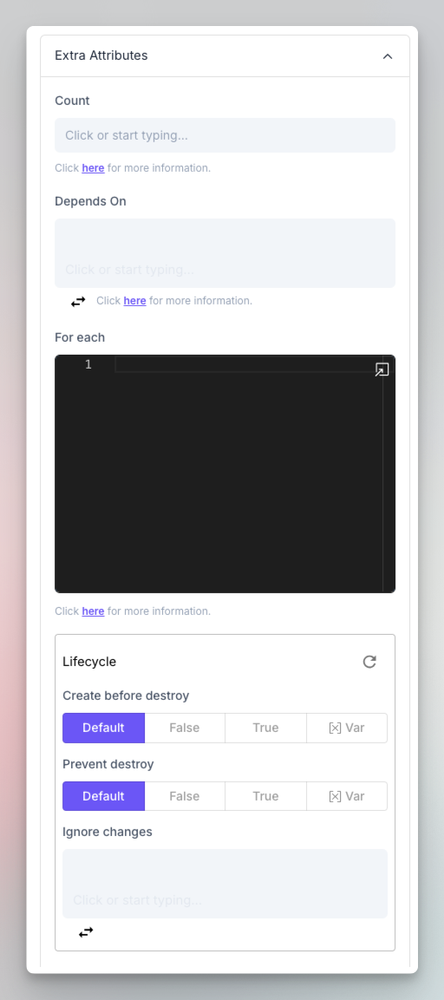<figcaption></figcaption></figure>

1. `Count`: allows you to create multiple instances of the same resource with a single configuration.
   1.  You can either use a number, a variable, Terraform functions or any valid Terraform syntax

       <figure>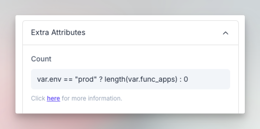<figcaption></figcaption></figure>
   2.  When the resource has a count, its icon changes visually to indicate that

       <figure>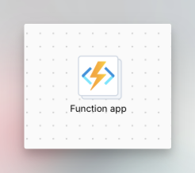<figcaption></figcaption></figure>
2. `Depends_On`: allows you to specify dependencies between resources, ensuring that one resource is created before another.
   1. When you reference any resource in this field, Brainboard automatically create a visual link between both resources.
3. `for_each`: allows you to create multiple instances of the same resource based on a map or set of values.
   1.  You can directly write your map in this field or use a variable. It's a best practice to use a variable.

       <figure>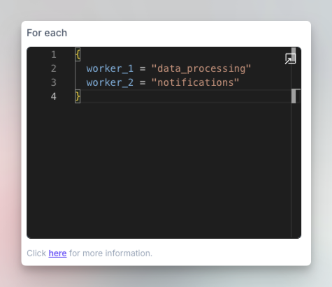<figcaption></figcaption></figure>
   2.  When the resource has a for\_each, its icon changes visually to indicate that

       <figure>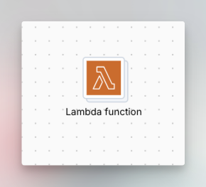<figcaption></figcaption></figure>
4.  `lifecycle` allows you to define actions that should be taken when the resource is created, updated, or deleted. The lifecycle attribute can be used to implement custom logic or to enforce specific policies on your infrastructure.

    The lifecycle block supports the following options:

    * `create_before_destroy`: This option allows Terraform to create a new resource before destroying the existing one.
      * This can be useful in scenarios where you need to maintain resource availability during the update.
    * `prevent_destroy`: This option prevents Terraform from destroying a resource.
      * This can be useful for resources that you want to protect from accidental deletion, like databases.
    * `ignore_changes`: This option allows you to specify a list of attributes that should not trigger an update.
      * This can be useful in cases where you don't want the resource to be updated when you change specific parameters.
5.  `terraform code`: to give you more freedom, you can write any valid Terraform code in this section. Like provisioner.

    <figure>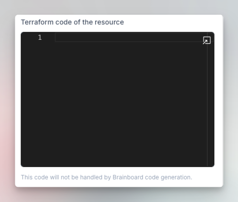<figcaption></figcaption></figure>

#### Exported attributes

<figure>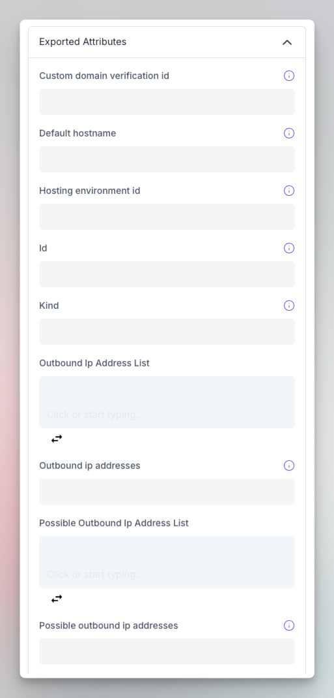<figcaption></figcaption></figure>

These attributes are information about the resource that are available to be used by another one.

These attributes are also used in output blocks to define attributes that you want to make available for other Terraform modules to use.


1. An exported attribute is also a value that is created by one Terraform module and made available for another module to use.
2. Once the infrastructure is deployed, Brainboard fills these fields automatically based on information from the generated tfstate file.


### Types of fields

Here are the different types of fields of the ID card and how they map out Terraform attributes:

#### Text attributes

This type of field is used when the expected value for the parameter is a `string` such as the `name` of the resource, its IP address, its location...

* All Terraform supported types of text values including [string & template strings](https://developer.hashicorp.com/terraform/language/expressions/strings), and [heredoc](https://en.wikipedia.org/wiki/Here\_document) are supported.
* When you click Enter in the text field, it switches into multiline where you can write properly the content.
* You don't need to quote the values you put in this field, Brainboard handles the quoting properly based on what is accepted and allowed in Terraform.

#### Number attributes

In the ID card, to specify numerical values you can use a number field, such as integers and floating-point numbers.

* You can use either a decimal or scientific notation to represent numbers.

Some common uses of the number attribute type include:

* Resource counts: Specifying the number of resources to create, such as the number of virtual machines in an Azure virtual machine scale set.
* Networking parameters: Specifying network configurations, such as the number of load balancer frontend IP configurations.
* Timeouts: Specifying timeouts for various operations, such as the timeout for a resource creation operation.


Terraform also provides a set of [built-in functions](https://developer.hashicorp.com/terraform/language/functions) for manipulating and converting numbers.


#### List attributes

The `list` attribute type is used to specify a collection of values. The values in the list can be of any data type, including strings, numbers, boolean, and even nested lists and maps.

Common uses of the list attribute type include:

* Lists of resources: Specifying a list of related resources, such as a list of virtual network subnets.
* Lists of strings: Specifying lists of strings, such as a list of IP addresses.
* Lists of maps: Specifying lists of maps, where each map represents a set of key-value pairs

<figure>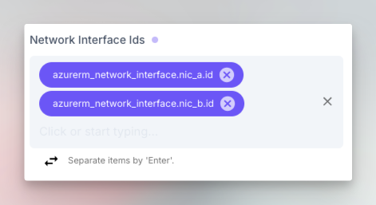<figcaption></figcaption></figure>

 

<figure>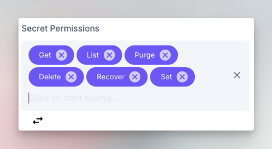<figcaption></figcaption></figure>

You can switch this field into a text field if you want to use a function instead of putting items manually:

<figure>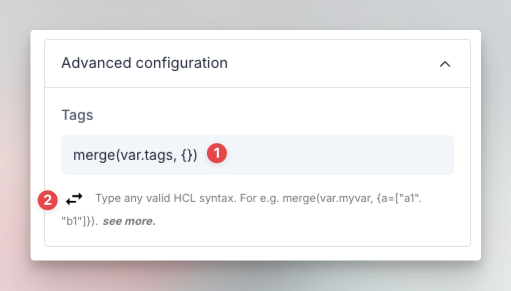<figcaption></figcaption></figure>

1. Example of a raw syntax using  `merge` function for tags instead of putting them manually in every resource.
2. Button to switch between list and text mode.


In Terraform, lists can be accessed and manipulated using [built-in functions](https://developer.hashicorp.com/terraform/language/functions) and expressions, such as indexing, length, concatenation, and filtering.


#### Boolean attributes

<figure>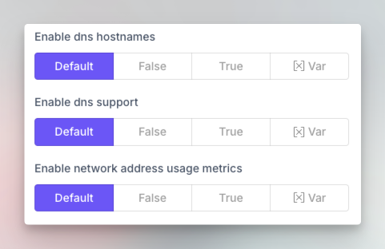<figcaption></figcaption></figure>

There are three options for a boolean type attribute:

* Default : this means that the value will be removed from the generated Terraform code and use Terraform default.
  * Refer to the documentation of the resource to check the default value.
* False
* True

To use an expression evaluation for the variable, click on the last option of the field called `Var` this will open a field where you can put your expression

<figure>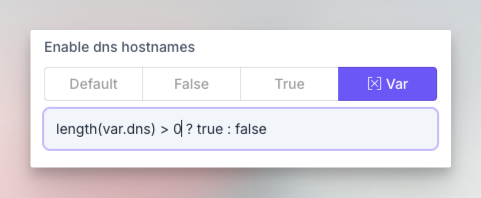<figcaption></figcaption></figure>

#### Blocks attributes

The blocks can have all the types mentioned above and also other nested blocks.

<figure>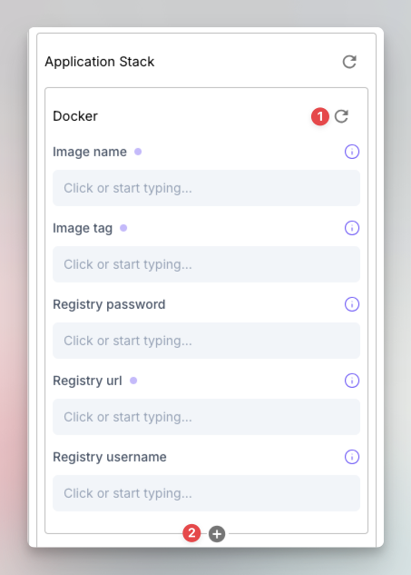<figcaption></figcaption></figure>

1. This button helps you to reset the entire block, which means that the block will be removed from the Terraform code generated.
2. This button helps you create another block after this one.


Brainboard shows you the possibility to create another block only when multiple blocks are supported in Terraform.


### Custom resource

The ID card of custom resources is similar to the ID card of any resource, the only exceptions are:

1. You can define the Terraform resource type of the resource
2. You can indicate the source of the provider if it is in a different namespace. For example `cloudflare/cloudflare`

<figure>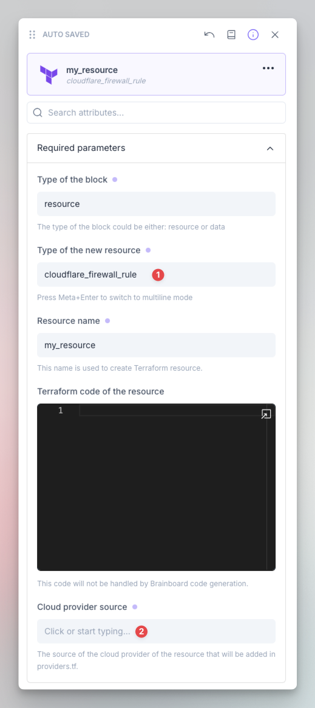<figcaption></figcaption></figure>


When you specify the cloud provider source, Brainboard automatically adds this entry in the provider block



### Modules

The ID card of a module is build based on the variables and outputs that are defined in the source code of the module, so it is slightly different from the ID card of the resources:

<figure>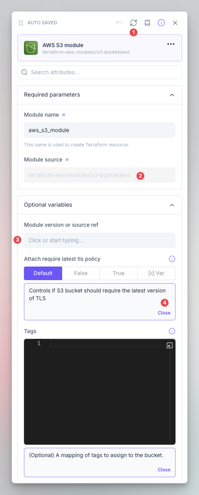<figcaption></figcaption></figure>

1. This button will fetch the latest version of the module from Git or the registry and rebuild the ID card based on the new information.
2. The source of the module.
   1. To change this value, you need to change the settings of the module in the modules' catalog
3. The version of the module: You can specify either a specific version of your module, or a branch / tag, if it is imported from a Git repository.
4. Documentation of the fields: This information comes from the description of the variables of the module.
