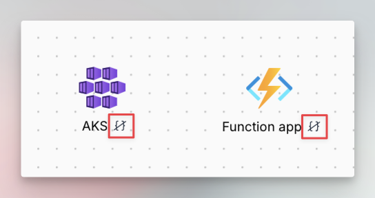

# Node

### Description

The node is the graphical object you use to build your cloud infrastructure and is the building block of the architecture.

When you drag and drop a node from the left bar and add it to the design area you can customize both its graphical aspects and its cloud configuration to generate its Terraform code.

### Types of nodes

1.  **Resource:** This represent a cloud resource for a given provider for which Brainboard generates the `resource` Terraform block.

    <figure><figcaption></figcaption></figure>
2. **Data source:** This is a read only object that you allows you to reference an existing cloud resource. Brainboard generates the `data` Terraform block for it.
   * The data block is indicated with a cube on its left:

<figure><figcaption></figcaption></figure>

3.  **Icon only:** This object is used to depict a graphical component that doesn't have a Terraform code, but has a meaning in the architecture.

    <figure><figcaption>
Resource icon only
</figcaption></figure>

    <figure><figcaption>
Data icon only
</figcaption></figure>
4. **Container:** This node is supposed to contain other resources and pass some of its cloud or graphical configurations to its children.
   1.  Azure example: When you add an AKS cluster into the resource group, it automatically inherits the `resource_group_name` from the RG

       <figure><figcaption></figcaption></figure>
   2.  AWS example: When you add an internet gateway to the VPC, it inherits the `vpc_id` automatically from the VPC.

       <figure><figcaption></figcaption></figure>
   3.  GCP example: When you add compute firewall into a compute network, it inherits its `network` automatically

       <figure><figcaption></figcaption></figure>
5. **Module:** This node represent a Terraform module for which Brainboard generates `module` block.
   1.  By default when you can a module, it is represented by a simple node containing the icon of the provider of the resources

       <figure><figcaption></figcaption></figure>
   2.  You can change any module into a container, by right-clicking on it and select `Switch to container.` You can turn it back into a node by right click and select `Switch to node`.

       <figure><figcaption></figcaption></figure>
6.  **Shape:** This is a pure graphical object that helps you depict information that don't have a Terraform code.

    1. Some shapes can also be containers, like rectangles and circles, which helps you group your resources without triggering cloud configuration inheritance.

    <figure><figcaption></figcaption></figure>
7. **Text:** This node helps create text object to add complementary information to your cloud architecture.

### Graphical options

#### Options bar

The following graphical options are common to any node in the design area:

<figure><figcaption></figcaption></figure>

1. Lock the node: This allows you lock/unlock the node graphically, which means it cannot be moved, resized, deleted or modified.
2. Duplicate the node
3.  Order: Change the z-index of the node

    <figure><figcaption></figcaption></figure>

    1. Send backwards
    2. Send to back
    3. Bring to front
    4. Bring forward
4.  Align: This option allows you to align multiple nodes

    <figure><figcaption></figcaption></figure>

    1. Align nodes left
    2. Align vertically nodes' centers
    3. Align nodes right
    4. Align nodes to the top
    5. Align horizontally nodes' centers
    6. Align nodes on the bottom
    7. Distribute space between nodes vertically
    8. Distribute space between nodes horizontally
5. Change the background color of the node
6. Change the text color of the node
7. Change the borders color of the node
8. Change the border radius of the node
9. Make borders of the node dashed
10. Change the border weight of the node
11. Open cloud configuration: This will open the ID card of the resource that contains all Terraform fields that  you can fill. Brainboard generates the Terraform code based on this configuration.

#### Context menu

1.  **Resource, data source and container:** These 3 types of nodes share the same options of their context menu:

    

    1. Open the ID card of the resource to update the cloud configuration
    2. Change the title of the node
    3. Add connectors
    4. Disable the Terraform code generation of the node without deleting it from the design
       1. You can enable the code back by right-clicking on the resource and chose the option `Add to code`
    5. Put the node into a different Terraform file
    6. Switch the resource into data and vice-versa
    7. Delete the node from the design and the generated code
2.  **Module:** All the options are similar to the resource, except that for modules you have the possibility to swatch a module visually into a container and switch it back into a normal node if needed.

    <figure><figcaption></figcaption></figure>

### Cloud configuration

Every node that is a cloud resource will have its Terraform code automatically generated and updated when you fill information of the ID card or when you move the node into a parent where it inherits some cloud properties.

Refer to ID card page for more details about how to update the cloud configuration of nodes and all the options available.

### Behavior

Brainboard design area is a smart canvas that has a cloud knowledge and is able to understand the relationship and links between resources.

Here is the behavior of the node in the design area:

* Nodes can be linked to each other automatically when you reference a Terraform attribute from node to another.
  * The name of the field that references the other node is put in the text of the connector created between both resources.
* Containers can pass their cloud properties into their children when it is supported by Terraform.
  * Brainboard can detect what should be passed and how and generates the right code.
* When you update the `resource name` of any node at any level, Brainboard automatically updates all the nodes that depend on it with the new name.
* Container cannot be resized smaller than its children. It has to visually indicate the children contained.
* There is no inheritance between resources of different providers.
  * For example you cannot add an `aws_subnet` inside `azurerm_virtual_network`.
* Within the same provider, you cannot do what is not allowed by the provider.
  * For example you cannot add a subnet inside a subnet, VPC inside VPC, VNET inside VNET...
* When you try to add a container into another one, Brainboard automatically fixes the right order of containers based on what is accepted by the provider.
  * For example if you try and add a VPC inside a subnet, Brainboard will put the subnet inside the VPC and fills the information correctly for you.
* You can still reference resources from different providers in the ID card.
  * For example reference AD user inside a VM.
* When selecting multiple resources and cloning them, Brainboard automatically generates new resource names to avoid collisions and tracks dependencies correctly. Which means, the Terraform plan should pass after the clone.
