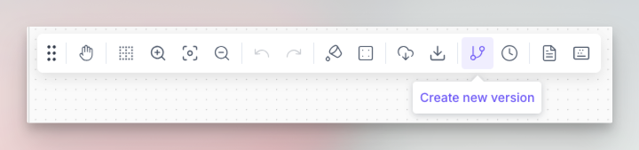
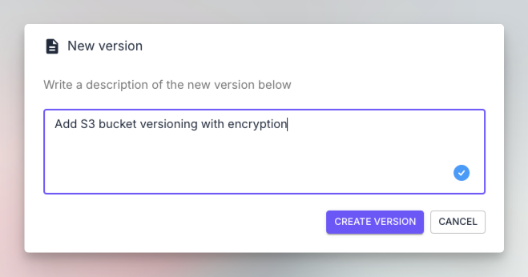
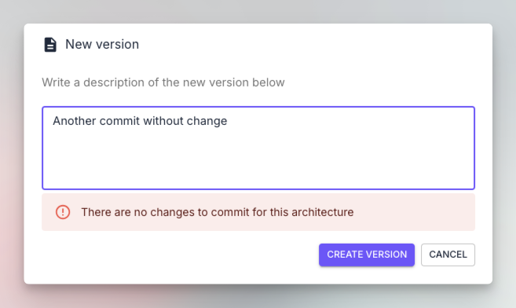
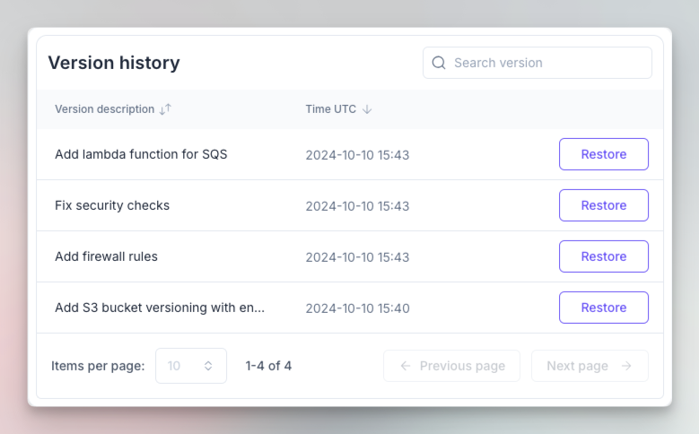

# Versioning

### Description

Brainboard provides a native versioning mechanism that allows you to keep track of your changed and be able to rollback/restore any specific point-in-time version.

### Components of a version

When you create a version, Brainboard saves the following information:

* The architecture design.
* The version of the cloud provider selected to create the architecture.
* Variables.
* Output.
* The README file.
* The structure of the Terraform files.
* Timestamp in UTC when the version is created.
* The person who created the version.
* The commit message.


The Terraform code is automatically generated, and it is not saved as code.


### Create a version

To create a version of your architecture:

1.  Click on the `Create new version` button in the options bar:&#x20;

    <figure><figcaption></figcaption></figure>
2.  Write a description of the version: This could the same commit message that you would write when you do a pull request.  You can write multiline text, if you want to provide more details.

    <figure><figcaption></figcaption></figure>
3. Click on `Create version` to create the new version.
   1.  When you create a new version, if there are no changes between the current version and the new one, you'll receive this message:

       <figure><figcaption></figcaption></figure>

### List versions

To list all the versions of your infrastructure:

*   Click on the `Show versions` button in the options bar:&#x20;

    <figure><figcaption></figcaption></figure>
*   This will open the versions table:

    <figure><figcaption></figcaption></figure>

### Restore a version

To check out or restore any version, click on the button `Restore` of the version you want to restore:

<figure><figcaption></figcaption></figure>


**Import notes:**

* Brainboard versions are immutable snapshots of your infrastructure. You cannot delete them.
* You can checkout any version and work on it without altering the history of the versioning.
* When you clone an architecture or create a template from it, its versions will be removed.
* When you checkout a version, both the diagram and the Terraform code will be updated.


### Push to git

Please refer to the page: Pull requests, for detailed information about how to do pull requests and save the generated code into git.

