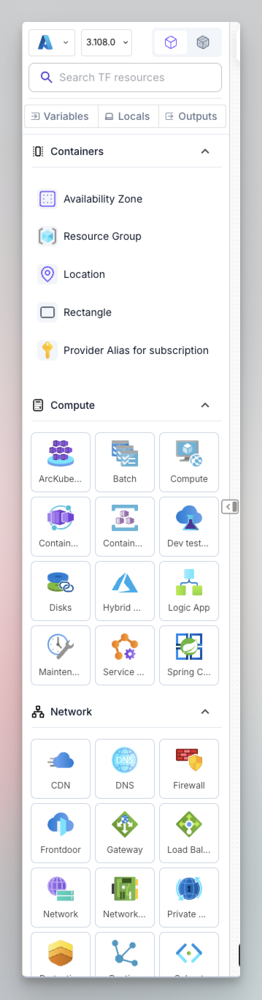
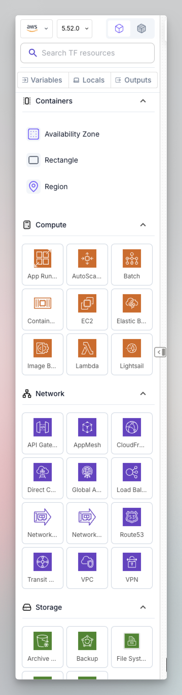
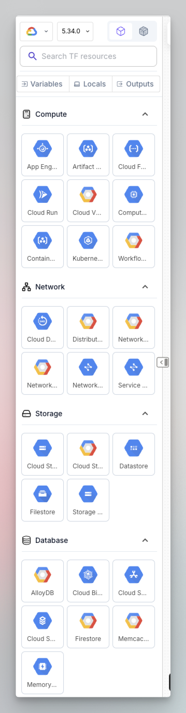
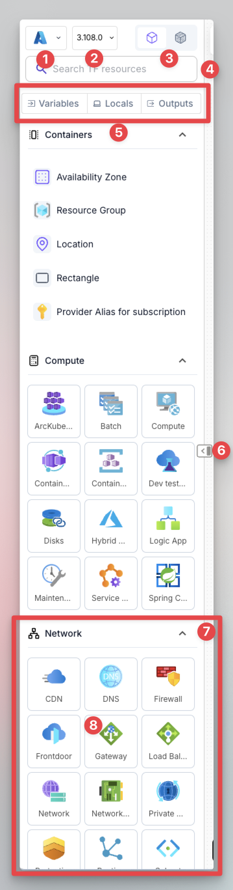
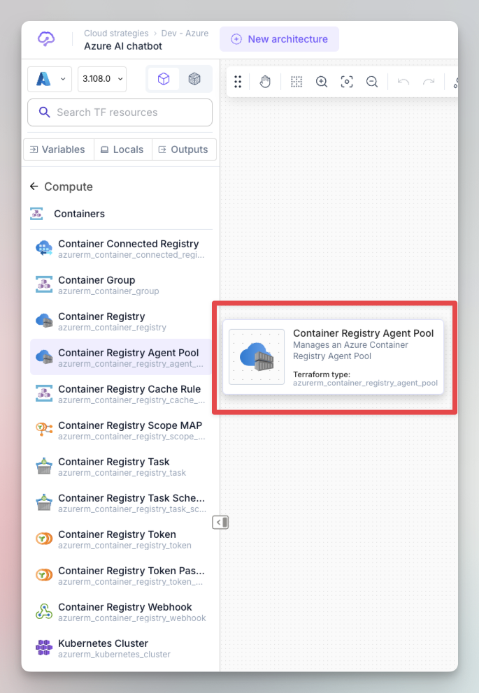

# Left bar

The left bar is where all the graphical objects are available to be used in the design area and it gives you the possibility to select a specific cloud provider from the supported ones, set the version of the same provider and switch between Terraform/OpenTofu resources and data sources.

It contains different sections that match cloud provider categories like compute, network, storage but also custom Brainboard sections like containers and modules.



<figure><figcaption></figcaption></figure>



<figure><figcaption></figcaption></figure>



<figure><figcaption></figcaption></figure>



You build your cloud infrastructure by drag and dropping resources from the left bar then configuring their cloud configuration.

Here are the components of the left bar:

<figure><figcaption>
Left bar components
</figcaption></figure>

1. Cloud providers selector: It allows you to select the cloud provider to use in the current architecture
2. Cloud provider version: This the Terraform/OpenTofu version of the selected provider
   1. Brainboard automatically update the left bar whenever there is a new Terraform/OpenTofu version of the provider.
   2. When you select a version, the left bar will updated for you to reflect the resources available at this specific version
3. Resource type selector: Allows you to switch between cloud resources and data sources
   1. When you select a type (either resource or data), the left bar will updated for you to reflect the resources available within this type.
4. Search bar: Allows you to search resources by:
   1. Full Terraform name, like _azurerm\_virtual\_network,_ _aws\_vpc_ or _google\_compute\_network_.
   2. Abbreviations.
   3. Part of the word.
5. Buttons to easily access the configuration of variables, locals and outputs.
6. Button to close or open the left bar.
7. Category of resources: It contains all the resources that belong to the same category as specified by the cloud providers.
   1. Every item is a sub-category, so you need to click on it to see all its resources.
8.  Sub-category of resources:

    1. When you hover any element, a small modal will appear to explain what the component is and its Terraform name.

    <figure><figcaption></figcaption></figure>

