---
layout:
  title:
    visible: true
  description:
    visible: true
  tableOfContents:
    visible: true
  outline:
    visible: true
  pagination:
    visible: true
---

# Cloud resources

### Description

The cloud resource is the building block of any architecture in Brainboard and could be:

1. Any resource available at the cloud provider that has either a Terraform resource or data source associated with it.
2. Terraform module.
3. Brainboard reference object that doesn't have a Terraform equivalent resource but helps you build accurate architecture and generate a correct Terraform code. For e.g. containers like Azure location, AWS region.

Characteristics of a cloud resource:

* It can be drag & dropped from the left bar.
* It has a lifecycle associated to it, so it can be created, updated and deleted.
* It has a set of configuration parameters that you can customize through the ID card.
  * Refer to the [identity card](../design-area/id-card.md) page for more information on how to configure a cloud resource.

### Types of cloud resources

Brainboard supports all the Terraform/OpenTofu resource types:

#### Resources:

They represent, for a specific cloud provider, all the resources available at any selected version of the Terraform provider.

#### Data sources:

Data sources allow you to reference existing resources and access their information in a read-only mode.

You can switch between the data types and resources in 2 ways:

1.  **From the left bar:** Select either a resource or data source option as follows:

    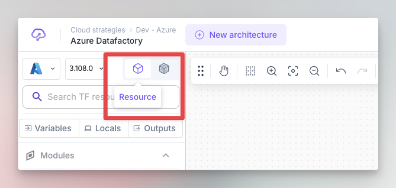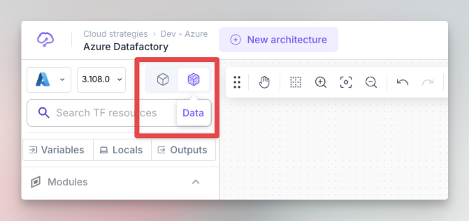
2.  **Inside the design area:** If you want to switch any resource in to data or vice-versa, right click on the resource and select either `Switch to data` or `Switch to resource.`

    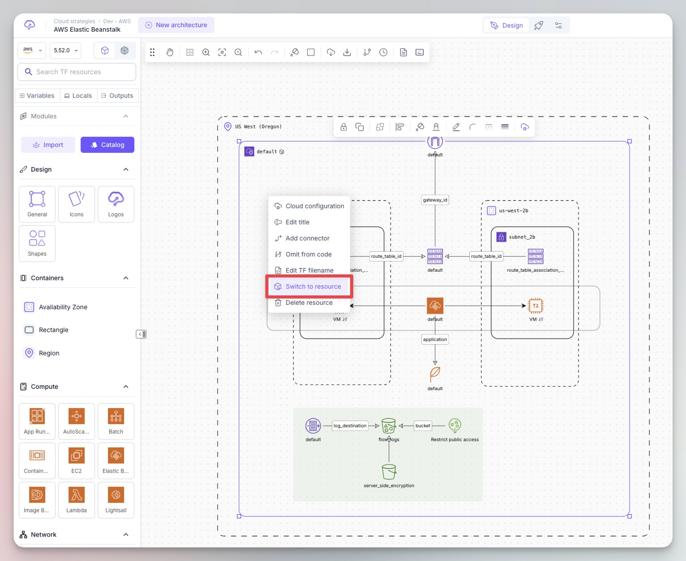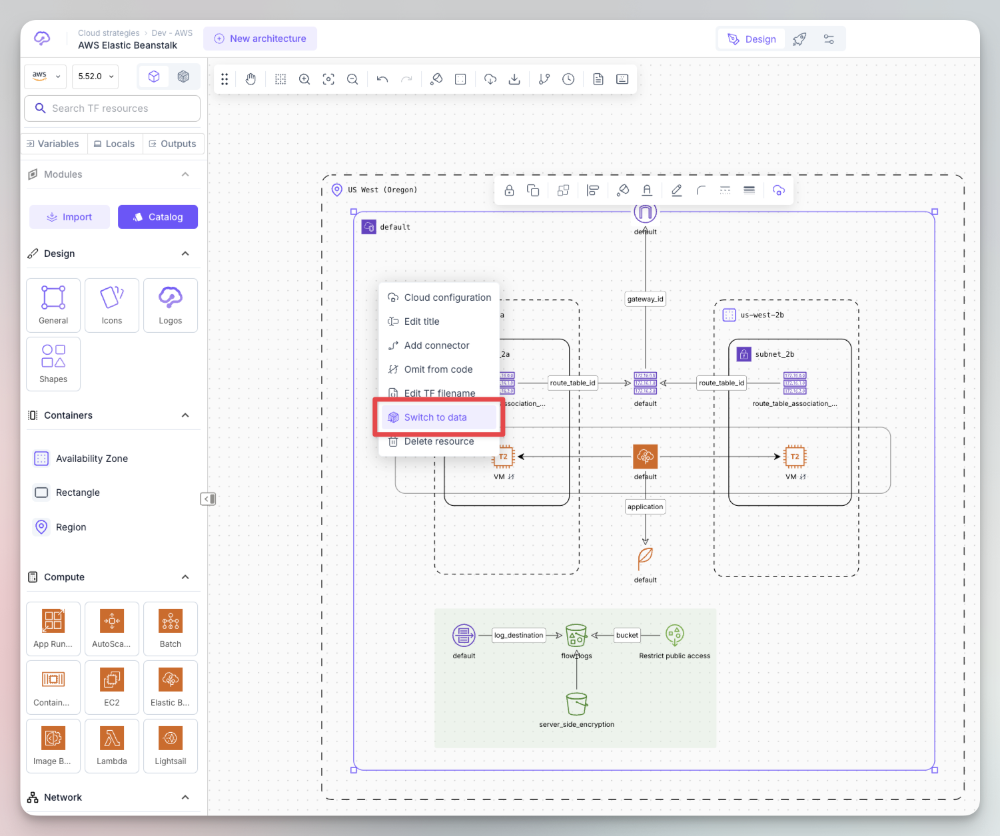


When you switch a resource into data, Brainboard automatically changes all the references of this resource in the Terraform code into a data block and also updates the configuration of its ID card.


**Agnostic nodes**

Nodes like Texts, generic icons or graphical shapes have no cloud configuration and will not be deployed into any cloud provider. They are diagraming objects only to help you represent information that cannot be represented by code.

* You can convert any cloud resource into an icon, which also removes its Terraform code by right-clicking on the resource and choose the option `Omit from code`.

<figure>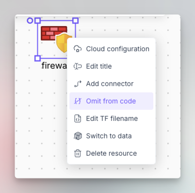<figcaption></figcaption></figure>

* You can change it back into a cloud resource. Its original configuration will be restored and its Terraform code will be shown as well.

<figure>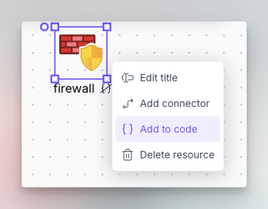<figcaption></figcaption></figure>

Refer to the Node documentation page to understand what the visual indications mean and to understand how cloud resources behave in the design area.

### Terraform modules

These are a special cloud resources as they are containers and abstract a group of cloud resources.

Here is the section in the left bar where you can import your modules and access the modules' catalog to manage them.

<figure>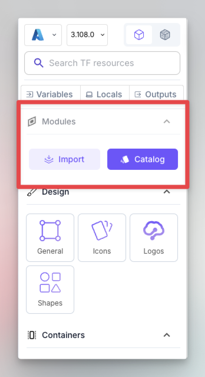<figcaption></figcaption></figure>

Refer to the Node documentation page to understand what the visual indications mean and to understand how modules behave in the design area.

#### Import module

Brainboard support any type of Terraform modules from any source. To import your module, just click on the button `Import` in the left bar, it will open the following window that allows you to specify information of the module:

<figure>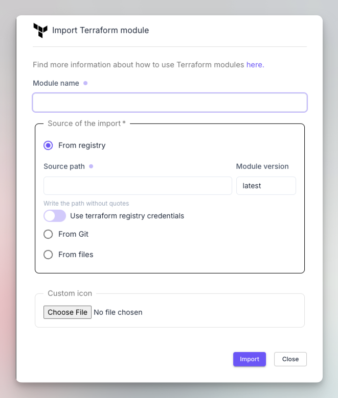<figcaption></figcaption></figure>

1.  Import from registry: You can import your Terraform / OpenTofu modules from your Terraform registry, could it be **public** or **private**. You need to specify:

    1. The name of the module: this will be used as a Terraform resource name when you use the module later. If needed, you can customize it for every module in the ID card when you use the module.
    2. The source path: the path of the module in the registry.
    3. The version: You can specify the version you want to import or keep the latest and later change it for the module's ID card when you use it.

    <figure>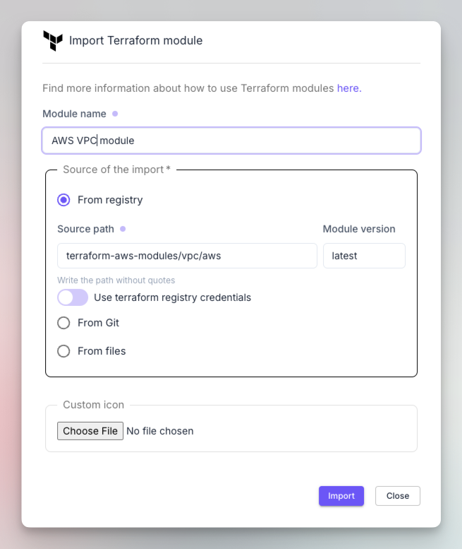<figcaption></figcaption></figure>

    To import from a private registry, click on the switch button `Use terraform registry credentials` below the source and select the credentials of the registry.
2.  Import from Git repository: You can also import you Terraform / OpenTofu modules from any git repository, **public** or **private:**

    <figure>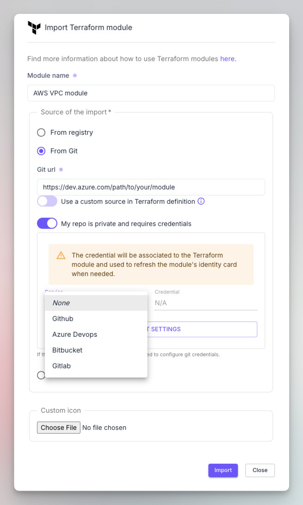<figcaption></figcaption></figure>

    1. The source of the module can be the browser URL to the folder or repository hosting the module.
       1. For GitHub and GitLab you can use the following format: [_`git::https://github.com/org/repo//folder$ref=branch`_](#user-content-fn-1)[^1]
    2. If your repository is private, click on the switch button `My repo is private and requires credentials`, and specify the git credentials that will be used to import your module.
    3.  If you want Brainboard to generate a custom source string when the Terraform code is generated for the module, click on the switch button `Use a custom source in Terraform definition`. This means that Brainboard will still use the git URL to fetch the latest information about the module while the code generated matches the path that you specify in the source. For example you want to specify a local path in the module like `./modules/myModule` because it will be run by your CI runners that don't have access to your git but have the module local to the file system:

        <figure><figcaption></figcaption></figure>

        <figure><figcaption></figcaption></figure>
3.  Import from files: This allows you to upload your local Terraform files and create a module from them.

    <figure>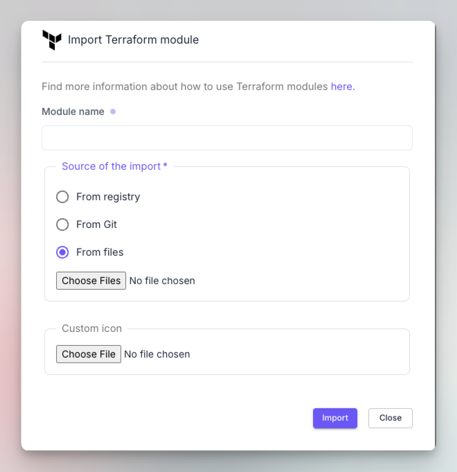<figcaption></figcaption></figure>


1. You can customize the icon of your modules when you import them whatever the source is.
2. When you initiate the import, Brainboard first checks if the Terraform code of the module is correct or not and displays an error if the module contains any Terraform errors or invalid syntax.


#### Modules catalog

When you import your modules in Brainboard, you build a catalog of modules that anyone within the team and browse and use. Which hopefully encourages the culture of reuse.

To access this catalog, click on the button `Catalog` in the modules section of the left bar, that will  open the gallery:

<figure>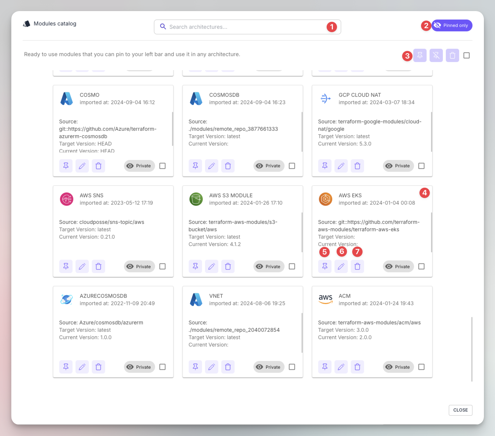<figcaption>
Modules' catalog
</figcaption></figure>

Here are the components of the catalog:

1. Search bar.
2. Pinned visibility button: it helps you select/unselect only modules that are pinned in the current architecture.
3. Global actions: You can select all the modules of the catalog and apply bulk actions:
   1. Pin: It adds all the selected modules to the left bar, so even if you switch architectures the modules stay available.
   2. Unpin: It removes all the selected modules from the left bar, but doesn't delete them.
   3. Delete: Deletes all the selected modules from Brainboard.
4. Module's card: This will contain all the information about the module.
5. Pin/unpin the module: It adds or removes this specific module to/from the left bar.
6. Edit module: Helps you edit the information of the module. It will open the same configuration window as the one of the [#import-module](cloud-resources.md#import-module "mention").
7. Delete module: It permanently delete the module from Brainboard.


* Deleting a module is a non-reversible action. You need to reimport any module that you delete if you want to use it again.
* If the module is used in any architecture when you delete it, the Terraform plan will fail as Brainboard will not have access to it.


#### Terraform code

When you add a module to the design area, the initial Terraform code generated will contain:

* The name of the module as a resource name. Brainboard replaces any white space with `_` to generate a valide Terraform code.
* Only the source field is added and if you defined a custom path, it be used instead.
* If you keep the latest as a version of the module during import, Brainboard will not add the field `version` to the generated code as Terraform will by default assume it is the latest.

[^1]: 
