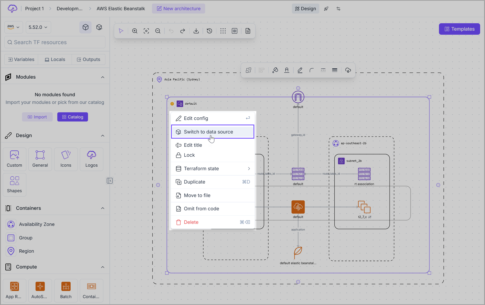
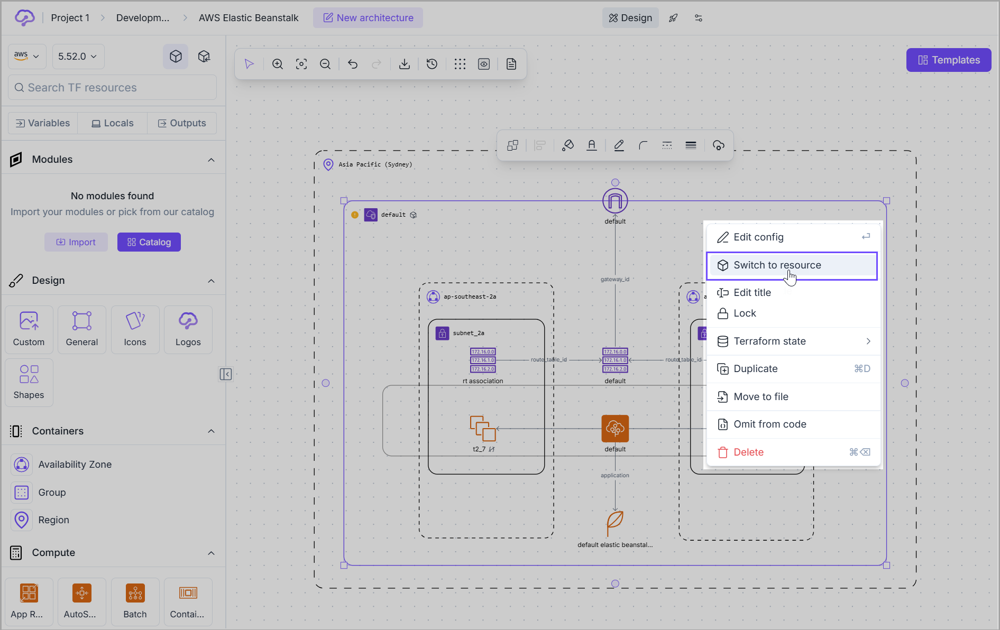
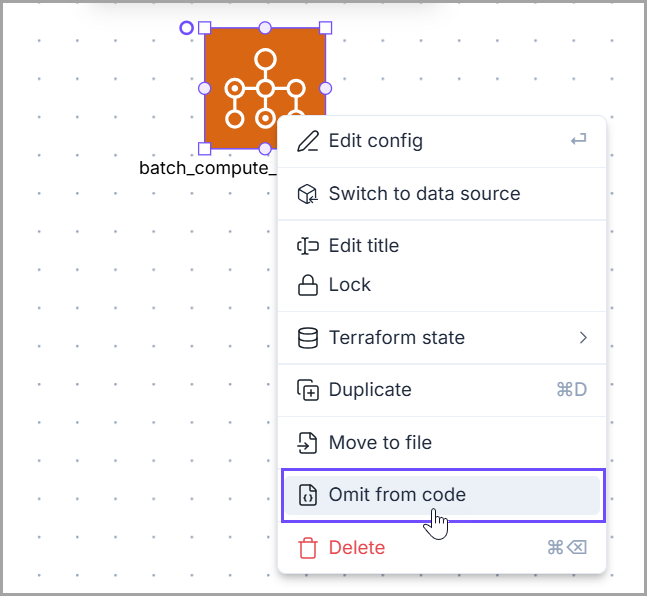
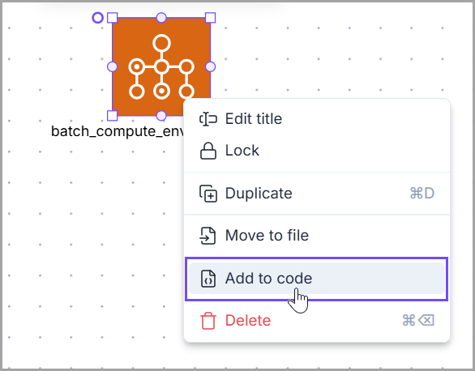
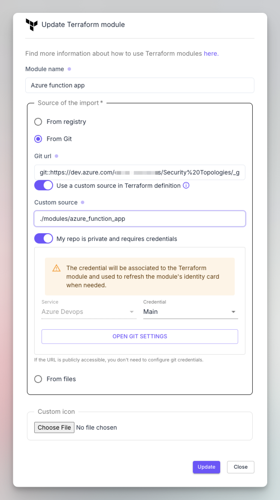
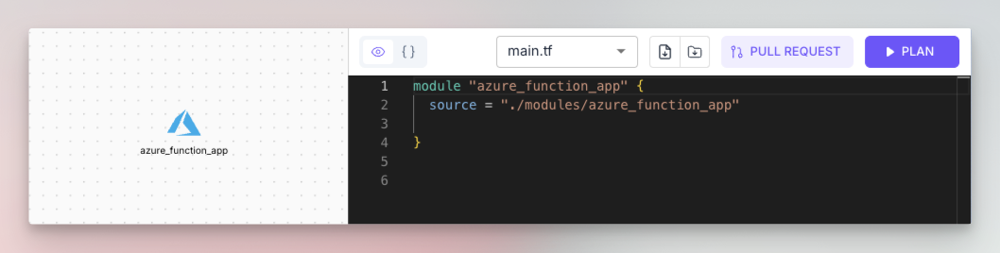

# Cloud resources

### Overview

A Cloud resource is a building block of any architecture in Brainboard and could be one of the following:&#x20;

1. Any resource available at the cloud provider that has either a Terraform resource or data source associated with it.
2. Terraform module.
3. Brainboard reference object that doesn't have a Terraform equivalent resource, but helps you build accurate architecture and generate a correct Terraform code. For example, _<mark style="color:$primary;">Containers</mark>_ like _<mark style="color:$primary;">Azure location, AWS region</mark>_.

### Characteristics of a Cloud Resource


It can be dragged & dropped from the [left panel](./).



It has a lifecycle associated with it, so it can be created, updated and deleted.



It has a set of configuration parameters that you can customize through the **Resource Configuration** panel.

🔗 Refer to the [Resource Configuration](../resource-configuration.md) page for more information on how to configure a cloud resource.


### Types of cloud resources

Brainboard supports all the Terraform/OpenTofu resource types.

#### Resources

For a specific cloud provider, these represent all the resources available at any selected version of the Terraform provider.

#### Data sources

Data sources allow you to reference existing resources and access their information in a read-only mode.

#### Switching between resource types

You can switch between the data types and resources in two ways:

1. **From the left panel**\
   Select either the _<mark style="color:$primary;">resource</mark>_ or _<mark style="color:$primary;">data source</mark>_ option as demonstrated below.&#x20;


{% column width="50%" %}
<figure><figcaption></figcaption></figure>


{% column width="50%" %}
<figure><figcaption></figcaption></figure>



2. **Inside the design area:** If you want to switch any _<mark style="color:$primary;">resource</mark>_ into _<mark style="color:$primary;">data</mark>_ or vice-versa, right-click on the resource and select either `Switch to data` or `Switch to resource.`

<figure><figcaption></figcaption></figure> <figure><figcaption></figcaption></figure>


When you switch a resource into data, Brainboard automatically does the following:

* Changes all the references of this resource in the **Terraform code** into a **data block.**
* Updates the configuration in the **Resource Configuration** panel.


### **Agnostic nodes**


Nodes like **Texts, generic icons** or **graphical shapes** have no cloud configuration and will not be deployed into any cloud provider. These are diagramming objects only to help you represent information that cannot be represented by code.


#### Converting Cloud resource into an Icon

You can convert any cloud resource into an icon by right-clicking on the resource and choosing the option `Omit from code`.


Once a Cloud resource is converted into an icon, its Terraform code is also removed.


<figure><figcaption></figcaption></figure>

#### Converting an icon into a Cloud resource

You can change an icon back into a cloud resource by right-clicking on the icon and choosing the option `Add to code`.


When an icon is converted back to a cloud resource, its original configuration is restored, and its Terraform code is shown as well.


<figure><figcaption></figcaption></figure>

### Terraform modules

These are special cloud resources as they are <mark style="color:$primary;">containers</mark> and abstract a group of cloud resources.

In the **left panel,** there is a section where you can import your modules and access a modules' _<mark style="color:$primary;">Catalog</mark>_ to manage them.

<figure><figcaption></figcaption></figure>


Please refer to the [Node documentation](../design-area/node.md) to understand **visual indications** and how cloud resources behave in the design area.


### Import module


Brainboard supports all types of **Terraform modules** from any source.&#x20;


To import your module, click on the `Import` button under **Modules** in the **left panel.** It will open the **"Import Terraform module"** window that allows you to specify information about the module.&#x20;

<figure><figcaption></figcaption></figure>

#### Import module from registry

You can import your **Terraform / OpenTofu** modules from your <mark style="color:$primary;">Terraform registry</mark>, which could be **public** or **private**. You need to specify:

1. **The name of the module:** this will be used as a Terraform resource name when you use the module later. If needed, you can customize it for every module in the Resource Configuration panel when you use the module.
2. **The source path:** The path of the module in the registry.
3. **The version:** You can specify the version you want to import or keep the latest and later change it in the <mark style="color:$primary;">Resource Configuration</mark> panel when you use it.

<figure><figcaption></figcaption></figure>

1. <mark style="color:$primary;">**Importing from a private registry**</mark>

To import from a private registry, click on the toggle button `Use terraform registry credentials` below the **source path**, select the credentials of the registry.

2. <mark style="color:$primary;">**Importing from Git repository**</mark>

You can also import your Terraform / OpenTofu modules from any Git repository, **public** or **private.**

<figure><figcaption></figcaption></figure>


**GitHub/GitLab browser URL**

The source of the module can be the browser URL to the folder or repository hosting the module.

For GitHub and GitLab you can use the following format: _`git::https://github.com/org/repo//folder$ref=branch`_



**Private repository**

If your repository is private, click on the switch button `My repo is private and requires credentials`, and specify the git credentials that will be used to import your module.



**Custom source**

If you want Brainboard to generate a custom source string when the Terraform code is generated for the module, click on the switch button `Use a custom source in Terraform definition`.&#x20;

This means that Brainboard will still use the git URL to fetch the latest information about the module, while the code generated matches the path that you specify in the source.&#x20;

For example, you want to specify a local path in the module like `./modules/myModule` because it will be run by your **CI runners** that don't have access to your git but have the module local to the file system.


<figure><figcaption></figcaption></figure>

<figure><figcaption></figcaption></figure>

3. <mark style="color:$primary;">**Importing from files**</mark>

&#x20;This option allows you to upload your local Terraform files and create a module from them.


You can customize the **icon** of your modules when you import them, regardless of the actual source.



When you initiate the import, Brainboard first checks if the Terraform code of the module is correct or not and displays an error if the module contains any Terraform errors or invalid syntax.


<figure><figcaption></figcaption></figure>

### Modules catalog

When you import your modules into Brainboard, you build a catalog of modules that anyone within the team can browse and use. It encourages the culture of reuse.

To access this catalog, click on the `Catalog` button under **Modules** in the **left panel.** It will open the gallery.&#x20;

<figure><figcaption></figcaption></figure>

#### **Modules Catalog Popup Window**

You can find the following options on the **Module Catalog** popup window:

1. **Search bar.**
2. **Pinned visibility button:** It helps you select/unselect only modules that are pinned in the current architecture.
3. **Global actions:** You can select all the modules of the catalog and apply bulk actions such as:
   1. **Pin:** It adds all the selected modules to the left panel, so even if you switch architectures, the modules stay available.
   2. **Unpin:** It removes all the selected modules from the left panel, but doesn't delete them.
   3. **Delete:** Deletes all the selected modules from Brainboard.
4. **Module's card:** This will contain all the information about the module.
5. **Pin/unpin the module:** It adds/removes a specific module to/from the left panel.
6. **Edit module:** Helps you edit the information of the module. It will open the same configuration window as the[#import-module](cloud-resources.md#import-module "mention").
7. **Delete module:** It permanently deletes the module from Brainboard.


* Deleting a module is a non-reversible action. You need to reimport any module that you delete if you want to reuse it.
* If the module is used in any architecture, when you delete it, the Terraform plan will fail, as Brainboard will cease access to it.


### Terraform code

When you add a module to the design area, the initial Terraform code generated will contain the following.


The **name of the module** as a resource name. Brainboard replaces any white space with `_` to generate a valid Terraform code.



Only the **source field** is added, and if you defined a custom path, it will be used instead.



If you keep the **latest version** of the module during import, Brainboard will not add the field `version` to the generated code, as Terraform will by default assume it is the latest.


