# Input & output

When you design your cloud infrastructures in Brainboard, the Terraform code is auto-generated for you based on the configuration of the resources. You have the possibility to use variables, locals and output exactly as you would do it in Terraform.

This helps you implement your naming conventions, set specific values for the configuration based on some criteria and define what information you want to display once the infrastructure is deployed.

To use variables, locals and output in Brainboard you click on the right button in the left bar:

<figure>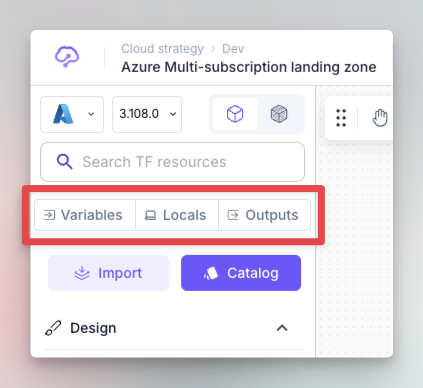<figcaption></figcaption></figure>

### Variables

In Terraform, a variable is a way to store and reuse values throughout your Terraform code, and it is defined using the `variable` block.

When you click on `Variable` button in the left bar, it opens the variables window:

<figure>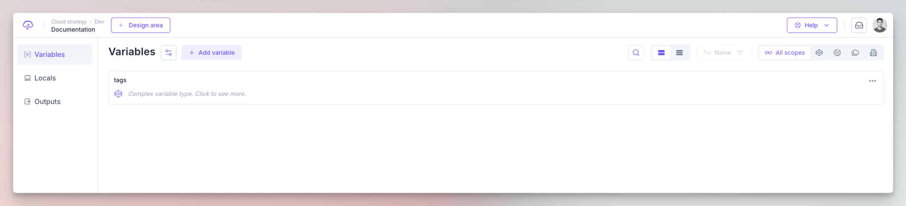<figcaption></figcaption></figure>


Brainboard follows Terraform best practices, so by default, when you create a new architecture, Brainboard automatically adds a variable called `tags` that will be added in the generated Terraform code of every resource that supports tagging.


Here are the components of the variables' page:

<figure>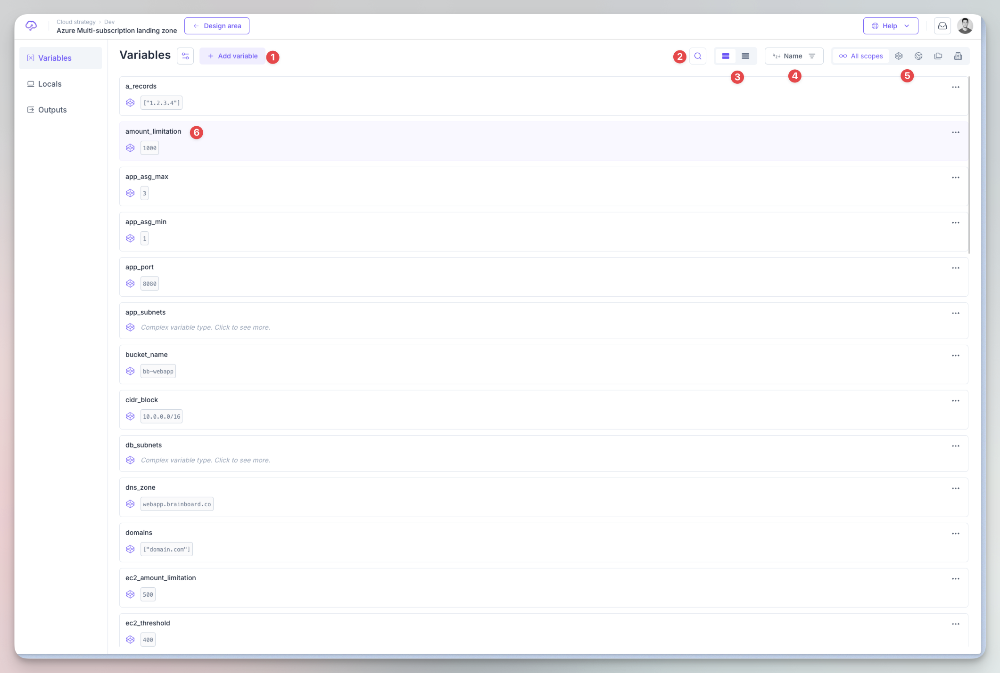<figcaption></figcaption></figure>

#### 1. Add variable

Click on this button if you want to create new variable(s), this will display the creation menu

<figure>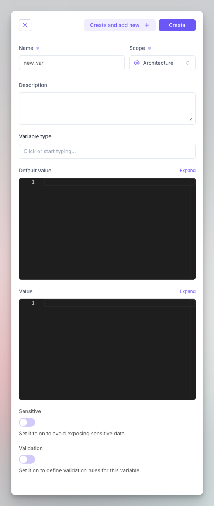<figcaption></figcaption></figure>

You can specify the following information:

1.  **Name of the variable:** This is the name that you'll use to reference the variable when you use it and It follows the naming conventions of Terraform, for example, it doesn't support spaces, or starting with a number.

    **Best practice:** use clear and explicit names and separate words with underscore `_`.
2.  **Scope:** You can set the level where you want this variable to be available.

    <figure>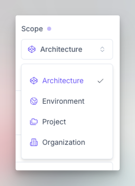<figcaption></figcaption></figure>

    There are 4 levels of scopes ordered here from least shared or restrictive to more shared / available:

    1. Architecture: Variables that are defined with this scope are only available within this architecture only.
       1. If the same variable is defined in another level as well, the default or values defined at the architecture level overrides any other level.&#x20;
    2. Environment: Variables defined at the environment level are available to all architectures within the same environment.
       1. Variables defined in this level override those defined at project and organization level.&#x20;
    3. Project: Variables defined at the project level are available to all environments and architectures within the same project.
       1. Variables defined in this level override those defined at the organization level.&#x20;
    4. Organization: Variables defined at the organization level are available to all architectures, environments and project within the organization.

    There is an override mechanism if the same variable is defined in multiple scopes.&#x20;
3. **Description:** It should concisely explain the purpose of the variable and what kind of value is expected. This description string might be included in documentation about the module, and so it should be written from the perspective of the user of the module rather than its maintainer.
4.  **Variable's type:** This allows you to restrict the type of value that will be accepted. If no type constraint is set then a value of any type is accepted.

    While type constraints are optional, we recommend specifying them; they can serve as helpful reminders for users of the module, and they allow Terraform to return a helpful error message if the wrong type is used.

    The supported type keywords are:

    <figure>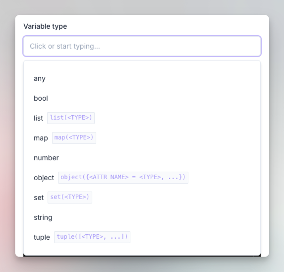<figcaption></figcaption></figure>
5. **Default value:** If present, the variable is considered to be _optional_ and the default value will be used if no value is set.
6. **Value:** The value that will be used during Terraform execution and if defined, it overrides the default value.
   1. This value will be put in the file `terraform.tfvars`
   2. If you convert the architecture into a template or clone the architecture, this value will be removed.
7. **Sensitive:** Setting this flag prevents Terraform from showing its value in the `plan` or `apply` output and Brainboard will store the variable in a separate vault.
8. **Validation:** You can specify custom validation rules for the variable.


Even if the variable is flagged sensitive, its value will still be stored in clear text in the Terraform state.



For every variable defined, Brainboard creates a variable block in the file `variables.tf.`


#### 2. Search for variables

When you click on the search button it will expand the text area where you can search for the variables in the table by name.

#### 3. Switch the view

You can switch between detailed and compact view of the variables. Here is how the compact view looks like:

<figure>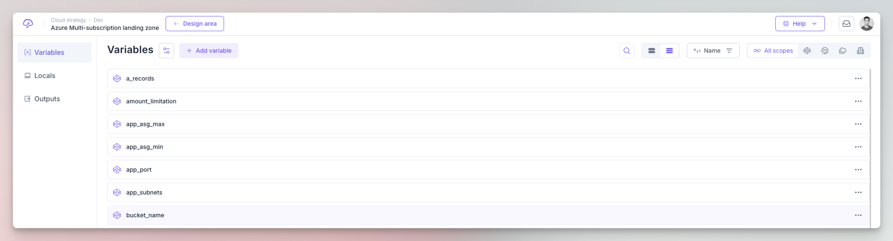<figcaption></figcaption></figure>

#### 4. Sorting the listed variables

You can also sort the listing of the variable based on the following criteria:

<figure>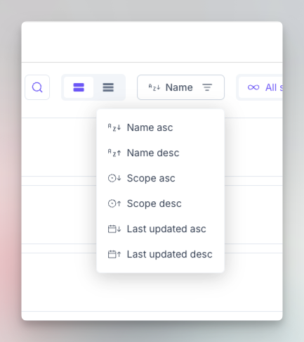<figcaption></figcaption></figure>

#### 5. Scoped view

The scope selector allows you to view variables that are defined in every scope, or display all variables of all scopes.

#### 6. Variable line

The default listing of the variables is called "detailed view" which shows more information about variables than just names.


Refer to the RBAC (Role Based Access Control) documentation page to understand how you can manage permissions to restrict/allow members and teams to add, update or delete variables.


### Locals

A local value assigns a name to an [expression](https://developer.hashicorp.com/terraform/language/expressions), so you can use the name multiple times within a module instead of repeating the expression.&#x20;

Brainboard allows you to define multiple locals:

<figure>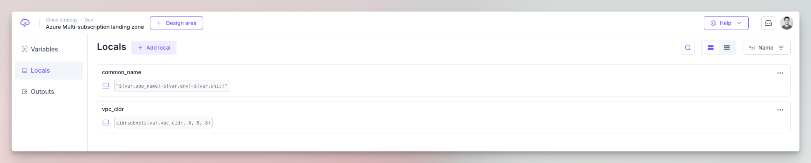<figcaption></figcaption></figure>

When you define locals in Brainboard, they'll all be put in `locals.tf` file and in the same block `locals`

The table of locals is similar to the one of variables detailed above. Please refer to it to understand the different components of the User Interface.

#### Create local

Click on the button `Add local` to open the modal that allows you to specify the following information of the local:

<figure>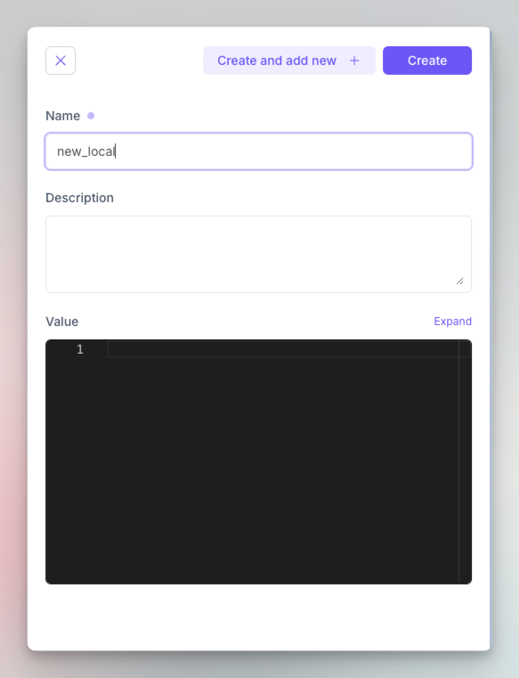<figcaption></figcaption></figure>


If you are using a complex expression in the value field, you need to quote it as you can mix strings, functions, variables....


### Outputs

Output values make information about your cloud infrastructure available on the command line and will be displayed in the output of the execution.

<figure>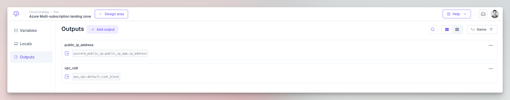<figcaption></figcaption></figure>

The table of output is similar to the one of variables detailed above. Please refer to it to understand the different components of the User Interface.

#### Create output

Click on the button `Add output` to open the modal that allows you to specify the following information of the output:

<figure>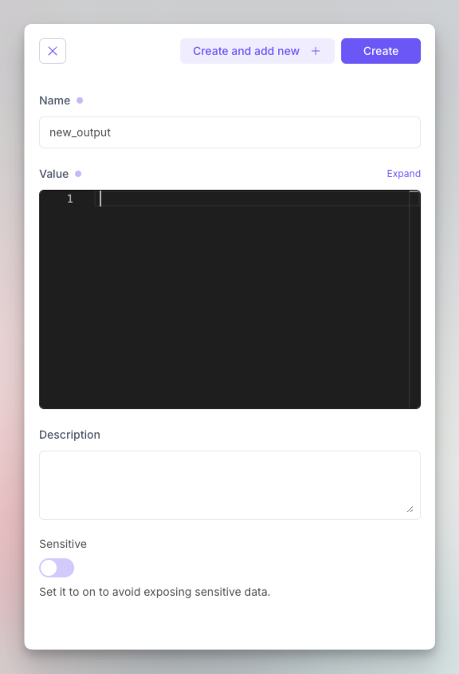<figcaption></figcaption></figure>


For every output defined, Brainboard creates an output block in the file `outputs.tf`.

