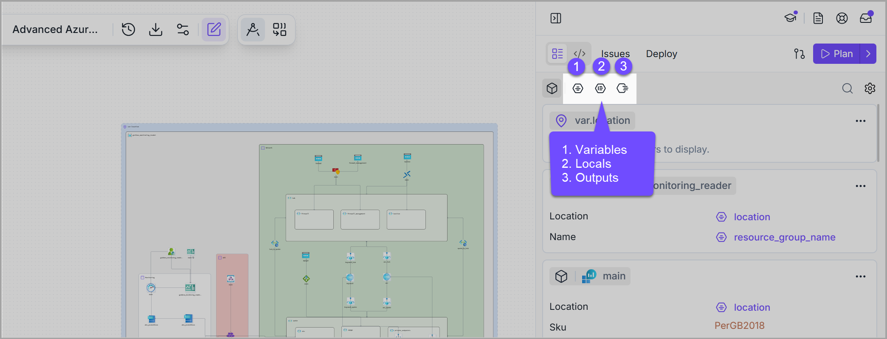

# Input & output

### Overview

When you design your cloud infrastructures in <mark style="color:$primary;">**Brainboard**</mark>, the <mark style="color:$primary;">Terraform</mark> code is auto-generated for you based on the configuration of the resources.&#x20;


<mark style="color:$primary;">**Brainboard**</mark> allows you to use **variables, locals** and **output** exactly as you would do it in **Terraform.**



You can implement your naming conventions, set specific values for the configuration based on some criteria and define what information you want to display once the infrastructure is deployed.


<figure><figcaption></figcaption></figure>

***

### Related


{% column width="25%" %}
<a href="variables.md" class="button secondary" data-icon="memo-circle-check">Variables</a> &#x20;


{% column width="25%" %}
<a href="locals.md" class="button secondary" data-icon="memo-circle-check">Locals</a>



{% column width="49.999999999999986%" %}
<a href="output.md" class="button secondary" data-icon="memo-circle-check">Output</a>


